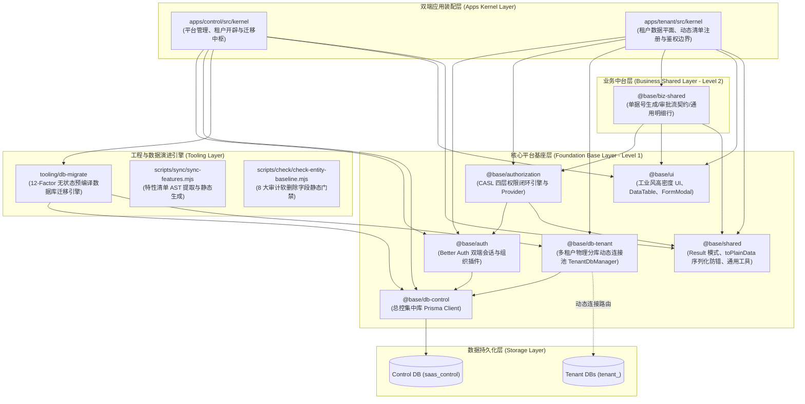

# 平台基座与基础设施框架演进指南 (Platform Base & Infrastructure Evolution)

> 消费预算：~5,000 Tokens。涉及 `@base/*` 基础设施包、`tooling/db-migrate` 演进引擎或双端应用装配层（`apps/*/src/kernel`）改造与迭代时的权威操作手册。

本项目采用 **Modular Monorepo** 架构。除了纵向独立的业务切片（`packages/features/*`）外，系统整体运转依托于坚实、解耦且具备高内聚特性的**横向平台基础设施层 (Horizontal Platform & Shared Modules)**。

---

## 一、 平台基础设施架构拓扑与矩阵总览



---

## 二、 基础设施核心模块演进规范与职责边界

### 1. `@base/auth` — 双端身份认证引擎

- **职责**：基于 Better Auth + Organization 插件提供平台端与租户端的账号认证、双因子鉴权、组织关系托管及 Cookie 会话生命周期管理。
- **边界红线**：
  - **认证管进门，授权管屋内**：Better Auth 仅负责登录身份合法性，**严禁**使用 Better Auth 的内置权限函数做业务资源级别的细粒度鉴权（业务鉴权统一由 CASL 接管）；
  - 维护双端独立的 Session 校验中间件与服务端上下文提取器。

### 2. `@base/authorization` — 四层细粒度权限闭环引擎

- **职责**：基于 CASL (`@casl/ability` + `@casl/prisma`) 构建四层权限防线：
  1. **准入门禁 (Gate)**：离职/停用员工硬阻断；
  2. **功能权限 (Statement)**：`resource:action` 决定操作与按钮可见性；
  3. **数据范围 (Data Scope)**：`SELF`、`DEPT`、`DEPT_TREE`、`ALL`，经 `accessibleBy` 自动下推为 Prisma Where 物理过滤条件；
  4. **字段权限 (Field Policy)**：`EDITABLE`、`READONLY`、`HIDDEN` 三态控制，服务端物理剥离敏感字段（`pickReadableFields`）与写防篡改（`assertEditableFields`）。
- **迭代要点**：
  - **跨端快照传输 (`AbilitySnapshot`)**：严禁将 Ability 类实例或函数直接作为 props 传给客户端，必须经由 `buildAbilitySnapshot()` 序列化为纯 JSON 快照，客户端由 `TenantAbilityProvider` 动态反序列化；
  - 客户端消费严格采用官方 `AbilityContext` + `useAbility()`，禁止组件自行通过工厂实例化 plain ability。

### 3. `@base/db-tenant` — 动态多租户物理分库连接池治理

- **职责**：基于 PostgreSQL Database-per-Tenant 架构，为每个企业租户（`tenant_<slug>`）动态维护独立的 Prisma Client 与 pg 连接池。
- **核心治理机制**：
  - **全局单例防泄漏**：挂载于 `globalThis[GLOBAL_TENANT_DB_MANAGER_KEY]`，彻底免疫 Next.js Turbopack HMR 重复求值导致的连接句柄泄漏；
  - **`initializing` Promise 锁并发防击穿**：高并发访问未缓存租户库时，合并并发请求共用同一个初始化流程，防止连接池被瞬间打满；
  - **安全凭据解耦 (`secretRef`)**：管控库中只存连接凭据引用标识，运行时由 `SecretResolver` 从受控环境变量或配置中枢解析真实密码；
  - **连接池生命周期管理**：提供 `evict(slug)` 支持租户停用或结构变更时安全释放连接，提供 `closeAll()` 支持应用优雅停机。

### 4. `tooling/db-migrate` — 云原生 12-Factor Day 0 自愈数据迁移引擎

- **职责**：多租户物理分库的数据库结构演进与自动初始化。
- **核心机制**：
  - **移除运行期 Prisma CLI 依赖**：彻底消除 Next.js 打包后 `ENOENT` 路径丢失风险，构建期将增量与基线 SQL 预编译为只读常量 `runtime-catalog.ts`，运行期 0 子进程毫秒级执行；
  - **切片 Schema 动态聚合 (`@db-migrate-extension`)**：各 Feature 在本地声明专属模型与反向关系扩展，聚合器统一合并生成主 Schema，消除跨包外键硬耦合；
  - **Day 0 状态机自愈**：严格探查 `EMPTY`（自动初装基线）、`READY`（健康运行）、`PARTIAL`（脏库 Fail-Closed 阻断）、`CHECKSUM_MISMATCH`（代码篡改硬拦截）；
  - **分布式咨询锁**：执行迁移时强制获取 PostgreSQL 事务级咨询锁 `pg_advisory_xact_lock`，事务提交自动释放，完美适配 PgBouncer。

### 5. `@base/ui` — 现代工业风高密度 UI 体系

- **职责**：为整个多租户 SaaS 系统提供设计系统代币、通用组件积木与页面布局框架。
- **架构范式**：对齐 **shadcn UI 官方最佳实践（Monorepo Design System）**，开发时参考并执行 `.agents/skills/shadcn/` Skill：
  - **原子组件层 (`src/components/ui/`)**：基于 Base UI 无头原语构建，源码归项目所有（由 Git 跟踪）。**允许且推荐就地通过 CVA 扩展变体与尺寸，支持就地内嵌修补**，彻底消除无意义伪包装层；
  - **高阶业务资产目录 (`src/components/`)**：
    - `data-table/`：企业级表格中台资产（涵盖自增序号、动态列配置、多维筛选条、紧凑数字分页与一体化白卡容器）；
    - `form/`：基于 Zod Schema 驱动的增改查三态表单 `FormModal`、下拉组合框 `Combobox`、日期选择 `DatePicker`；
    - `auth/`：声明式权限守卫 `AuthGuard`、权限受控按钮 `ActionButton` 与敏感字段渲染器 `AuthField`；
    - `tree/`：层级管理树 `HierarchyTree` 与左树右表过滤面板 `DirectoryTreeFilter`；
    - `layout/`：后台框架 `DashboardShell`、标签页 `TabBar`、顶部栏 `TopHeader`；
    - `feedback/`：单次确认对话框 `ConfirmDialog`、空状态 `EmptyState` 与统一 `toast`（基于 `sonner`）。

### 6. `@base/biz-shared` — 跨切片中台公共资产库 (Level 2)

- **职责**：沉淀经过 2 个以上业务切片验证的通用业务模式，避免在各业务切片中重复造轮子。
- **资产范围**：
  - **统一单据流水号系统 (`doc-no`)**：涵盖单据类型前缀契约（如 `PO`、`QU`、`SO`）、日期规则与序列号生成契约；
  - **通用业务审批流契约 (`approval`)**：定义单据草稿、待审、已审、驳回的标准状态机与流转接口；
  - **明细行表格模板 (`detail-table`)**：主子表单据明细行高密度录入与金额聚合计算。

### 7. `@base/shared` — 纯技术工具库 (Level 1)

- **职责**：无业务语义的底层纯技术函数与通用辅助工具。
- **核心工具**：
  - `Result<T, E>`：用于安全错误处理与 Railway Oriented 编程范式；
  - `toPlainData(data)`：底层消灭 Next.js RSC/Action 跨端序列化异常，安全转换 Decimal、Date 与嵌套对象；
  - Radash, SuperJSON, Decimal.js 统一封装与导出。

---

## 三、 基础设施演进的四大铁律 (Zero-Tolerance Rules)

1. **严禁反向与环状依赖**：
   - 基础包（`@base/*`）**绝对严禁**引用任何业务切片（`packages/features/*`）；
   - `@base/biz-shared` 仅能依赖 Level 1 基础包（`@base/shared`, `@base/ui`, `@base/authorization`），不可反向被 Level 1 依赖；
   - 依赖关系必须保持严格单向拓扑，由应用层（`apps/*`）负责最终装配。
2. **严禁在基础设施中嵌入特定业务逻辑**：
   - `@base/ui` 的组件必须是通用抽象，不得内嵌特定业务字段（如 `customerId`, `quoteAmount` 等）；
   - `@base/db-tenant` 仅负责数据库连接与生命周期，不感知上层表结构与查询语义。
3. **保持运行期轻量与无状态**：
   - 基础设施包不得在运行期依赖外部 CLI 工具（如运行时调用 `child_process.exec("prisma ...")`）；
   - 所有清单、Catalog、Schema 合并必须在构建期或启动前（`pre-build` / `pre-dev`）静态编译完毕。
4. **包暴露必须规范收敛**：
   - 所有 `@base/*` 包必须在 `package.json#exports` 明确声明导出入口；
   - 内部实现细节私有化，禁止外部包通过深层路径跨包穿透（如 `import ... from "@base/ui/src/components/internals/..."`）。

---

## 四、 基础设施框架维护与升级工作流

### 场景 1：向 `@base/ui` 引入新的 shadcn 原子组件

```bash
# 在根目录下通过项目脚本添加
pnpm ui:add <component-name>
# 或显式指定配置路径
npx shadcn@latest add <component-name> -y -c packages/base/ui
```

- 添加后遵循 `.agents/skills/shadcn/` 最佳范式规范，在 `packages/base/ui/src/index.ts` 中规范导出；
- 若需定制样式变体，直接在 `src/components/ui/<component>.tsx` 内扩充 CVA variants，杜绝手写 1:1 伪包装层。

### 场景 2：扩展 `@base/biz-shared` 业务中台资产

1. 确认该能力已被至少两个业务切片独立实现过，存在明确的复用诉求；
2. 在 `packages/biz-shared/src/` 下创建模块目录（如 `src/approval/`）；
3. 遵循 pure data contract 原则，导出契约、类型与工具函数；
4. 编写全面的单元测试（`*.test.ts`），确保 100% 覆盖关键边界分支；
5. 在 `packages/biz-shared/src/index.ts` 统一导出，并在业务切片中以 `@base/biz-shared` 声明引用。

### 场景 3：调整 `@base/db-tenant` 或总控连接池逻辑

1. 任何连接池改动必须同时通过并发单测与集成测试；
2. 确保 `globalThis` 单例挂载机制未被破坏；
3. 确保 `initializing` 锁在异常发生时能正确清除挂起状态并抛出结构化错误，杜绝死锁与未捕获 Promise。

### 场景 4：升级 `tooling/db-migrate` 数据库演进引擎

1. 运行 `pnpm --filter @base/db-migrate test` 验证状态机和咨询锁逻辑；
2. 若涉及基线迁移文件变更，运行 `pnpm db:migrate:generate` 重新生成静态 `runtime-catalog.ts`；
3. 验证冷启动自愈逻辑（空库初装、已有库增量追平、损坏库拦截）。
