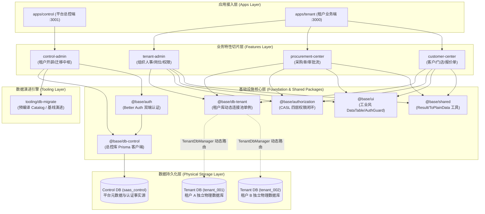

# 系统数智 ERP 整体系统架构白皮书 (System Architecture Whitepaper)

> **文档定位**：本文档为系统数智 ERP 系统的**架构总纲与全景索引导航**，旨在高维梳理系统定位、核心技术栈、分层拓扑、设计哲学与四大架构支柱。
> **阅读规约**：本白皮书仅作为高维概述与全景索引；各项核心基础设施的详细实现原理、代码细节、端到端时序流转与数据迁移规格，请依照各章节指引查阅对应的专项深度技术文档。

---

## 一、 系统定位与业务边界

系统数智 ERP 是一套面向现代化数字化工业制造、中央厨房与冷链生鲜供应链的云原生企业级 SaaS 系统。
系统在顶层划分为两大物理与逻辑隔离的运行平面：

1. **平台管控平面 (Control Plane - `apps/control`)**：
   面向平台超级管理员与集中运维运营团队。负责企业租户开辟与注销（Onboarding & Offboarding）、租户物理数据库生命周期治理、租户拓扑路由解析、跨租户版本迁移中枢（Migration Hub）与全局安全审计。
2. **租户数据平面 (Data Plane / Tenant SaaS - `apps/tenant`)**：
   面向各入驻企业的内部员工（从企业 Owner、各级部门主管到车间基层业务员）。提供包含组织人事架构、岗位字典、细粒度权限控制台、采购管理中心、客户与门店中心等垂直业务切片。

---

## 二、 核心技术栈全景 (Technology Matrix)

| 层次 | 技术选型 | 版本/规范 | 选型考量与工程收益 |
| :--- | :--- | :--- | :--- |
| **前端应用框架** | Next.js App Router | `16.3.x` (Turbopack) | React Server Components (RSC) 直调应用层，消除网络瀑布流，原生流式渲染 |
| **UI 交互与渲染** | React + Tailwind CSS | `React 19` + `Tailwind v4` | 现代工业风高密度交互，基于 `@base/ui` 纯数据契约驱动受控三态渲染 |
| **持久层与 ORM** | Prisma + `@prisma/adapter-pg` | `7.10.x` | 强类型安全数据访问，驱动适配器解耦，支持 PostgreSQL 17 原生连接 |
| **数据库存储引擎** | PostgreSQL | `17-alpine` | Database-per-tenant 物理隔离，事务级咨询锁支持，JSONB 策略高效存储 |
| **身份认证引擎** | Better Auth + Organization 插件 | `1.7.x` | 会话状态轻量安全托管，多租户上下文隔离，支持动态角色模型 |
| **权限与授权引擎** | CASL (`@casl/ability` + `@casl/prisma`) | `6.x` | 四层细粒度权限闭环 (功能 + 数据范围 SQL 下推 + 字段三态 + 准入门禁) |
| **单体模块化编排** | Turborepo + pnpm Workspace | `Turbo 2.x` + `pnpm 11.x` | 依赖拓扑确定性、精准增量构建缓存、严禁跨包幽灵依赖 |

---

## 三、 整体系统架构分层拓扑

系统严格遵循 **垂直切片 (FDD) + 物理隔离分层** 架构，各层之间单向依赖，杜绝反向或环状引用：



---

## 四、 核心架构规划与设计思想

系统架构由四大核心支柱共同筑起，本节作为高维概括，具体实现请跳转对应的专项深度解析：

### 1. 多租户物理隔离架构 (Database-per-Tenant)

- **绝对物理隔离**：每个企业租户拥有完全独立的 PostgreSQL 物理数据库（`tenant_<slug>`），业务数据（采购单据、客户价格协议、库存资产等）物理隔离，杜绝共享库模式下因手写 SQL 或 ORM 过滤遗漏引发的跨租户数据泄露。
- **凭据安全解耦 (`secretRef`)**：管控库 `tenant_database` 仅持久化安全引用标识，运行时经由 `SecretResolver` 从受控环境变量或配置中枢求值，严禁数据库明文存储密码。
- **动态连接池治理 (`TenantDbManager`)**：
  - 挂载全局 `globalThis` 单例，彻底免疫 Next.js Turbopack / Webpack 开发期 HMR 模块重新求值引发的连接句柄泄漏；
  - 采用 `initializing` Promise 锁式合并，实现并发防击穿（Thundering Herd Protection）；
  - 支持租户停用与结构变更时的连接淘汰（`evict`）与停机排空（`closeAll`）。
- **租户全生命周期闭环**：平台管理员在总控后台一键完成租户创建、分布式咨询锁互斥、物理数据库原子开辟、Baseline DDL 执行、种子数据灌装与可用性验证。

> 📖 **专项详细文档**：关于多租户双平面模型、动态连接池源码解析、并发防击穿与开通全流程时序图，详见 **[《多租户 SaaS 架构与隔离机制深度解析》(`docs/architecture/saas-multitenant-architecture.md`)](./architecture/saas-multitenant-architecture.md)**。

---

### 2. 四层细粒度权限闭环体系 (Four-Tier Authorization)

权限体系严格践行 **Fail-Closed（默认关闭拒绝）**、**职责分离（进门看 Better Auth，屋内决策看 CASL）** 与 **前后端双向闭环阻断** 原则：

```text
第 4 层：租户准入门禁 (Tenant Access Gate)
  └── 校验租户物理库中员工档案 (EmployeeProfile) 状态，离职/停用直接硬阻断
第 1 层：功能操作权限 (Statement)
  └── resource:action (如 customer.read, order.audit)，驱动按钮显隐与 Server Action 动作拦截
第 2 层：行级数据范围 (Data Scope)
  └── ALL / DEPT_TREE / DEPT / SELF / CUSTOM，结合组织部门树拓扑
  └── 经 accessibleBy 自动下推为 Prisma Where 语句，由 PostgreSQL 原生索引执行过滤
第 3 层：敏感字段三态策略 (Field Policy)
  └── EDITABLE (可编辑) / READONLY (只读锁定并渲染 Badge) / HIDDEN (隐藏物理剥离)
  └── 读取时：服务端 pickReadableFields 物理剔除敏感键；写入时：assertEditableFields 校验防篡改
```

- **RSC 跨端序列化防线 (`AbilitySnapshot`)**：类实例与函数不跨端传输，Server Component 提取纯 JSON 快照，客户端 `TenantAbilityProvider` 动态重建 CASL Ability。
- **工业级声明式 UI 积木**：`AuthGuard` 守卫组件、`AuthField` 字段三态渲染器、`DataTableActionButton` 自动置灰或隐藏。
- **导航菜单服务端裁剪**：`filterNavSections` 在 Server Component 阶段剔除无权菜单项与空分组，杜绝界面死链。

> 📖 **专项详细文档**：关于四层权限编译细节、SQL 自动下推源码、字段物理剥离机制与端到端交互时序，详见 **[《权限系统全链路架构与原理解析》(`docs/permissions/permission-architecture-deep-dive.md`)](./permissions/permission-architecture-deep-dive.md)** 及 **[《字段级权限设计资产》(`docs/permissions/Field_Level_Permission_Architecture_and_Implementation.md`)](./permissions/Field_Level_Permission_Architecture_and_Implementation.md)**。

---

### 3. 云原生 Day 0 数据库自愈与演进引擎 (`tooling/db-migrate`)

针对多租户环境与生产容器首次冷启动，系统自研了符合云原生 **12-Factor 原则** 的无状态迁移引擎：

- **移除运行期 Prisma CLI 依赖**：
  - 彻底解决 Next.js 打包后磁盘文件路径丢失（`ENOENT`）问题；
  - 生产镜像无需预装庞大的 Prisma CLI 与编译器依赖，实现安全轻量化；
  - 基线与增量 SQL 在构建期预编译为静态只读常量 `runtime-catalog.ts`，运行期 0 CLI 派生，毫秒级直接执行。
- **切片 Schema 动态聚合 (`@db-migrate-extension`)**：各业务切片在本地声明模型与反向关系扩展，聚合器自动提取织入主模型，消除跨包外键耦合。
- **Day 0 状态机自愈与分布式锁**：
  - 严格状态机探查：`EMPTY`（空库）-> `READY`（健康就绪）-> `PARTIAL`（残缺脏库 Fail-Closed 阻断）-> `CHECKSUM_MISMATCH`（代码篡改阻断）；
  - 采用 PostgreSQL 事务级咨询锁 `pg_advisory_xact_lock`，提交时自动释放，完美适配 PgBouncer 事务连接池。

> 📖 **专项详细文档**：关于 12-Factor 原则设计论证、Schema 聚合器实现、状态机流转图与咨询锁机制，详见 **[《数据库自愈与演进引擎架构解析》(`docs/architecture/database-migration-engine.md`)](./architecture/database-migration-engine.md)**。

---

### 4. Feature-based Vertical Slice 与构建期动态自发现

系统全面推行 **垂直切片 (Feature-Driven Development)** 架构规范，杜绝横向技术分层带来的依赖蔓延：

- **切片物理高内聚 (`packages/features/*`)**：
  - 单一切片涵盖数据模型、纯数据权限契约（`contracts/`）、领域服务（`services/`）、安全 Actions 与交互组件（`components/`）；
  - 对外仅导出受控清单 `manifest.ts` 与统一入口 `index.ts`。
- **构建期动态自发现 (`Feature Manifest`)**：
  - 在 `dev` / `build` 前置执行轻量脚本 `scripts/sync-features.mjs`（~10ms）；
  - 静态聚合生成 `apps/tenant/src/kernel/registry.generated.ts`，汇聚全局菜单、CASL 权限目录与角色赋权树。
- **切片依赖解耦防腐 (ADR-006)**：
  - 所有业务切片（`customer-center`、`procurement-center`、`tenant-admin`）彼此平级，**严禁互相依赖**；
  - `apps/tenant` 位于拓扑顶层作为“装配者”；系统管理组件 `RolePermissionManager` 采用控制反转 (IoC)，由页面 SSR 阶段注入全局权限树。
- **现代工业风高密度 UI/UX 哲学**：
  - **无白屏 (No Blank Out)**：Suspense + Skeleton 局部流式占位，杜绝跳转闪烁；
  - **静默同步 (Silent Sync)**：筛选排序状态严格同步 URL Query，支持刷新与链接分享复原；
  - **单次确认 (Single Confirm)**：破坏性操作单次模态对话框确认，Action 执行期间按钮锁定防重；
  - **高密度 DataTable**：分面过滤、自定义列宽、批量操作栏与侧滑详情抽屉一体化。

> 📖 **专项详细文档**：关于垂直切片规范、构建期清单同步、ADR-006 解耦设计与工业风设计系统，详见 **[《垂直切片与动态自发现架构解析》(`docs/architecture/fdd-vertical-slice-architecture.md`)](./architecture/fdd-vertical-slice-architecture.md)** 与 **[《特性清单与动态自发现架构规范》(`docs/architecture/Feature_Manifest_and_Dynamic_Discovery_Architecture.md`)](./architecture/Feature_Manifest_and_Dynamic_Discovery_Architecture.md)**。

---

## 五、 部署拓扑与生产环境规范概要

- **集群拓扑**：
  - **平台管控平面**：单一无状态 Web 实例集群（连接集中库 `saas_control`）；
  - **租户数据平面**：水平弹性伸缩的无状态 Web 实例集群（请求携带租户会话，经由 `TenantDbManager` 动态路由至 `tenant_<slug>` 物理库）；
  - **发布态与运行态分离**：数据库 DDL 演进由独立任务在发布流程中显式收敛，业务进程不内嵌随意的动态 DDL。
- **容器化交付**：
  - 基于 Docker Compose 的多阶段构建分发；生产镜像剥离编译工具，仅携带 Next.js standalone 运行时产物。

> 📖 **专项详细文档**：关于 Docker Compose 本地打包、生产环境变量配置、镜像优化与 Day 0 冷启动部署，详见 **[《生产与多环境部署实战指南》(`docs/deployment/DEPLOYMENT.md`)](./deployment/DEPLOYMENT.md)**。

---

## 六、 全局架构资产与决策记录 (ADR) 权威索引

为保障架构演进的确定性与工程协同一致性，系统所有设计与决策均收敛于以下权威索引矩阵：

### 1. 专项架构深度解析文档 (`docs/`)

| 专项领域 | 文档路径 | 核心内容概要 |
| :--- | :--- | :--- |
| **权限系统全链路** | [`docs/permissions/permission-architecture-deep-dive.md`](./permissions/permission-architecture-deep-dive.md) | 前端门禁、四层权限模型、SQL 下推、字段物理剥离与端到端时序 |
| **字段权限设计资产** | [`docs/permissions/Field_Level_Permission_Architecture_and_Implementation.md`](./permissions/Field_Level_Permission_Architecture_and_Implementation.md) | 字段三态控制、物理剥离、安全导出与组件拦截实战指南 |
| **多租户 SaaS 架构** | [`docs/architecture/saas-multitenant-architecture.md`](./architecture/saas-multitenant-architecture.md) | 双平面隔离、Database-per-Tenant、连接池治理与租户全生命周期 |
| **自愈数据迁移引擎** | [`docs/architecture/database-migration-engine.md`](./architecture/database-migration-engine.md) | 12-Factor、预编译 Catalog、Schema 聚合、Day 0 自愈与咨询锁 |
| **垂直切片与动态发现** | [`docs/architecture/fdd-vertical-slice-architecture.md`](./architecture/fdd-vertical-slice-architecture.md) | FDD 切片规范、构建期清单自发现、ADR-006 解耦与工业风 UI/UX |
| **特性清单技术架构** | [`docs/architecture/Feature_Manifest_and_Dynamic_Discovery_Architecture.md`](./architecture/Feature_Manifest_and_Dynamic_Discovery_Architecture.md) | Feature Manifest 规范、静态 AST 提取与构建流水线对接 |
| **生产与多环境部署** | [`docs/deployment/DEPLOYMENT.md`](./deployment/DEPLOYMENT.md) | 生产容器化打包、Docker Compose、环境变量与部署实战 |
| **团队协同与 Harness** | [`docs/collaboration/harness-collaboration-guide.md`](./collaboration/harness-collaboration-guide.md) | 智能体协作工程流、角色契约与记忆演进指南 |
| **历史归档与 PRD 资产** | [`docs/archive/README.md`](./archive/README.md) | 早期 SaaS 实施规格、闭环设计方案与租户产品结构定义 |

### 2. 团队持久记忆与架构决策记录 (ADR - `.harness/memory/adr/`)

| ADR 编号 | 决策记录路径 | 核心决策要点 |
| :--- | :--- | :--- |
| **ADR-001** | [ADR-001: Modular Monorepo、Feature-based Vertical Slice 与 Harness 工程架构](../.harness/memory/adr/ADR-001-fdd-and-harness.md) | 确立模块化 Monorepo、业务垂直切片与智能体工程协作体系 |
| **ADR-002** | [ADR-002: Database-per-tenant 物理隔离战略](../.harness/memory/adr/ADR-002-database-per-tenant.md) | 确立放弃共享单库、全面采用物理分库隔离的战略决策 |
| **ADR-003** | [ADR-003: Better Auth 与 CASL 四层权限闭环](../.harness/memory/adr/ADR-003-four-tier-permissions.md) | 确立 Better Auth 认证与 CASL 授权分工以及四层权限模型 |
| **ADR-004** | [ADR-004: Feature-based Vertical Slice 与多 App 解耦](../.harness/memory/adr/ADR-004-fdd-vertical-slices-and-multi-app.md) | 消除内部 HTTP 伪接口自调，推行 RSC 直调应用服务 |
| **ADR-005** | [ADR-005: 特性清单与构建期动态自发现](../.harness/memory/adr/ADR-005-feature-manifest-and-build-time-discovery.md) | 确立构建期扫描静态聚合清单、解决 Turbopack 限制 |
| **ADR-006** | [ADR-006: 租户应用 Kernel 装配与切片解耦机制](../.harness/memory/adr/ADR-006-app-kernel-assembly-and-slice-decoupling.md) | 拨乱反正消除兄弟切片横向依赖，确立顶层 Kernel 装配与 IoC |

### 3. 工程规范与交互指南 (`.harness/context/`)

| 维度 | 规范路径 | 适用场景 |
| :--- | :--- | :--- |
| **工业风设计系统** | [`.harness/context/design-system.md`](../.harness/context/design-system.md) | 工业数智化高密度 UI/UX 规范、色彩代币与响应式交互 |
| **领域拓扑矩阵** | [`.harness/context/tier-2-domain-matrix.md`](../.harness/context/tier-2-domain-matrix.md) | Monorepo 模块分层矩阵、边界防腐与反平铺规约 |
| **深度协议指南** | [`.harness/context/tier-3-deep-dives.md`](../.harness/context/tier-3-deep-dives.md) | 物理分库连接池协议、四层鉴权落地与状态机判定 |
