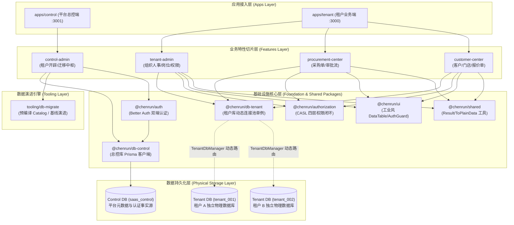
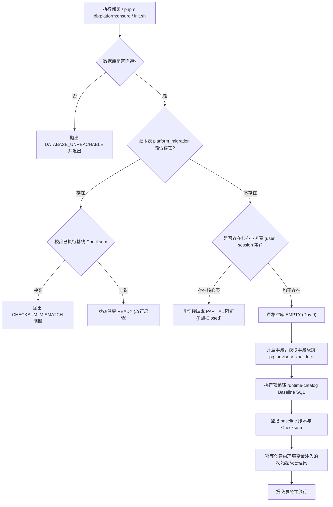

# 宸润数智 ERP 整体系统架构白皮书 (System Architecture Whitepaper)

## 一、 系统定位与业务边界

宸润数智 ERP 是一套面向现代化工业制造与供应链业务的云原生企业级 SaaS 系统。
系统服务于两大核心使用场景：

1. **平台管控端 (Control Plane - `apps/control`)**：
   面向系统超级管理员与平台运维运营团队。负责企业租户开通（Onboarding）、租户物理数据库生命周期管理、动态拓扑路由调度、跨租户版本迁移中枢（Migration Hub）与平台级审计日志。
2. **租户业务端 (Data Plane / Tenant SaaS - `apps/tenant`)**：
   面向入驻企业的内部员工（从企业法人 Owner、各部门主管到基层业务员）。提供包含组织人事架构、岗位字典、细粒度权限控制台、采购管理中心、客户与门店中心等垂直业务切片。

---

## 二、 核心技术栈全景 (Technology Matrix)

| 层次 | 技术选型 | 版本/规范 | 选型考量与工程收益 |
| :--- | :--- | :--- | :--- |
| **前端应用框架** | Next.js App Router | `16.3.x` (Turbopack) | React Server Components (RSC) 直调应用层，零网络瀑布，原生流式渲染 |
| **UI 交互与渲染** | React + Tailwind CSS | `React 19` + `Tailwind v4` | 工业数智化高密度界面，基于 `@chenrun/ui` 纯数据契约与受控三态渲染 |
| **持久层与 ORM** | Prisma + `@prisma/adapter-pg` | `7.10.x` | 强类型数据访问，驱动适配器分层解耦，支持 PostgreSQL 17 原生连接 |
| **数据库存储引擎** | PostgreSQL | `17-alpine` | Database-per-tenant 物理隔离，事务级咨询锁支持，JSONB 策略下推 |
| **身份认证引擎** | Better Auth + Organization 插件 | `1.7.x` | 会话状态轻量安全托管，多租户上下文隔离，支持动态角色模型 |
| **权限与授权引擎** | CASL (PrismaAbility) | `6.x` | 四层权限闭环 (功能 + 数据范围 + 字段三态 + 动态策略下推) |
| **单体模块化编排** | Turborepo + pnpm Workspace | `Turbo 2.x` + `pnpm 11.x` | 依赖拓扑确定性、精准增量构建缓存、严禁跨包幽灵依赖 |

---

## 三、 整体系统架构分层拓扑

系统遵循 **垂直切片 (FDD) + 物理隔离分层** 架构，各层之间单向依赖，杜绝反向或环状引用：



---

## 四、 核心架构设计支柱

### 1. 多租户物理隔离架构 (Database-per-Tenant)

- **绝对物理隔离**：每个租户拥有完全独立的 PostgreSQL 物理数据库（`tenant_<slug>`），业务表（采购单、客户、员工档案等）绝不共享同一数据库实例。
- **连接凭据隔离 (SecretRef)**：平台总控库 (`saas_control`) 中的 `tenant_database` 拓扑表中仅存储密文索引或安全环境变量引用（`secretRef`），严禁在数据库明文持久化真实数据库密码。
- **动态连接池治理 (`TenantDbManager`)**：
  - 由 `@chenrun/db-tenant` 暴露全局单例管理物理连接；
  - 挂载于 `globalThis` 防止 Next.js 开发期 HMR (Hot Module Replacement) 产生连接句柄泄漏；
  - 按照活跃租户上下文动态按需创建/复用连接，并提供优雅注销（`evict`）与停机排空（`closeAll`）。

---

### 2. 四层细粒度权限闭环 (Four-Layer Authorization)

基于 Better Auth 与 CASL 构建无死角鉴权闭环：

```text
第 1 层：功能操作权限 (Statement)
  └── resource:action (如 procurement.order:create, customer:export)
第 2 层：数据范围权限 (Data Scopes)
  └── ALL (全量) / DEPT_TREE (本部门及下级部门) / DEPT (本部门) / SELF (仅本人)
  └── 通过 Prisma accessibleBy / Where 条件实现 SQL 查询安全下推
第 3 层：字段级三态控制 (Field Policies)
  └── EDITABLE (可编辑) / READONLY (只读) / HIDDEN (物理剥离)
  └── 在 DataTable 表格渲染与 Server Action 传输时对 HIDDEN 字段进行服务端彻底脱敏剥离
第 4 层：租户准入门禁 (Tenant Access Gate)
  └── 拦截离职 (TERMINATED) 或停职 (SUSPENDED) 成员，执行严格 Fail-Closed 阻断
```

---

### 3. 云原生 Day 0 数据库自愈与演进引擎 (`tooling/db-migrate`)

针对新环境与生产首次部署，系统建立了符合 12-Factor App 规范的数据库初始化机制：



- **脱离 Prisma CLI 运行期依赖**：全量 Baseline SQL 在开发期预编译为静态常量 `runtime-catalog.ts`，生产镜像无需携带庞大的 Prisma CLI 与编译依赖。
- **发布态与运行态彻底解耦**：移除 Web HTTP 请求链路上的所有 DDL 拦截与 Next.js `instrumentation.ts` 钩子，消除 Serverless 冷启动并发惊群。
- **事务级分布式锁**：使用 `pg_advisory_xact_lock` 并设置 `SET LOCAL lock_timeout = '15s'`，随事务提交自动释放，天然适配 PgBouncer 事务连接池。
- **Ledger-First 状态探查**：以迁移账本表为主判定，即使云端托管库预装了扩展辅助表（如 PostGIS `spatial_ref_sys`），也不会误判为残缺库。

---

### 4. 垂直切片规范 (Feature-Driven Development)

每个切片（`packages/features/<slice>`）均为高内聚功能单元，禁止随意向外暴露私有实体：

- **纯数据契约事实源 (`contracts/`)**：页面与交互的受控字段、动作由纯 TypeScript 契约声明，禁止在组件层手写平铺权限。
- **Action 安全序列化 (`defineServerAction`)**：所有 Server Actions 统一使用 `@chenrun/shared` 提供的包装工厂，原生解决 Prisma Decimal/Date 的 React RSC 跨端序列化报错。
- **工业风高密度交互 (`@chenrun/ui`)**：严格遵守无白屏体验，所有状态变更由 React 本地 State 优先响应配合 Next.js Server Action 静默同步；破坏性操作单次 Modal 确认，提示由右上角 Toast 弹出。

---

## 五、 系统拓扑与物理模型概要

- **双端分工**：
  - **平台管控平面 (Control Plane)**：单一逻辑集群，连接 `saas_control` 集中管控库。
  - **租户数据平面 (Data Plane)**：多实例无状态水平集群，依据请求携带的租户 Session 经由 `TenantDbManager` 路由至各租户专属物理库。
- **发布态与运行态分离原则**：
  系统严格遵循 12-Factor 原则，数据库 DDL 演进由独立的迁移工具（`@chenrun/db-migrate`）在发布流程中显式收敛，Web 业务进程不内嵌随意的动态 DDL。
- **详细部署方案**：
  关于基于 Docker Compose 的本地打包、镜像分发、生产环境配置与 Day 0 详细冷启动流程，请参阅专门的 [《生产与多环境部署实战指南》(`docs/DEPLOYMENT.md`)](./DEPLOYMENT.md)。

---

## 六、 架构演进与决策记录 (ADR)

核心架构历史选型与推演细节收录于仓库持久化记忆中：

- [ADR-001: FDD 垂直切片与 Harness 工程架构](.harness/memory/adr/ADR-001-fdd-and-harness.md)
- [ADR-002: Database-per-tenant 物理隔离战略](.harness/memory/adr/ADR-002-database-per-tenant.md)
- [ADR-003: Better Auth 与 CASL 四层权限闭环](.harness/memory/adr/ADR-003-four-tier-permissions.md)
- [ADR-004: FDD 垂直切片与多 App 解耦](.harness/memory/adr/ADR-004-fdd-vertical-slices-and-multi-app.md)
- [ADR-005: 特性清单与构建期动态自发现](.harness/memory/adr/ADR-005-feature-manifest-and-build-time-discovery.md)
- [ADR-006: 租户应用 Kernel 装配与切片解耦机制](.harness/memory/adr/ADR-006-app-kernel-assembly-and-slice-decoupling.md)
