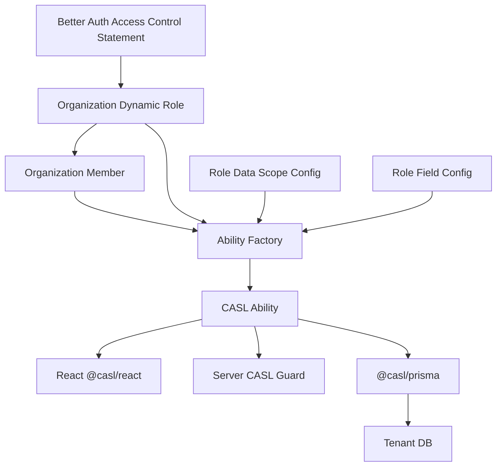
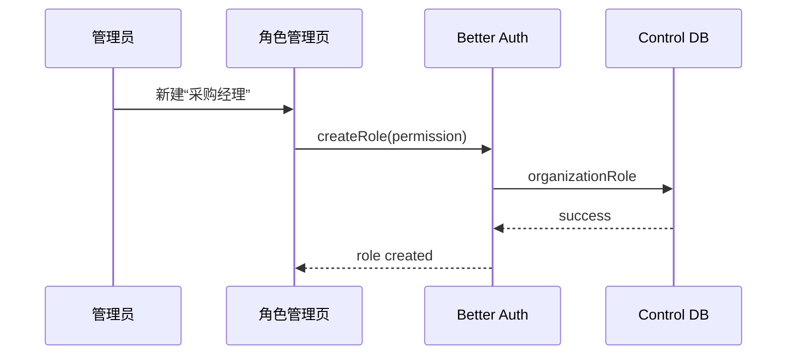
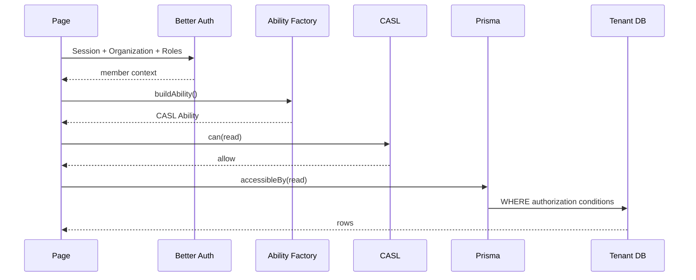

# 权限系统流程与伪代码手册

## 成熟框架版：Better Auth + CASL

> 本文只讲权限。  
> 不再设计自定义 Permission Registry（权限注册表）和自定义 Authorization Engine（授权引擎）。  
> 核心使用：
>
> - Better Auth：Role（角色）+ Resource（资源）+ Action（动作）
> - CASL：Action（动作）+ Subject（资源对象）+ Conditions（条件）+ Fields（字段）
> - `@casl/prisma`：把数据权限转换成 Prisma `where`
> - `@casl/react`：前端声明式权限

---

# 1. 整体流程



---

# 2. 功能权限从哪里定义

使用 Better Auth 官方 Access Control（访问控制）。

```typescript
import {
  createAccessControl
} from "better-auth/plugins/access";

export const statement = {
  "procurement.order": [
    "read",
    "create",
    "update",
    "audit",
    "export",
  ],

  "inventory.stock": [
    "read",
    "adjust",
    "export",
  ],
} as const;

export const ac =
  createAccessControl(statement);
```

这就是系统功能能力清单。

没有自定义 Permission Registry。

---

# 3. Better Auth 动态角色

```typescript
organization({
  ac,
  dynamicAccessControl: {
    enabled: true,
  },
});
```

管理员可以创建角色：

```text
采购员
采购经理
审核员
```

例如“采购经理”：

```json
{
  "procurement.order": [
    "read",
    "create",
    "update",
    "audit",
    "export"
  ]
}
```

Better Auth 保存角色及功能权限。

---

# 4. Role 管理流程



---

# 5. UI 中文名称

Better Auth Statement 是安全定义：

```text
procurement.order
read
create
audit
```

中文展示单独：

```typescript
export const labels = {
  "procurement.order": {
    label: "采购订单",
    actions: {
      read: "查看",
      create: "新建",
      update: "修改",
      audit: "审核",
      export: "导出",
    },
  },
};
```

注意：

```text
labels
```

只是 UI 元数据。

删掉它也不会改变安全结果。

---

# 6. Data Scope（数据范围）为什么不交给 Better Auth

Better Auth 功能权限回答：

```text
能不能 read？
```

但 ERP 还要问：

```text
能 read 哪些订单？
```

所以我们保存很薄的配置：

```text
role_data_scope
```

---

# 7. role_data_scope 表

```text
role_data_scope
---------------
organization_id
role_name
resource
action
scope_type
scope_value_json
```

例如：

```text
organization = chenrun
role = procurement_manager
resource = procurement.order
action = read
scope_type = DEPT_TREE
```

---

# 8. Data Scope 类型

```text
SELF       本人
DEPT       本部门
DEPT_TREE  本部门及下级
CUSTOM     指定部门
ALL        全部
```

---

# 9. Field Policy（字段权限）配置

```text
role_field_policy
-----------------
organization_id
role_name
subject
field
access
```

Access：

```text
HIDDEN
READONLY
EDITABLE
```

---

# 10. 为什么字段三态不需要新引擎

CASL Fields（字段）已经能表示：

```text
哪些字段能 read
哪些字段能 update
```

映射：

```text
read=no
→ HIDDEN

read=yes + update=no
→ READONLY

read=yes + update=yes
→ EDITABLE
```

---

# 11. Ability Factory（能力构建器）

Ability Factory 是唯一核心适配代码。

伪代码：

```typescript
async function buildAbility(ctx) {
  const {
    organizationId,
    memberId,
    userId,
    deptId,
  } = ctx;

  // 1. Better Auth 当前成员角色
  const roles =
    await getOrganizationMemberRoles(
      organizationId,
      memberId
    );

  // 2. Better Auth 动态角色功能权限
  const rolePermissions =
    await loadBetterAuthRolePermissions(
      organizationId,
      roles
    );

  // 3. ERP 扩展配置
  const scopeConfigs =
    await loadRoleDataScopes(
      organizationId,
      roles
    );

  const fieldConfigs =
    await loadRoleFieldPolicies(
      organizationId,
      roles
    );

  // 4. 当前部门树
  const deptTreeIds =
    await getDeptTreeIds(deptId);

  // 5. 生成 CASL Prisma Ability
  return createAbility({
    userId,
    deptId,
    deptTreeIds,
    rolePermissions,
    scopeConfigs,
    fieldConfigs,
  });
}
```

---

# 12. createAbility()

伪代码：

```typescript
function createAbility(input) {
  const {
    can,
    cannot,
    build
  } =
    new AbilityBuilder(
      createPrismaAbility
    );

  for (
    const permission
    of input.rolePermissions
  ) {
    compileFunctionalPermission(
      can,
      permission,
      input
    );
  }

  compileFieldRules(
    can,
    input.fieldConfigs
  );

  return build();
}
```

---

# 13. 功能权限转 CASL Action / Subject

Better Auth：

```text
resource = procurement.order
action = read
```

映射：

```text
Subject = PurchaseOrder
Action  = read
```

映射表：

```typescript
const subjectMap = {
  "procurement.order":
    "PurchaseOrder",

  "inventory.stock":
    "InventoryStock",
};
```

---

# 14. ALL Scope

```typescript
can(
  "read",
  "PurchaseOrder"
);
```

没有 Conditions（条件）：

```text
全部数据
```

---

# 15. SELF Scope

```typescript
can(
  "read",
  "PurchaseOrder",
  {
    createdById:
      input.userId
  }
);
```

---

# 16. DEPT Scope

```typescript
can(
  "read",
  "PurchaseOrder",
  {
    deptId:
      input.deptId
  }
);
```

---

# 17. DEPT_TREE Scope

```typescript
can(
  "read",
  "PurchaseOrder",
  {
    deptId: {
      in:
        input.deptTreeIds
    }
  }
);
```

---

# 18. CUSTOM Scope

```typescript
can(
  "read",
  "PurchaseOrder",
  {
    deptId: {
      in:
        scopeConfig.departmentIds
    }
  }
);
```

---

# 19. Fields（字段）规则

假设采购经理：

```text
supplierName = EDITABLE
costPrice    = READONLY
```

则：

```typescript
can(
  "read",
  "PurchaseOrder",
  [
    "supplierName",
    "costPrice"
  ]
);

can(
  "update",
  "PurchaseOrder",
  [
    "supplierName"
  ]
);
```

因为：

```text
costPrice 不在 update fields
```

所以：

```text
READONLY
```

---

# 20. 功能 + Data Scope + Field 一起生成

更完整：

```typescript
can(
  "read",
  "PurchaseOrder",
  [
    "id",
    "supplierName",
    "quantity",
    "costPrice"
  ],
  {
    deptId: {
      in: deptTreeIds
    }
  }
);

can(
  "update",
  "PurchaseOrder",
  [
    "supplierName",
    "quantity"
  ],
  {
    deptId: {
      in: deptTreeIds
    }
  }
);
```

这就是 CASL 最有价值的地方：

> 一条授权 Rule（规则）同时包含动作、字段和数据条件。

---

# 21. 多角色如何合并

张三：

```text
采购员
+
审核员
```

Ability Factory 把两个角色的 Rules 全部加入：

```typescript
can("read", ...);
can("create", ...);
can("update", ...);
can("audit", ...);
```

CASL 自己负责判定。

不需要自己做：

```text
Effective Permission Set Engine
```

---

# 22. 服务端基础检查

```typescript
const ability =
  await getCurrentAbility();

ForbiddenError
  .from(ability)
  .throwUnlessCan(
    "create",
    "PurchaseOrder"
  );
```

---

# 23. Decorator（装饰器）

```typescript
function RequireAbility(
  action,
  subject
) {
  return function (
    originalMethod,
    context
  ) {
    return async function (...args) {
      const ability =
        await getCurrentAbility();

      ForbiddenError
        .from(ability)
        .throwUnlessCan(
          action,
          subject
        );

      return originalMethod
        .apply(this, args);
    };
  };
}
```

使用：

```typescript
class PurchaseOrderService {

  @RequireAbility(
    "create",
    "PurchaseOrder"
  )
  async createOrder(input) {
    // ...
  }
}
```

---

# 24. 列表查询：使用 @casl/prisma

```typescript
import {
  accessibleBy
} from "@casl/prisma";

async function listOrders(query) {
  const ability =
    await getCurrentAbility();

  const authWhere =
    accessibleBy(
      ability,
      "read"
    ).PurchaseOrder;

  return prisma
    .purchaseOrder
    .findMany({
      where: {
        AND: [
          authWhere,
          buildBusinessWhere(query),
        ],
      },
    });
}
```

数据权限真正进入：

```text
Prisma where
```

---

# 25. 为什么不能查全部再过滤

错误：

```typescript
const all =
  await prisma.purchaseOrder
    .findMany();

return all.filter(...);
```

问题：

```text
性能差
可能泄漏
统计容易出错
批量操作危险
```

正确：

```text
accessibleBy
↓
数据库直接过滤
```

---

# 26. Detail（详情）查询

不要：

```typescript
findUnique({ id })
```

然后再决定。

推荐：

```typescript
const where =
  accessibleBy(
    ability,
    "read"
  ).PurchaseOrder;

const order =
  await prisma
    .purchaseOrder
    .findFirst({
      where: {
        AND: [
          { id },
          where,
        ],
      },
    });
```

---

# 27. Update（修改）查询

```typescript
const authWhere =
  accessibleBy(
    ability,
    "update"
  ).PurchaseOrder;

const order =
  await prisma
    .purchaseOrder
    .findFirst({
      where: {
        AND: [
          { id },
          authWhere,
        ],
      },
    });
```

找不到就：

```text
404 / 403
```

---

# 28. 单条数据再次检查

如果已经拿到实体：

```typescript
import {
  subject
} from "@casl/ability";

ForbiddenError
  .from(ability)
  .throwUnlessCan(
    "audit",
    subject(
      "PurchaseOrder",
      order
    )
  );
```

这样 CASL 会根据实体 Conditions 判断。

---

# 29. 读取字段

我们可以包装：

```typescript
function getReadableFields(
  ability,
  subjectName
) {
  return permittedFieldsOf(
    ability,
    "read",
    subjectName,
    fieldOptions
  );
}
```

Response：

```typescript
const readableFields =
  getReadableFields(
    ability,
    "PurchaseOrder"
  );

return pick(
  order,
  readableFields
);
```

---

# 30. 修改字段

```typescript
const editableFields =
  getEditableFields(
    ability,
    "PurchaseOrder"
  );

for (
  const key
  of Object.keys(input)
) {
  if (
    !editableFields.includes(key)
  ) {
    throw new ForbiddenError();
  }
}
```

---

# 31. 为什么 READONLY 修改要直接报错

不要：

```typescript
delete input.costPrice;
```

而应该：

```text
明确拒绝
```

因为客户端提交了一个无权修改字段。

---

# 32. Export（导出）

完整：

```typescript
@RequireAbility(
  "export",
  "PurchaseOrder"
)
async exportOrders(query) {
  const ability =
    await getCurrentAbility();

  const authWhere =
    accessibleBy(
      ability,
      "read"
    ).PurchaseOrder;

  const rows =
    await prisma.purchaseOrder
      .findMany({
        where: {
          AND: [
            authWhere,
            buildBusinessWhere(query),
          ],
        },
      });

  const fields =
    getReadableFields(
      ability,
      "PurchaseOrder"
    );

  return excel.export(
    rows,
    fields
  );
}
```

---

# 33. 前端 CASL Ability

前端不直接读取数据库角色结构。

服务器在 Layout 初始化时给：

```json
{
  "rules": [
    {
      "action": "read",
      "subject": "PurchaseOrder"
    },
    {
      "action": "create",
      "subject": "PurchaseOrder"
    }
  ]
}
```

客户端：

```typescript
const ability =
  createMongoAbility(rules);
```

> UI Rules 只用于界面控制。  
> 数据级 Conditions 的最终安全判断始终在 Server。

---

# 34. React `<Can>`

```tsx
import {
  Can
} from "@casl/react";

<Can
  I="create"
  a="PurchaseOrder"
  ability={ability}
>
  <Button>新建</Button>
</Can>
```

---

# 35. 自己包装更统一的组件

```tsx
function Permission({
  action,
  subject,
  children
}) {
  return (
    <Can
      I={action}
      a={subject}
      ability={ability}
    >
      {children}
    </Can>
  );
}
```

使用：

```tsx
<Permission
  action="create"
  subject="PurchaseOrder"
>
  <Button>新建</Button>
</Permission>
```

底层没有自研权限算法。

---

# 36. 字段前端三态

服务端可计算：

```typescript
function getFieldMode(
  ability,
  subject,
  field
) {
  const readable =
    ability.can(
      "read",
      subject,
      field
    );

  const editable =
    ability.can(
      "update",
      subject,
      field
    );

  if (!readable) {
    return "HIDDEN";
  }

  if (!editable) {
    return "READONLY";
  }

  return "EDITABLE";
}
```

---

# 37. `<PermissionField>`

```tsx
function PermissionField({
  mode,
  children
}) {
  if (
    mode === "HIDDEN"
  ) {
    return null;
  }

  return cloneElement(
    children,
    {
      readOnly:
        mode === "READONLY",
      disabled:
        mode === "READONLY",
    }
  );
}
```

CASL 决定权限。

组件只负责 UI。

---

# 38. 一次列表请求



---

# 39. 一次更新请求

```text
Server Action
↓
Application Service
↓
@RequireAbility(update)
↓
accessibleBy(update)
↓
找到允许修改的实体
↓
检查 editable fields
↓
Business Policy
↓
Transaction
↓
UPDATE
```

---

# 40. Business Policy（业务规则）

例如：

```typescript
@RequireAbility(
  "audit",
  "PurchaseOrder"
)
async auditOrder(id) {
  const order =
    await findAuditableOrder(id);

  assertPending(order);
  assertNotSelfApproval(order);

  // ...
}
```

CASL 不代替业务状态机。

---

# 41. Role 权限修改

功能 Action：

```text
Better Auth Dynamic Role API
```

Data Scope：

```text
role_data_scope
```

Field：

```text
role_field_policy
```

保存后：

```text
下次 buildAbility()
自动得到新规则
```

---

# 42. Cache（缓存）

V1 可以不做。

以后如果要缓存：

```text
organizationId
+
memberId
+
authzVersion
```

作为 Key。

任何 Role / Scope / Field 修改：

```text
authzVersion++
```

---

# 43. SaaS Tenant 隔离

Permission 之前先确定：

```text
activeOrganizationId
```

然后：

```text
organizationId
↓
tenant_database
↓
Tenant DB
```

CASL 只在当前 Tenant DB 内做数据范围。

跨 Tenant 隔离主要由：

```text
Better Auth Organization
+
Database-per-Tenant
```

负责。

---

# 44. 最小数据库表

Better Auth 管：

```text
user
session
organization
member
organizationRole
...
```

我们补：

```text
tenant_database
tenant_migration

role_data_scope
role_field_policy

department
```

不再自己建立：

```text
sys_role_permission
permission_registry
```

功能角色权限已经交给 Better Auth。

---

# 45. 这套流程最终是谁负责什么

```text
Better Auth
= Role / Resource / Action

CASL
= Conditions / Fields / can()

@casl/prisma
= 数据过滤

@casl/react
= 前端显示

Feature
= Business Policy

PostgreSQL
= Tenant 数据隔离
```

---

# 46. 最终公式

```text
最终允许
=
Better Auth 功能权限
+
CASL Data Conditions
+
CASL Fields
+
Business Policy
```

更准确地说：

```text
所有适用条件都必须满足。
```

---

# 47. V1 完成标准

```text
✅ Better Auth Organization
✅ Dynamic Roles
✅ Resource / Action
✅ 多角色

✅ CASL Ability Factory
✅ React <Can>
✅ @RequireAbility
✅ Prisma accessibleBy

✅ SELF
✅ DEPT
✅ DEPT_TREE
✅ CUSTOM
✅ ALL

✅ HIDDEN
✅ READONLY
✅ EDITABLE

✅ 列表
✅ 详情
✅ 修改
✅ 审核
✅ 导出
```

做到这些，权限基础设施就完成。

---

# 官方参考

- Better Auth Organization  
  <https://better-auth.com/docs/plugins/organization>
- Better Auth Next.js  
  <https://better-auth.com/docs/integrations/next>
- CASL  
  <https://github.com/stalniy/casl>
- CASL Examples  
  <https://github.com/stalniy/casl-examples>
- Prisma  
  <https://docs.prisma.io/docs/orm/core-concepts/supported-databases/postgresql>
