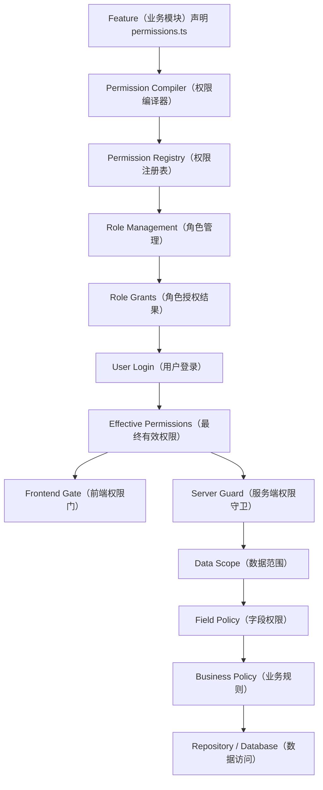
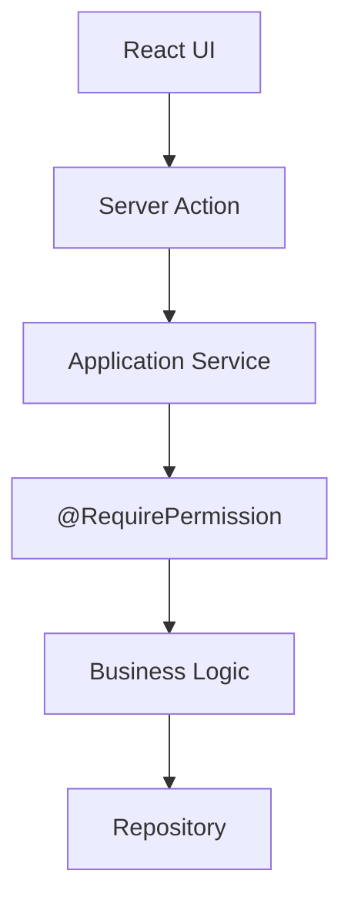
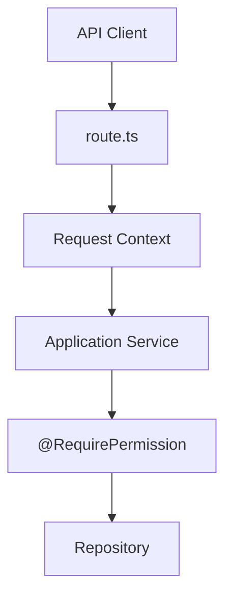
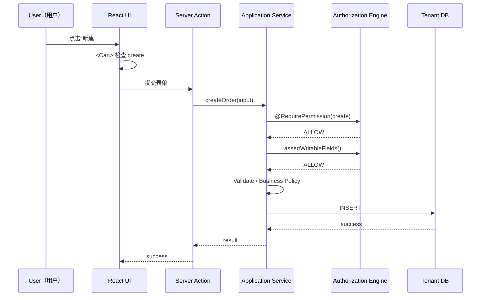
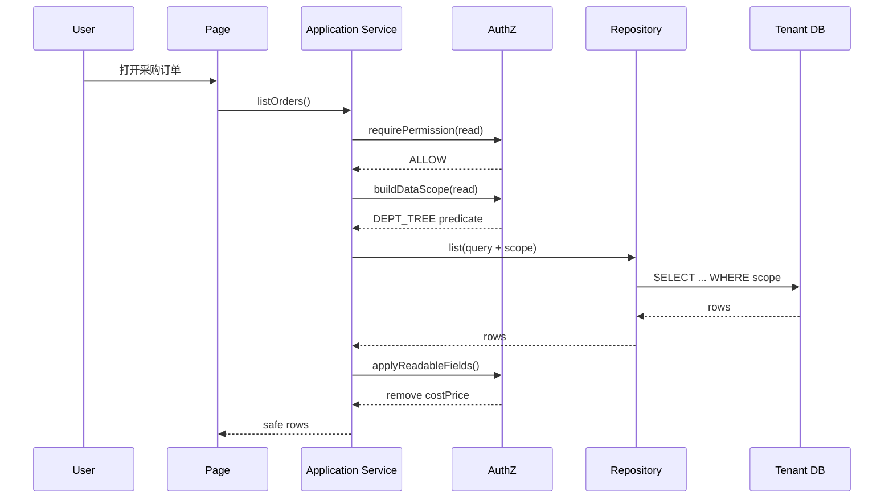
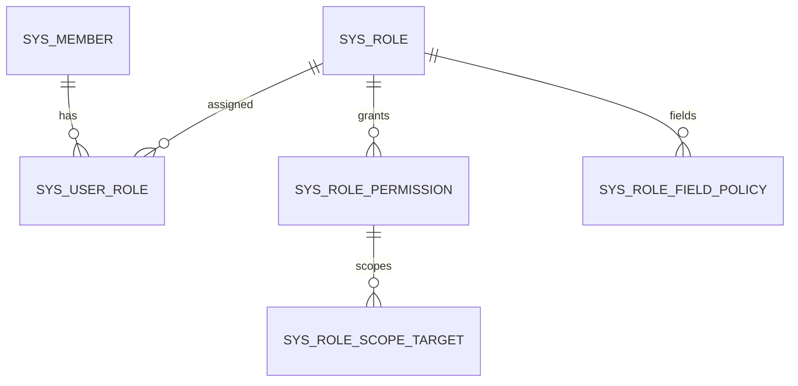
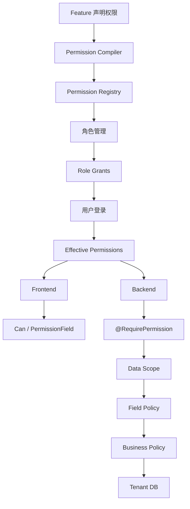

# 权限系统流程与伪代码手册
## SaaS Foundation Minimal（最小 SaaS 基础设施）权限子系统

> 这份文档只讲权限。  
> 目标是把整套权限系统从“定义 → 授权 → 登录 → 前端 → 后端 → 数据库查询 → 字段过滤 → 审计”的完整链路讲清楚。  
> 所有英文术语尽量使用“英文（中文解释）”形式；代码、类名、变量名、权限码保留英文，方便后续直接开发。

---

# 1. 先记住整个权限系统只有 4 层

```text
RBAC（基于角色的访问控制）
        ↓
Data Scope（数据范围权限）
        ↓
Field Policy（字段权限策略）
        ↓
Business Policy（业务规则策略）
```

分别回答：

```text
1. 你能不能做这件事？
2. 你能操作哪些数据？
3. 你能看/改哪些字段？
4. 当前业务状态是否允许？
```

例如：

```text
张三要审核采购订单 10001
```

完整判断：

```text
有 procurement.order.audit 权限？
        ↓
这张订单在张三的数据范围内？
        ↓
涉及字段是否允许读取/修改？
        ↓
订单当前是不是 pending？
        ↓
是不是张三自己提交的订单？
        ↓
ALLOW（允许）
```

---

# 2. 整体权限流程



一句话：

> **Feature 定义“系统有哪些权限”，Role 保存“角色拥有哪些权限”，User 登录后计算“当前用户最终拥有哪些权限”。**

---

# 3. 权限定义和角色授权是两回事

这是非常关键的一点。

## 3.1 Permission Registry（权限注册表）

表示：

```text
系统一共有哪些权限。
```

例如：

```text
procurement.order.read
procurement.order.create
procurement.order.update
procurement.order.audit
procurement.order.export
```

这些权限来自代码。

---

## 3.2 Role Grant（角色授权）

表示：

```text
采购员这个角色，被授予了哪些权限。
```

例如：

```text
采购员
├── procurement.order.read
├── procurement.order.create
└── procurement.order.update
```

这些授权结果保存在数据库。

---

# 4. 为什么不能把权限定义也存数据库

如果数据库手工维护：

```text
permission_code
permission_name
menu_id
button_id
...
```

会出现：

```text
代码有功能
数据库没权限

数据库有权限
代码已经删了

AI 新增功能忘记维护权限表
```

所以我们采用：

```text
Code-as-Config（代码即配置）
```

权限定义跟代码走。

---

# 5. Feature（业务模块）如何声明权限

例如采购模块：

```text
packages/features/procurement-center/
└── permissions.ts
```

伪代码：

```typescript
export const procurementPermissions = defineFeaturePermissions({
  feature: "procurement",
  name: "采购中心",

  resources: {
    order: {
      name: "采购订单",

      actions: {
        read: "查看",
        create: "新建",
        update: "修改",
        audit: "审核",
        export: "导出",
      },

      fields: {
        costPrice: {
          name: "成本价",
          sensitive: true,
        },

        supplierName: {
          name: "供应商",
          sensitive: false,
        },
      },
    },
  },
});
```

---

# 6. Permission Compiler（权限编译器）做什么

构建时：

```text
permissions.ts
       ↓
Permission Compiler
       ↓
校验
       ↓
生成 Registry
       ↓
生成类型安全常量
```

---

# 7. Permission Compiler 需要做哪些校验

至少：

```text
1. 权限码是否重复
2. Feature 名是否重复
3. Resource 名是否重复
4. Action 是否非法
5. Field 是否重复
6. 是否存在命名冲突
7. 删除权限后是否产生 orphan grant（孤儿授权）
```

伪代码：

```typescript
function compilePermissions(features: FeaturePermissionDefinition[]) {
  const seenCodes = new Set<string>();

  for (const feature of features) {
    for (const [resourceKey, resource] of entries(feature.resources)) {
      for (const actionKey of keys(resource.actions)) {
        const code =
          `${feature.feature}.${resourceKey}.${actionKey}`;

        if (seenCodes.has(code)) {
          throw new Error(`重复权限码: ${code}`);
        }

        seenCodes.add(code);
      }
    }
  }

  return buildPermissionRegistry(features);
}
```

---

# 8. 自动生成 P / F 常量

编译后：

```typescript
P.procurement.order.read
P.procurement.order.create
P.procurement.order.update
P.procurement.order.audit
P.procurement.order.export
```

字段：

```typescript
F.procurement.order.costPrice
F.procurement.order.supplierName
```

不要让开发者手写：

```text
"procurement.order.create"
```

---

# 9. 为什么一定要生成常量

因为 AI 很容易写成：

```text
procurement.order.create
procurement.orders.create
purchase.order.create
procurement:order:create
```

如果使用：

```typescript
P.procurement.order.create
```

那么：

```text
IDE 自动补全
TypeScript 检查
AI 更容易保持一致
```

---

# 10. Permission Registry 的数据结构

伪代码：

```typescript
type PermissionRegistry = {
  features: Array<{
    code: string;
    name: string;

    resources: Array<{
      code: string;
      name: string;

      actions: Array<{
        code: string;
        name: string;
      }>;

      fields: Array<{
        code: string;
        name: string;
        sensitive: boolean;
      }>;
    }>;
  }>;
};
```

示例：

```json
{
  "features": [
    {
      "code": "procurement",
      "name": "采购中心",
      "resources": [
        {
          "code": "procurement.order",
          "name": "采购订单",
          "actions": [
            {
              "code": "procurement.order.read",
              "name": "查看"
            },
            {
              "code": "procurement.order.create",
              "name": "新建"
            },
            {
              "code": "procurement.order.audit",
              "name": "审核"
            }
          ],
          "fields": [
            {
              "code": "procurement.order.cost_price",
              "name": "成本价",
              "sensitive": true
            }
          ]
        }
      ]
    }
  ]
}
```

---

# 11. 角色管理页面怎么来的

Role Management（角色管理）直接读取 Permission Registry。

例如 UI：

```text
采购中心
└── 采购订单
    ├── ☑ 查看
    ├── ☑ 新建
    ├── ☑ 修改
    ├── ☐ 审核
    ├── ☑ 导出
    │
    ├── 数据范围
    │   └── DEPT_TREE（本部门及下级）
    │
    └── 字段权限
        └── 成本价
            └── READONLY（只读）
```

---

# 12. Role（角色）数据库表

伪表结构：

```text
sys_role
--------
id
code
name
status
created_at
updated_at
```

例如：

```text
role_id = 1001
code = procurement_manager
name = 采购经理
```

---

# 13. Member 与 Role 是多对多

不要：

```text
sys_member.role_id
```

应该：

```text
sys_member
    ↓
sys_user_role
    ↓
sys_role
```

表：

```text
sys_user_role
-------------
member_id
role_id
```

一个用户：

```text
张三
├── 采购员
└── 审核员
```

---

# 14. Role Permission（角色功能权限）

表：

```text
sys_role_permission
-------------------
role_id
perm_code
data_scope
```

示例：

```text
role_id = 1001
perm_code = procurement.order.read
data_scope = DEPT_TREE
```

---

# 15. Field Policy（字段权限）表

```text
sys_role_field_policy
---------------------
role_id
field_code
access
```

例如：

```text
role_id = 1001
field_code = procurement.order.cost_price
access = READONLY
```

---

# 16. Custom Scope（自定义数据范围）表

如果：

```text
data_scope = CUSTOM_DEPT
```

再查：

```text
sys_role_scope_target
---------------------
role_id
perm_code
target_type
target_id
```

例如：

```text
target_type = DEPT
target_id = 1002
```

---

# 17. 用户登录后如何计算最终权限

假设张三角色：

```text
采购员
+
审核员
```

角色授权：

```text
采购员
├── read
├── create
└── update

审核员
└── audit
```

最终：

```text
read
create
update
audit
```

---

# 18. Effective Permissions（最终有效权限）结构

伪代码：

```typescript
type EffectivePermissionSet = {
  permissions: Set<PermissionCode>;

  scopes: Map<PermissionCode, EffectiveDataScope>;

  fields: Map<FieldCode, FieldAccess>;
};
```

---

# 19. 计算 Effective Permissions

伪代码：

```typescript
async function buildEffectivePermissions(
  memberId: string
): Promise<EffectivePermissionSet> {

  const roles = await roleRepository.findRolesByMember(memberId);

  const permissions = new Set<PermissionCode>();
  const scopes = new Map<PermissionCode, EffectiveDataScope>();
  const fields = new Map<FieldCode, FieldAccess>();

  for (const role of roles) {
    const rolePermissions =
      await roleRepository.findPermissions(role.id);

    for (const grant of rolePermissions) {
      permissions.add(grant.permCode);

      scopes.set(
        grant.permCode,
        mergeScope(
          scopes.get(grant.permCode),
          grant.dataScope,
        ),
      );
    }

    const roleFields =
      await roleRepository.findFieldPolicies(role.id);

    for (const policy of roleFields) {
      fields.set(
        policy.fieldCode,
        mergeFieldAccess(
          fields.get(policy.fieldCode),
          policy.access,
        ),
      );
    }
  }

  return {
    permissions,
    scopes,
    fields,
  };
}
```

---

# 20. 多角色 Permission 合并规则

V1：

```text
Allow-only（仅允许规则）
```

即：

```text
角色 A 有
+
角色 B 没有
=
最终有
```

就是集合并集。

---

# 21. Data Scope 合并规则

优先级：

```text
ALL
>
CUSTOM_DEPT / DEPT_TREE / DEPT / SELF
>
NONE
```

但不是简单比较大小。

多个 Scope 可以做并集。

例如：

```text
Role A
→ DEPT

Role B
→ CUSTOM_DEPT [D9]
```

最终：

```text
当前部门
OR
D9
```

---

# 22. Field Policy 合并规则

字段权限强度：

```text
EDITABLE
>
READONLY
>
HIDDEN
```

多角色取最高显式权限。

例如：

```text
Role A:
costPrice = HIDDEN

Role B:
costPrice = READONLY
```

最终：

```text
READONLY
```

---

# 23. 为什么默认必须拒绝

如果没有任何授权：

```text
Permission
→ DENY

Field
→ HIDDEN

Scope
→ NONE
```

这就是：

```text
Default Deny（默认拒绝）
```

---

# 24. 前端如何获取权限

登录后，Server 返回：

```json
{
  "permissions": [
    "procurement.order.read",
    "procurement.order.create",
    "procurement.order.audit"
  ],

  "fields": {
    "procurement.order.cost_price": "READONLY"
  }
}
```

前端不用拿复杂角色结构。

它只需要：

```text
最终有效权限
```

---

# 25. 前端 Permission Store（权限状态）

伪代码：

```typescript
type PermissionState = {
  permissions: Set<string>;
  fields: Record<string, FieldAccess>;
};

const permissionState = createPermissionStore();
```

---

# 26. `can()` 函数

伪代码：

```typescript
function can(permission: PermissionCode): boolean {
  return permissionState.permissions.has(permission);
}
```

---

# 27. `<Can>` 组件

伪代码：

```tsx
function Can({
  permission,
  children,
  fallback = null,
}) {
  if (!can(permission)) {
    return fallback;
  }

  return children;
}
```

使用：

```tsx
<Can permission={P.procurement.order.create}>
  <Button>新建采购订单</Button>
</Can>
```

---

# 28. 菜单权限

菜单定义：

```typescript
const menu = {
  title: "采购订单",
  href: "/procurement/orders",
  permission: P.procurement.order.read,
};
```

过滤：

```typescript
function filterMenu(menuItems) {
  return menuItems.filter(item => {
    if (!item.permission) {
      return true;
    }

    return can(item.permission);
  });
}
```

---

# 29. 页面权限

页面：

```typescript
export default async function Page() {
  await requirePermission(
    P.procurement.order.read
  );

  return <PurchaseOrderPage />;
}
```

即使菜单没显示：

```text
用户直接输入 URL
```

仍然会被 Server 拦截。

---

# 30. Field Access（字段访问）

前端：

```typescript
function getFieldAccess(fieldCode: FieldCode) {
  return (
    permissionState.fields[fieldCode]
    ?? "HIDDEN"
  );
}
```

---

# 31. `<PermissionField>` 组件

伪代码：

```tsx
function PermissionField({
  field,
  children,
}) {
  const access = getFieldAccess(field);

  if (access === "HIDDEN") {
    return null;
  }

  return cloneElement(children, {
    readOnly: access === "READONLY",
    disabled: access === "READONLY",
  });
}
```

---

# 32. 为什么前端权限不能当安全边界

因为用户可以：

```text
DevTools
Postman
curl
自定义 HTTP Request
```

所以：

```text
<Can>
```

只是 UI（用户界面）体验。

真正安全必须在 Server（服务端）。

---

# 33. 服务端统一 Authorization Engine（授权引擎）

核心函数：

```typescript
interface AuthorizationService {
  can(permission: PermissionCode): Promise<boolean>;

  requirePermission(
    permission: PermissionCode
  ): Promise<void>;

  getDataScope(
    permission: PermissionCode
  ): Promise<EffectiveDataScope>;

  getFieldAccess(
    field: FieldCode
  ): Promise<FieldAccess>;
}
```

---

# 34. `requirePermission()` 伪代码

```typescript
async function requirePermission(
  permission: PermissionCode
) {
  const ctx = getRequestContext();

  const grants =
    await permissionService.getEffectivePermissions(
      ctx.memberId
    );

  if (!grants.permissions.has(permission)) {
    throw new ForbiddenError({
      code: "AUTHZ_PERMISSION_DENIED",
      permission,
    });
  }
}
```

---

# 35. `@RequirePermission` 装饰器

伪代码：

```typescript
function RequirePermission(
  permission: PermissionCode
) {
  return function (
    originalMethod,
    context
  ) {
    return async function (...args) {
      await requirePermission(permission);

      return originalMethod.apply(this, args);
    };
  };
}
```

使用：

```typescript
class PurchaseOrderService {

  @RequirePermission(
    P.procurement.order.create
  )
  async createOrder(input) {
    // business logic
  }
}
```

---

# 36. 为什么装饰器放 Application Service（应用服务层）

因为不同入口：

```text
Server Action
REST API
未来 MCP
Background Job
```

最终都调用：

```text
PurchaseOrderService
```

所以权限写一次：

```text
所有入口都生效
```

---

# 37. Server Action 流程



---

# 38. REST API 流程



---

# 39. Data Scope（数据范围）是什么

Permission：

```text
procurement.order.read
```

回答：

```text
能不能看订单？
```

Data Scope：

```text
DEPT_TREE
```

回答：

```text
能看哪些订单？
```

---

# 40. Data Scope V1 类型

```text
NONE
SELF
DEPT
DEPT_TREE
CUSTOM_DEPT
ALL
```

---

# 41. Data Policy（数据归属策略）

每个 Resource（资源）需要声明：

```text
这条数据属于谁？
属于哪个部门？
```

例如：

```typescript
export const purchaseOrderDataPolicy =
  defineDataPolicy({
    resource: "procurement.order",

    ownerField: "createdByMemberId",
    deptField: "deptId",
  });
```

---

# 42. `buildDataScope()` 伪代码

```typescript
async function buildDataScope(
  permission: PermissionCode,
  policy: DataPolicy
) {
  const ctx = getRequestContext();

  const scope =
    await authorization.getDataScope(
      permission
    );

  switch (scope.type) {
    case "NONE":
      return alwaysFalse();

    case "SELF":
      return eq(
        policy.ownerField,
        ctx.memberId
      );

    case "DEPT":
      return eq(
        policy.deptField,
        ctx.deptId
      );

    case "DEPT_TREE":
      const deptIds =
        await departmentService.getDescendantIds(
          ctx.deptId
        );

      return inArray(
        policy.deptField,
        deptIds
      );

    case "CUSTOM_DEPT":
      return inArray(
        policy.deptField,
        scope.departmentIds
      );

    case "ALL":
      return noRestriction();
  }
}
```

---

# 43. Repository 如何使用 Data Scope

错误：

```typescript
return db.purchaseOrder.findMany();
```

正确：

```typescript
async function listOrders(query) {
  const scope = await buildDataScope(
    P.procurement.order.read,
    purchaseOrderDataPolicy
  );

  return repo.list({
    query,
    scope,
  });
}
```

---

# 44. Repository 伪代码

```typescript
async function list({
  query,
  scope,
}) {
  return tenantDb.purchaseOrder.findMany({
    where: and(
      scope,
      buildBusinessFilter(query),
    ),
  });
}
```

---

# 45. 详情接口也必须 Scope

错误：

```typescript
findUnique({
  where: { id }
});
```

正确思路：

```typescript
async function getOrder(id) {
  const scope = await buildDataScope(
    P.procurement.order.read,
    purchaseOrderDataPolicy
  );

  return repo.findOne({
    id,
    scope,
  });
}
```

数据库：

```text
WHERE id = ?
AND <scope predicate>
```

---

# 46. Update / Delete 也必须 Scope

例如：

```typescript
async updateOrder(id, input) {
  const scope = await buildDataScope(
    P.procurement.order.update,
    purchaseOrderDataPolicy
  );

  const order =
    await repo.findOne({
      id,
      scope,
    });

  if (!order) {
    throw new NotFoundOrForbidden();
  }

  ...
}
```

---

# 47. Export 也必须 Scope

```typescript
async exportOrders(query) {
  await requirePermission(
    P.procurement.order.export
  );

  const scope = await buildDataScope(
    P.procurement.order.export,
    purchaseOrderDataPolicy
  );

  const rows = await repo.list({
    query,
    scope,
  });

  ...
}
```

---

# 48. Field Policy 服务端处理

字段权限必须覆盖：

```text
READ（读）
WRITE（写）
EXPORT（导出）
```

---

# 49. `assertWritableFields()` 伪代码

```typescript
async function assertWritableFields(
  resource: ResourceCode,
  input: Record<string, unknown>
) {
  for (const field of Object.keys(input)) {
    const fieldCode =
      resolveFieldCode(resource, field);

    if (!fieldCode) {
      continue;
    }

    const access =
      await authorization.getFieldAccess(
        fieldCode
      );

    if (
      access === "HIDDEN"
      || access === "READONLY"
    ) {
      throw new ForbiddenError({
        code: "AUTHZ_FIELD_WRITE_DENIED",
        field: fieldCode,
      });
    }
  }
}
```

---

# 50. 为什么不能静默删除 readonly 字段

错误：

```typescript
delete input.costPrice;
```

因为：

```text
攻击者提交了非法字段
```

系统却：

```text
假装什么都没发生
```

更好的做法：

```text
明确拒绝
```

---

# 51. `applyReadableFields()` 伪代码

```typescript
async function applyReadableFields(
  resource: ResourceCode,
  dto: Record<string, unknown>
) {
  const result = { ...dto };

  for (const field of Object.keys(result)) {
    const fieldCode =
      resolveFieldCode(resource, field);

    if (!fieldCode) {
      continue;
    }

    const access =
      await authorization.getFieldAccess(
        fieldCode
      );

    if (access === "HIDDEN") {
      delete result[field];
    }
  }

  return result;
}
```

---

# 52. Export 字段过滤

```typescript
async function filterExportColumns(
  columns: ExportColumn[]
) {
  const result = [];

  for (const column of columns) {
    const access =
      await authorization.getFieldAccess(
        column.fieldCode
      );

    if (access !== "HIDDEN") {
      result.push(column);
    }
  }

  return result;
}
```

---

# 53. Business Policy（业务规则）

这不是权限表解决的。

例如：

```text
订单只有 pending 才能审核
不能审核自己创建的订单
金额超过 10 万需要更高级审批
```

这些应该：

```text
显式写在业务代码
```

---

# 54. 完整审核流程伪代码

```typescript
class PurchaseOrderService {

  @RequirePermission(
    P.procurement.order.audit
  )
  @Audit("procurement.order.audit")
  @Transactional()
  async auditOrder(
    orderId: string
  ) {
    const scope = await buildDataScope(
      P.procurement.order.audit,
      purchaseOrderDataPolicy
    );

    const order =
      await repo.findOne({
        id: orderId,
        scope,
      });

    if (!order) {
      throw new NotFoundOrForbidden();
    }

    assertOrderPending(order);

    assertNotSelfApproval(
      order,
      getRequestContext().memberId
    );

    await repo.updateStatus(
      order.id,
      "APPROVED"
    );
  }
}
```

这段代码同时覆盖：

```text
Permission
Data Scope
Business Policy
Transaction
Audit
```

---

# 55. 一次“新建采购订单”完整流程



---

# 56. 一次“查询列表”完整流程



---

# 57. 一次“导出”完整流程

```text
用户点击导出
    ↓
<Can permission=export>
    ↓
Server
    ↓
@RequirePermission(export)
    ↓
Data Scope
    ↓
查询允许的数据
    ↓
Field Policy
    ↓
删除 HIDDEN 列
    ↓
生成 Excel
```

---

# 58. 一次“直接攻击 API”流程

用户前端没有：

```text
审核按钮
```

但手工：

```text
POST /api/v1/orders/10001/audit
```

Server：

```text
Route Handler
↓
Application Service
↓
@RequirePermission(order.audit)
↓
DENY
↓
403
```

这就是为什么：

```text
前端权限 != 安全权限
```

---

# 59. Permission Cache（权限缓存）怎么做

V1 可以先不缓存。

如果后续性能需要：

```text
memberId
↓
Effective Permissions
↓
Cache
```

推荐使用：

```text
AuthZ Epoch（授权版本号）
```

---

# 60. AuthZ Epoch（授权版本号）

Tenant DB：

```text
sys_authz_meta
--------------
epoch
```

每次修改：

```text
Role Permission
User Role
Field Policy
Data Scope
```

执行：

```text
epoch++
```

---

# 61. Cache Key

```text
authz:{tenantId}:{epoch}:{memberId}
```

例如：

```text
authz:10001:23:90001
```

权限发生变化：

```text
epoch = 24
```

旧缓存自然失效。

---

# 62. 为什么权限不要直接塞进长期 JWT

如果：

```text
JWT
```

直接塞：

```text
100 个权限
```

然后管理员撤权：

```text
JWT 还没过期
```

用户可能继续拥有旧权限。

更稳妥：

```text
Session 保存身份
Effective Permissions 动态加载 / 可缓存
```

---

# 63. Audit（审计）需要记录什么

对于重要权限操作：

```text
谁
什么时候
在哪个 Tenant
执行了什么
对哪个资源
结果是什么
```

---

# 64. `@Audit` 伪代码

```typescript
function Audit(action: string) {
  return function (
    originalMethod,
    context
  ) {
    return async function (...args) {
      const start = Date.now();

      try {
        const result =
          await originalMethod.apply(
            this,
            args
          );

        await auditLog.write({
          action,
          result: "SUCCESS",
          durationMs:
            Date.now() - start,
        });

        return result;
      } catch (error) {
        await auditLog.write({
          action,
          result: "FAILED",
          durationMs:
            Date.now() - start,
        });

        throw error;
      }
    };
  };
}
```

---

# 65. 角色权限修改流程

管理员：

```text
打开角色管理
↓
加载 Permission Registry
↓
加载 Role Grants
↓
修改勾选
↓
保存
↓
更新 sys_role_permission
↓
更新 sys_role_field_policy
↓
更新 sys_role_scope_target
↓
authz epoch++
```

---

# 66. 角色权限保存伪代码

```typescript
@RequirePermission(
  P.system.role.update
)
@Transactional()
@Audit("system.role.permission.update")
async function updateRolePermissions(
  roleId,
  command
) {
  await roleRepository.replacePermissions(
    roleId,
    command.permissions
  );

  await roleRepository.replaceFieldPolicies(
    roleId,
    command.fields
  );

  await roleRepository.replaceScopeTargets(
    roleId,
    command.scopeTargets
  );

  await authzMetaRepository.incrementEpoch();
}
```

---

# 67. Permission Registry 不保存角色状态

Registry：

```text
系统有哪些权限
```

Role DB：

```text
谁被授予了什么
```

一定要分开。

---

# 68. 删除 Permission 后怎么办

例如代码删除：

```text
procurement.order.old_action
```

Registry 不再存在。

但数据库可能还有：

```text
role_permission
```

这种叫：

```text
Orphan Grant（孤儿授权）
```

---

# 69. Permission Doctor（权限检查工具）

构建或部署时：

```text
Permission Registry
        ↓
对比
        ↓
Role Grant DB
```

发现：

```text
数据库存在
Registry 不存在
```

则：

```text
报警 / 清理
```

---

# 70. 最小权限数据库关系图



---

# 71. 最小表清单

```text
sys_member
sys_department

sys_role
sys_user_role
sys_role_permission
sys_role_field_policy
sys_role_scope_target

sys_authz_meta
sys_audit_log
```

---

# 72. 最小 API / Service 清单

Foundation：

```text
PermissionRegistry
PermissionCompiler
AuthorizationService
RoleService
DataScopeService
FieldPolicyService
AuditService
```

React：

```text
Can
PermissionField
useCan
useFieldAccess
```

Server：

```text
requirePermission
RequirePermission
buildDataScope
assertWritableFields
applyReadableFields
```

---

# 73. 最小开发者 API

未来写业务时，开发者最好只需要记住：

```text
P.xxx
F.xxx

<Can>
<PermissionField>

@RequirePermission
buildDataScope
assertWritableFields
applyReadableFields
```

这样学习成本最低。

---

# 74. 一个完整 Feature 示例

```typescript
export const permissions =
  defineResource({
    feature: "procurement",
    resource: "order",

    actions: {
      read: "查看",
      create: "新建",
      update: "修改",
      audit: "审核",
      export: "导出",
    },

    fields: {
      costPrice: {
        name: "成本价",
        sensitive: true,
      },
    },
  });
```

---

# 75. 对应 React UI

```tsx
function PurchaseOrderToolbar() {
  return (
    <>
      <Can
        permission={
          P.procurement.order.create
        }
      >
        <Button>新建</Button>
      </Can>

      <Can
        permission={
          P.procurement.order.export
        }
      >
        <Button>导出</Button>
      </Can>
    </>
  );
}
```

---

# 76. 对应字段

```tsx
function PurchaseOrderForm() {
  return (
    <PermissionField
      field={
        F.procurement.order.costPrice
      }
    >
      <Input />
    </PermissionField>
  );
}
```

---

# 77. 对应 Service

```typescript
class PurchaseOrderService {

  @RequirePermission(
    P.procurement.order.create
  )
  @Audit("procurement.order.create")
  @Transactional()
  async createOrder(input) {
    await assertWritableFields(
      "procurement.order",
      input
    );

    validateCreateOrder(input);

    return repo.create(input);
  }
}
```

---

# 78. 对应列表查询

```typescript
@RequirePermission(
  P.procurement.order.read
)
async listOrders(query) {
  const scope = await buildDataScope(
    P.procurement.order.read,
    purchaseOrderDataPolicy
  );

  const rows = await repo.list({
    query,
    scope,
  });

  return applyReadableFields(
    "procurement.order",
    rows
  );
}
```

---

# 79. 对应审核

```typescript
@RequirePermission(
  P.procurement.order.audit
)
@Audit("procurement.order.audit")
@Transactional()
async auditOrder(orderId) {
  const scope = await buildDataScope(
    P.procurement.order.audit,
    purchaseOrderDataPolicy
  );

  const order = await repo.findOne({
    id: orderId,
    scope,
  });

  if (!order) {
    throw new ForbiddenError();
  }

  assertPending(order);
  assertNotSelfApproval(order);

  return repo.audit(order.id);
}
```

---

# 80. 最终权限判断公式

记住：

```text
ALLOW
=
Functional Permission（功能权限）
AND
Data Scope（数据范围）
AND
Field Policy（字段权限）
AND
Business Policy（业务规则）
```

---

# 81. 但不同场景不一定四层全用

## 页面访问

```text
Permission
```

---

## 列表查询

```text
Permission
+
Data Scope
+
Field Policy
```

---

## 修改数据

```text
Permission
+
Data Scope
+
Field Policy
+
Business Policy
```

---

## 审核

```text
Permission
+
Data Scope
+
Business Policy
```

---

# 82. 最推荐的心智模型

以后看到任何一个功能，只问：

```text
1. Resource 是什么？
2. Action 是什么？
3. Data Owner / Dept 怎么判断？
4. 哪些字段敏感？
5. 有哪些业务规则？
```

例如：

```text
库存调整
```

回答：

```text
Resource:
inventory.stock

Action:
adjust

Data Scope:
warehouse / dept

Sensitive Fields:
cost_price

Business Policy:
冻结库存不可调整
```

权限设计基本就完成了。

---

# 83. 最终流程总图



---

# 84. 一句话总结整套权限框架

> **权限由 Feature（业务模块）声明，通过 Permission Registry（权限注册表）形成系统统一权限元数据；管理员把这些权限授予 Role（角色）；用户登录后根据当前 Tenant（租户）与多个 Role 计算 Effective Permissions（最终有效权限）；React 使用 `<Can>` / `<PermissionField>` 控制用户界面，Server 使用 `@RequirePermission` 进行真正权限校验，再通过 Data Scope（数据范围权限）、Field Policy（字段权限策略）和 Business Policy（业务规则策略）完成最终授权。**

---

# 85. 实现时最重要的红线

```text
❌ 不手写散落的权限字符串
❌ 不把 Permission 定义绑死在菜单表
❌ 不只做前端权限
❌ 不只在列表实现 Data Scope
❌ 不让 hidden 字段继续出现在 API Response
❌ 不静默吞掉 readonly 字段修改
❌ 不把所有业务规则做成 Permission Code
❌ 不把复杂业务逻辑藏进 Decorator
❌ 不把长期权限快照硬塞进 JWT
```

---

# 86. V1 权限子系统完成标准

必须验证：

```text
✅ 多角色合并
✅ Permission Registry
✅ 类型安全 P / F
✅ 角色授权 UI
✅ <Can>
✅ PermissionField
✅ @RequirePermission
✅ Data Scope
✅ Field Policy
✅ Business Policy
✅ Audit
✅ 权限修改后失效
✅ 列表/详情/统计/导出权限一致
✅ 直接 API 攻击无法绕过
```

做到这些：

> **权限 Foundation（权限基础设施）才算真正完成。**
