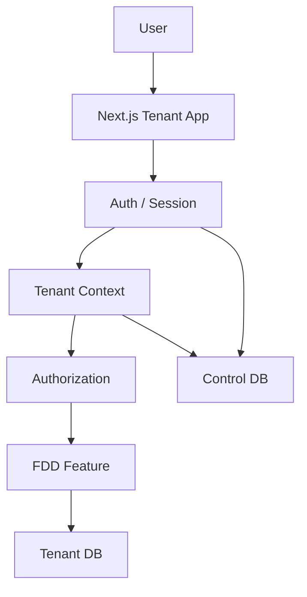
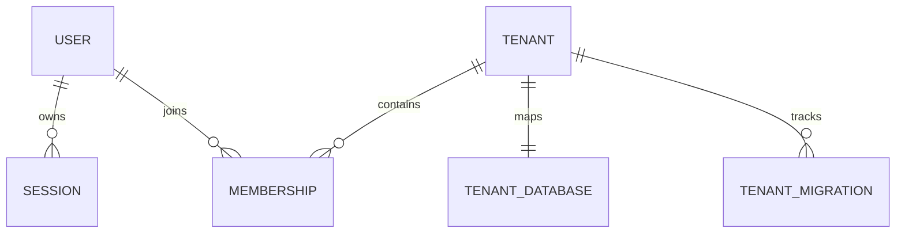
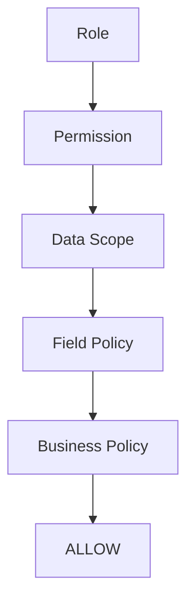
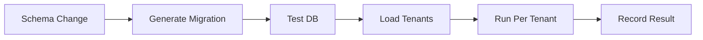

# SaaS Foundation Minimal
## 最小、稳定、可扩展的 SaaS + 权限基础设施

> 目标：不是先做一个“大而全”的 SaaS 平台，而是把以后最难改、最值得提前做对的核心一次做稳。
> 原则：核心能力完整，外围能力延后；以后新增能力尽量“加模块”，而不是“推翻底座”。

---

# 1. V1 只做什么

第一阶段只做：

```text
1. 多租户
2. 身份与权限
3. 数据库发布与迁移
4. 一个真实 Feature 验证底座
```

后续优先级：

```text
Foundation V1
    ↓
真实业务 Feature
    ↓
MCP
    ↓
套餐 / Subscription
    ↓
Billing
```

---

# 2. 技术栈

```text
Monorepo
├── pnpm Workspace
└── Turborepo

Web
└── Next.js 16 App Router

Runtime
└── Node.js 24 LTS

Database
└── PostgreSQL 17

ORM
└── Prisma ORM 8

UI
├── Tailwind CSS
└── shadcn/ui

Architecture
├── Modular Monolith
├── FDD
├── Harness
└── Decorator-first, Framework-native
```

---

# 3. 整体架构



只需要先理解：

```text
User
  ↓
Session
  ↓
Tenant
  ↓
Role
  ↓
Permission
  ↓
Feature
  ↓
Tenant Database
```

---

# 4. Monorepo 最小结构

第一阶段不要创建大量空 App。

```text
repo/
├── apps/
│   └── tenant/                    # Next.js 主应用
│
├── packages/
│   ├── foundation/                # SaaS / Auth / AuthZ / Tenant
│   ├── db-control/                # Control DB Prisma
│   ├── db-tenant/                 # Tenant DB Prisma
│   ├── ui/
│   ├── shared/
│   └── features/
│       └── procurement-center/    # 第一个真实 Feature
│
├── tooling/
│   ├── permission-compiler/
│   ├── tenant-migrate/
│   └── boundary-check/
│
├── .harness/
│   └── features/
│       └── procurement-center/
│
├── turbo.json
├── pnpm-workspace.yaml
└── package.json
```

以后真正需要时再增加：

```text
apps/platform/
apps/worker/
```

---

# 5. Next.js 路由

保持官方 App Router 方式：

```text
apps/tenant/src/
├── app/
│   ├── (auth)/
│   │   └── login/page.tsx
│   ├── (dashboard)/
│   │   ├── layout.tsx
│   │   ├── system/
│   │   │   ├── members/
│   │   │   ├── departments/
│   │   │   └── roles/
│   │   └── procurement/
│   │       └── orders/
│   │           ├── page.tsx
│   │           └── [orderId]/page.tsx
│   └── api/v1/
├── proxy.ts
└── instrumentation.ts
```

规则：

```text
page.tsx      -> 默认 Server Component
Server Action -> Web Mutation Adapter
route.ts      -> REST / Webhook / Callback
proxy.ts      -> 轻量路由前置逻辑
```

Server Component 查询直接调用 Application Service，不绕自己的 `/api`。

---

# 6. SaaS V1

第一阶段只做：

```text
Tenant
Membership
Session
Tenant Context
Tenant Database Mapping
Tenant Database Isolation
```

不做：

```text
套餐
计费
复杂租户运营后台
自动 Provision 平台
```

---

# 7. Control DB 最小模型

```text
User
Session
Tenant
Membership
TenantDatabase
TenantMigration
```

关系：



含义：

```text
User       = 这个人是谁
Membership = 这个人属于哪个 Tenant
TenantDB   = 这个 Tenant 使用哪个 PostgreSQL Database
```

---

# 8. 数据库隔离

采用 Database-per-Tenant：

```text
PostgreSQL
├── saas_control
├── tenant_10001
├── tenant_10002
└── tenant_10003
```

链路：

```text
Session / Host
    ↓
Resolve Tenant
    ↓
tenantId
    ↓
Control DB Database Mapping
    ↓
TenantDbManager
    ↓
tenant_xxxxx
```

禁止：

```text
客户端 tenantCode -> 直接拼 DATABASE_URL
default tenant fallback
```

---

# 9. 权限模型

权限核心只做四层：

```text
RBAC
+
Data Scope
+
Field Policy
+
Business Policy
```



---

# 10. RBAC

成员和角色：

```text
Member N:N Role
```

不要：

```text
member.roleId
```

而是：

```text
Member
  ↓
UserRole
  ↓
Role
  ↓
RolePermission
```

V1 采用：

```text
Allow-only
默认拒绝
多角色做权限并集
```

暂不做复杂 Deny、角色继承、ABAC、ReBAC。

---

# 11. Permission Code

统一：

```text
<feature>.<resource>.<action>
```

例如：

```text
procurement.order.read
procurement.order.create
procurement.order.update
procurement.order.audit
procurement.order.export
```

同一个 Permission Code 同时控制：

```text
前端按钮
页面访问
Server Action
REST API
未来 MCP
```

---

# 12. Permission Registry

权限属于 Feature，不属于前端页面。

```text
packages/features/procurement-center/
└── permissions.ts
```

例如：

```typescript
export const permissions = defineResource({
  feature: "procurement",
  resource: "order",

  actions: {
    read: "查看",
    create: "新建",
    update: "修改",
    audit: "审核",
    export: "导出",
  },

  fields: {
    costPrice: {
      name: "成本价",
      sensitive: true,
    },
  },
});
```

编译：

```text
permissions.ts
      ↓
Permission Compiler
      ↓
Permission Registry
      ↓
P / F 类型安全常量
```

使用：

```typescript
P.procurement.order.create
F.procurement.order.costPrice
```

避免 AI 到处手写字符串。

---

# 13. 角色管理页面

管理员看到：

```text
采购中心
└── 采购订单
    ├── ☑ 查看
    ├── ☑ 新建
    ├── ☑ 修改
    ├── ☐ 审核
    ├── ☑ 导出
    │
    ├── 数据范围
    │   └── 本部门及下级
    │
    └── 字段
        └── 成本价
            └── 只读
```

数据库保存“授权结果”。

权限定义来自 Permission Registry。

---

# 14. 前端权限

提供：

```text
<Can />
useCan()
<PermissionField />
useFieldAccess()
```

例如：

```tsx
<Can permission={P.procurement.order.create}>
  <Button>新建采购订单</Button>
</Can>
```

字段：

```tsx
<PermissionField field={F.procurement.order.costPrice}>
  <CostPriceInput />
</PermissionField>
```

前端权限只负责 UX，不负责最终安全。

---

# 15. 服务端权限

真正安全边界在 Server。

Decorator-first：

```typescript
@RequirePermission(P.procurement.order.create)
@Audit("procurement.order.create")
@Transactional()
async createOrder(input: CreateOrderInput) {
  // business logic
}
```

适合 Decorator：

```text
@RequirePermission
@Audit
@Transactional
@Validate
@Trace
```

业务规则继续显式写代码，不全部藏进装饰器。

---

# 16. Data Scope

V1 必须支持：

```text
SELF
DEPT
DEPT_TREE
CUSTOM_DEPT
ALL
```

例如：

```text
procurement.order.read
+
DEPT_TREE
```

表示：

```text
有查看采购订单权限
但只能看本部门及下级数据
```

必须覆盖：

```text
list
detail
count
aggregate
export
batch update
batch delete
```

---

# 17. Field Policy

敏感字段：

```text
HIDDEN
READONLY
EDITABLE
```

例如：

```text
costPrice = HIDDEN
```

必须同时：

```text
Frontend       -> 不显示
Backend API    -> 不返回
Export         -> 不导出
```

`READONLY`：

```text
Frontend -> 只读
Backend  -> 恶意修改时拒绝
```

---

# 18. Business Policy

业务规则不塞进 RBAC。

例如：

```text
只有 pending 才能审核
不能自己审核自己的订单
关账后不能修改
```

```typescript
@RequirePermission(P.procurement.order.audit)
async auditOrder(id: string) {
  const order = await repo.find(id);

  assertPending(order);
  assertNotSelfApproval(order);

  // ...
}
```

---

# 19. Tenant DB 最小权限表

```text
sys_department
sys_member
sys_role
sys_user_role
sys_role_permission
sys_role_field_policy
sys_role_scope_target
sys_audit_log
```

业务表从各 Feature 自己增加。

---

# 20. Migration 是 V1 Core

因为使用 Database-per-Tenant：

```text
Schema V1 -> V2
```

实际上要迁移：

```text
tenant_10001
tenant_10002
tenant_10003
...
```

所以第一天就提供：

```text
tooling/tenant-migrate
```

---

# 21. Migration 流程



每个 Tenant 保存：

```text
current_version
target_version
status
error
updated_at
```

必须：

```text
可重试
可追踪
幂等
```

---

# 22. 发布流程

```text
Feature Code
    ↓
Permission Compile
    ↓
Typecheck / Test
    ↓
Build
    ↓
Control DB Migration
    ↓
Tenant DB Migration
    ↓
Deploy
    ↓
Smoke Test
```

Migration 失败，不继续盲目发布。

---

# 23. FDD + Harness 保留

业务：

```text
packages/features/procurement-center/
├── permissions.ts
├── contracts/
├── domain/
├── policies/
├── application/
├── infrastructure/
├── ui/
└── index.ts
```

Harness：

```text
.harness/features/procurement-center/
├── context.md
├── scope.md
├── progress.md
├── verification.md
└── handoff.md
```

映射：

```text
Next.js Route
      ↕
Feature Package
      ↕
Harness Feature
```

FDD 是外层组织方式；DDD 只在复杂 Feature 内局部使用。

---

# 24. 第一个验证 Feature

不要使用过于简单的“计量单位”。

采用最小采购订单：

```text
read
create
update
audit
export
```

字段：

```text
costPrice
```

数据归属：

```text
deptId
createdBy
```

业务规则：

```text
pending 才能审核
禁止自审
```

这一块能一次验证：

```text
Tenant
RBAC
Data Scope
Field Policy
Business Policy
Decorator
Audit
Transaction
Migration
```

---

# 25. V1 开发顺序

```text
Phase 0
工程骨架
Monorepo / Next.js / PostgreSQL / Prisma / Harness

        ↓

Phase 1
Tenant + Auth
User / Session / Tenant / Membership / Tenant Context

        ↓

Phase 2
Authorization
Role / UserRole / Permission Registry / <Can> / @RequirePermission

        ↓

Phase 3
高级权限核心
Data Scope / Field Policy / Audit

        ↓

Phase 4
Migration / Release
Control Migration / Tenant Migration / Retry

        ↓

Phase 5
采购订单验证 Feature
```

Phase 5 完成：

> Foundation V1 完成。

---

# 26. 后续阶段

## V2：MCP

```text
MCP Adapter
    ↓
Authentication
    ↓
Request Context
    ↓
同一个 Application Service
    ↓
同一个 Authorization Engine
```

MCP 不新建一套权限。

---

## V3：SaaS 平台增强

按需要增加：

```text
apps/platform
Tenant 管理后台
自动 Provision
自定义域名
Tenant 启停
```

---

## V4：套餐与计费

最后再做：

```text
Plan
Subscription
Entitlement
Billing
Invoice
Quota
```

明确：

```text
MCP 优先级 > 套餐 > Billing
```

---

# 27. V1 明确不做

```text
❌ Billing
❌ Subscription
❌ Plan
❌ 复杂 Platform
❌ 自定义域名平台
❌ OpenFGA
❌ Casbin
❌ OPA
❌ ReBAC
❌ ABAC DSL
❌ 微服务
❌ CQRS
❌ Event Bus
❌ Workflow Engine
```

不是这些能力不好，而是现在没有必要。

---

# 28. V1 必须做完整

```text
✅ Monorepo
✅ Next.js App Router
✅ PostgreSQL
✅ Prisma
✅ FDD
✅ Harness

✅ User / Session
✅ Tenant / Membership
✅ Tenant Context
✅ Database-per-Tenant

✅ Role / Multi-role
✅ Permission Code
✅ Permission Registry
✅ <Can>
✅ @RequirePermission

✅ Data Scope
✅ Field Policy
✅ Business Policy

✅ Audit
✅ Migration
✅ Release Gate

✅ 一个真实 Feature 验证
```

这就是：

> 最小，但不是简陋。

---

# 29. 判断是否进入 Foundation 的唯一问题

以后每次碰到新能力，只问：

> **如果现在不做，以后增加时，会不会迫使我们修改 Tenant / Auth / Authorization / Database Boundary？**

如果会：

```text
现在做
```

例如：

```text
Data Scope
Field Policy
Migration
```

如果不会，只是外围新增：

```text
以后做
```

例如：

```text
MCP
套餐
Billing
自定义域名后台
运营报表
```

---

# 30. 最终一句话

> **基于 Turborepo + pnpm Workspace 的 Next.js 模块化单体，以 PostgreSQL Database-per-Tenant 建立 SaaS 数据隔离，以 Tenant + Membership 建立租户上下文，以 Code-as-Config Permission Registry 驱动前后端统一权限码，以 RBAC + Data Scope + Field Policy + Business Policy 构建完整授权核心，并通过 Decorator-first、FDD Feature 与 Harness 工程形成一个最小、稳定、AI 易开发、后续可自然扩展到 MCP、套餐与计费的 SaaS Foundation。**
