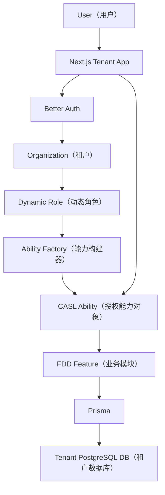

# SaaS Foundation Minimal

## 成熟框架版：最小、稳定、可扩展的 SaaS + 权限基础设施

> **目标**：不自研认证框架、不自研权限引擎。  
> 使用成熟开源框架完成核心能力，只保留少量 ERP 必需的扩展代码。  
> V1 把以后最难改的部分做稳：**多租户、角色权限、数据权限、字段权限、数据库迁移与发布**。

---

# 1. 最终选型

| 能力 | 采用方案 |
| --- | --- |
| Web | Next.js 16 App Router（应用路由器） |
| Monorepo（单体多包仓库） | pnpm Workspace + Turborepo |
| Runtime（运行时） | Node.js 24 LTS |
| Database（数据库） | PostgreSQL 17 |
| ORM（对象关系映射） | Prisma 7.x |
| Authentication（认证） | Better Auth |
| SaaS Tenant（租户） | Better Auth Organization Plugin（组织插件） |
| Role / Functional Permission（角色 / 功能权限） | Better Auth Organization Dynamic Access Control（动态访问控制） |
| Authorization Engine（授权引擎） | CASL |
| React 权限组件 | `@casl/react` |
| Prisma 数据权限 | `@casl/prisma` |
| UI | Tailwind CSS + shadcn/ui |
| Architecture（架构） | Modular Monolith（模块化单体）+ FDD（特性驱动开发） |
| AI / 团队工程 | Harness（智能体协作工程） |
| 服务端风格 | Decorator-first（装饰器优先），但保持 Next.js 原生范式 |

> **为什么使用 Prisma 7，而不是强行 Prisma 8？**  
> 当前 Better Auth 官方 Prisma 集成文档以及 CASL Prisma 生态都明确以 Prisma 7 为成熟兼容基线。V1 优先选择经过框架组合验证的版本，等两边正式确认 Prisma 8 后再升级。

---

# 2. 为什么改成 Better Auth + CASL

之前我们准备自己实现：

```text
Permission Registry
Authorization Engine
Can()
Data Scope Engine
Field Policy Engine
```

现在改为：

```text
Better Auth
├── User（用户）
├── Session（会话）
├── Organization（组织 / Tenant 租户）
├── Member（租户成员）
├── Role（角色）
└── Resource -> Actions（功能权限）

CASL
├── can() / cannot()
├── React <Can>
├── Conditions（条件 / 数据范围）
├── Fields（字段权限）
└── Prisma accessibleBy（数据库数据过滤）
```

我们自己只实现：

```text
1. Tenant -> Database Mapping（租户到数据库映射）
2. Role Data Scope Config（角色数据范围配置）
3. Role Field Config（角色字段配置）
4. Ability Factory（把 Better Auth 角色权限编译成 CASL Ability）
5. 少量 Next.js / Decorator 适配
6. Tenant Migration Runner（租户数据库迁移执行器）
```

核心授权计算不自己发明。

---

# 3. 整体架构



---

# 4. Monorepo 最小结构

```text
repo/
├── apps/
│   └── tenant/                       # Next.js 主应用
│
├── packages/
│   ├── auth/                         # Better Auth 配置
│   ├── authorization/                # CASL + Ability Factory + React 适配
│   ├── db-control/                   # Control DB
│   ├── db-tenant/                    # Tenant DB
│   ├── ui/
│   ├── shared/
│   └── features/
│       └── procurement-center/
│
├── tooling/
│   ├── tenant-migrate/
│   └── boundary-check/
│
├── .harness/
│   └── features/
│       └── procurement-center/
│
├── turbo.json
├── pnpm-workspace.yaml
└── package.json
```

V1 不提前创建：

```text
apps/platform/
apps/worker/
```

真正需要时再增加。

---

# 5. SaaS（软件即服务）核心：直接使用 Better Auth Organization

Better Auth Organization Plugin 已经提供：

```text
Organization（组织）
Member（成员）
Invitation（邀请）
Active Organization（当前组织）
Role（角色）
Multiple Roles（多角色）
```

因此：

```text
Organization = Tenant（租户）
Member       = Membership（租户成员关系）
```

我们不再自己创建一套重复的：

```text
saas_tenant
saas_membership
```

---

# 6. Control DB（控制数据库）

Control DB 主要由 Better Auth 管理：

```text
user
session
account
organization
member
invitation
organizationRole      # 开启动态角色后
```

我们只补两类 SaaS 基础表：

```text
tenant_database
tenant_migration
```

---

# 7. Tenant Database Mapping（租户数据库映射）

```text
tenant_database
---------------
organization_id
cluster_code
database_name
secret_ref
schema_version
status
```

请求流程：

```text
Better Auth Session
        ↓
activeOrganizationId
        ↓
确认 Member 有效
        ↓
tenant_database
        ↓
TenantDbManager
        ↓
tenant_xxxxx
```

禁止：

```text
Cookie tenantCode -> 拼接 DATABASE_URL
x-tenant-code -> 直接决定数据库
default tenant fallback
```

---

# 8. PostgreSQL Database-per-Tenant（每租户独立数据库）

```text
PostgreSQL Cluster
├── saas_control
├── tenant_10001
├── tenant_10002
└── tenant_10003
```

Better Auth 使用：

```text
saas_control
```

业务 Feature 使用：

```text
tenant_xxxxx
```

---

# 9. 功能权限：直接使用 Better Auth Access Control

Better Auth 的 Access Control（访问控制）采用成熟的：

```text
Resource（资源）
    ↓
Actions（动作）
```

例如：

```typescript
import { createAccessControl } from "better-auth/plugins/access";

export const statement = {
  "procurement.order": [
    "read",
    "create",
    "update",
    "audit",
    "export",
  ],

  "system.member": [
    "read",
    "create",
    "update",
    "delete",
  ],
} as const;

export const ac = createAccessControl(statement);
```

这份 `statement` 就是我们的：

> **Functional Permission Catalog（功能权限目录）**

不再自研 Permission Registry。

---

# 10. 动态 Role（角色）也使用 Better Auth

Organization Plugin 开启：

```typescript
organization({
  ac,
  dynamicAccessControl: {
    enabled: true,
  },
});
```

管理员可以创建：

```text
采购员
采购经理
仓库管理员
财务
```

并为角色分配：

```text
procurement.order
├── read
├── create
├── update
└── audit
```

Better Auth 负责：

```text
角色创建
角色更新
角色删除
角色权限保存
成员角色分配
多角色
```

---

# 11. UI 中文名称不属于安全模型

Better Auth 的 `statement` 只需要：

```text
resource
action
```

管理页面还需要：

```text
采购订单
查看
新建
审核
```

我们可以单独维护一个很薄的：

```typescript
export const permissionLabels = {
  "procurement.order": {
    label: "采购订单",
    actions: {
      read: "查看",
      create: "新建",
      update: "修改",
      audit: "审核",
      export: "导出",
    },
  },
};
```

注意：

> 这个文件只是 UI Metadata（界面显示元数据），不是安全事实源。

---

# 12. 为什么还需要 CASL

Better Auth 很适合：

```text
Role -> Resource -> Action
```

但 ERP 还需要：

```text
只能看自己的数据
只能看本部门
只能看本部门及下级
某字段隐藏
某字段只读
```

这部分交给 CASL。

CASL 的核心模型：

```text
Action（动作）
Subject（资源）
Conditions（条件）
Fields（字段）
```

恰好对应：

```text
功能权限
+
数据范围
+
字段权限
```

---

# 13. CASL Ability（授权能力对象）

例如一个采购经理：

```typescript
can("read", "PurchaseOrder", {
  deptId: { in: descendantDeptIds }
});

can("create", "PurchaseOrder");

can(
  "read",
  "PurchaseOrder",
  ["id", "supplierName", "costPrice"]
);

can(
  "update",
  "PurchaseOrder",
  ["supplierName"]
);
```

含义：

```text
read + Conditions
= 数据范围

read + Fields
= 可见字段

update + Fields
= 可编辑字段
```

---

# 14. Data Scope（数据范围权限）

角色管理页面提供我们熟悉的几种选项：

```text
SELF（本人）
DEPT（本部门）
DEPT_TREE（本部门及下级）
CUSTOM_DEPT（指定部门）
ALL（全部）
```

这不是新的权限引擎。

它只是把管理员选择编译成 CASL Conditions（条件）。

例如：

```text
SELF
```

编译：

```typescript
{ createdById: userId }
```

`DEPT_TREE`：

```typescript
{ deptId: { in: descendantDeptIds } }
```

---

# 15. Data Scope 配置表

Better Auth 不负责 ERP 数据范围，所以我们只补一张简单表：

```text
role_data_scope
---------------
organization_id
role_name
resource
action
scope_type
scope_value_json
```

例如：

```text
采购经理
procurement.order
read
DEPT_TREE
```

---

# 16. Field Permission（字段权限）

CASL 原生支持 Fields（字段）。

我们需要的：

```text
HIDDEN（隐藏）
READONLY（只读）
EDITABLE（可编辑）
```

映射为：

```text
不能 read 字段
= HIDDEN

可以 read，但不能 update
= READONLY

可以 read，也可以 update
= EDITABLE
```

---

# 17. Field 配置表

```text
role_field_policy
-----------------
organization_id
role_name
subject
field
access
```

例如：

```text
role = procurement_manager
subject = PurchaseOrder
field = costPrice
access = READONLY
```

---

# 18. Ability Factory（能力构建器）

这是整个授权系统唯一重要的自定义适配层。

职责：

```text
Better Auth 当前 Organization
        ↓
当前 Member Roles
        ↓
Better Auth Role Permissions
        ↓
role_data_scope
role_field_policy
        ↓
编译 CASL Rules
        ↓
createPrismaAbility()
```

它不自己做权限决策。

它只负责：

> **把成熟框架里的配置组合成 CASL Ability。**

---

# 19. Server（服务端）权限

服务端真正安全边界统一使用 CASL。

例如：

```typescript
const ability = await getCurrentAbility();

ForbiddenError
  .from(ability)
  .throwUnlessCan(
    "create",
    "PurchaseOrder"
  );
```

---

# 20. Decorator-first（装饰器优先）

封装一个很薄的：

```typescript
@RequireAbility("create", "PurchaseOrder")
async createOrder(input) {
  ...
}
```

内部只是：

```text
getCurrentAbility()
↓
CASL throwUnlessCan()
```

不是自己实现 Authorization Engine。

---

# 21. Prisma 数据权限

使用：

```text
@casl/prisma
```

例如：

```typescript
const where =
  accessibleBy(
    ability,
    "read"
  ).PurchaseOrder;

return prisma.purchaseOrder.findMany({
  where,
});
```

CASL 把 Conditions（条件）转换成 Prisma 查询条件。

因此：

```text
DEPT_TREE
```

最后真正落在 SQL / Prisma `where` 上。

---

# 22. Field 权限

读取时：

```text
CASL permittedFieldsOf()
```

或者我们的薄包装：

```typescript
getReadableFields(
  ability,
  "PurchaseOrder"
);
```

更新时：

```typescript
getEditableFields(
  ability,
  "PurchaseOrder"
);
```

服务端必须：

```text
Response 过滤
Mutation 字段校验
Export 字段过滤
```

---

# 23. Frontend（前端）

使用：

```text
@casl/react
```

我们提供：

```tsx
<Can I="create" a="PurchaseOrder">
  <Button>新建</Button>
</Can>
```

或者项目统一包装：

```tsx
<Permission
  action="create"
  subject="PurchaseOrder"
>
  <Button>新建</Button>
</Permission>
```

底层仍然是 CASL。

---

# 24. 前端 Ability 来源

不要每个按钮请求一次服务器。

登录 / Layout 初始化时，服务器返回：

```text
UI Ability Snapshot（界面能力快照）
```

只包含前端需要的：

```text
action
subject
fields
```

React 创建 CASL Ability。

对于某一条具体数据的条件权限：

```text
API Response
```

可以直接附加：

```json
{
  "permissions": {
    "update": true,
    "audit": false
  }
}
```

服务端仍然是最终安全边界。

---

# 25. Business Policy（业务规则）

CASL 解决：

```text
谁
能对什么数据
做什么
操作哪些字段
```

业务状态规则继续写在 Feature 中：

```text
订单必须 Pending 才能审核
不能自己审核
关账后不能修改
```

例如：

```typescript
@RequireAbility("audit", "PurchaseOrder")
async auditOrder(id: string) {
  const order = await findAccessibleOrder(id);

  assertPending(order);
  assertNotSelfApproval(order);

  ...
}
```

---

# 26. Migration（数据库迁移）

Database-per-Tenant 意味着：

```text
一个 Schema 变化
=
所有 Tenant DB 都要迁移
```

V1 必须保留：

```text
tenant_migration
tooling/tenant-migrate
```

流程：

```text
生成 Migration
↓
测试数据库验证
↓
迁移 Control DB
↓
遍历 Tenant
↓
逐库 Migration
↓
记录 success / failed
↓
失败可重试
↓
部署应用
```

---

# 27. FDD + Harness

继续保持：

```text
packages/features/procurement-center
                    ↕
apps/tenant/src/app/(dashboard)/procurement
                    ↕
.harness/features/procurement-center
```

Feature 只关心：

```text
Subject
Action
Business Policy
Repository
UI
```

Auth / Tenant / CASL 都由 Foundation 提供。

---

# 28. 第一个验证 Feature

仍然推荐：

```text
采购订单
```

能力：

```text
read
create
update
audit
export
```

数据范围：

```text
SELF
DEPT
DEPT_TREE
ALL
```

字段：

```text
costPrice
```

业务规则：

```text
Pending 才能审核
禁止自审
```

它可以一次验证全部 Foundation。

---

# 29. V1 开发阶段

```text
Phase 0
Monorepo + Next.js + PostgreSQL + Prisma 7

Phase 1
Better Auth + Organization
登录 / Session / Tenant / Member

Phase 2
Better Auth Dynamic Access Control
Role / Resource / Action

Phase 3
CASL Ability Factory
Data Scope / Fields / Prisma / React

Phase 4
Tenant DB Migration / Release

Phase 5
采购订单 Feature 验证
```

完成 Phase 5：

> **Foundation V1 完成。**

---

# 30. 后续阶段

```text
V2
MCP（模型上下文协议）

V3
Platform 管理后台 / 自动 Tenant Provision

V4
Plan（套餐）/ Subscription（订阅）/ Billing（计费）
```

MCP 优先级高于套餐和计费。

---

# 31. 为什么 V1 不使用 Cerbos

Cerbos 是成熟的外部 PDP（权限决策服务），很适合：

```text
多微服务
多语言服务
集中策略管理
跨服务 Agent / MCP
```

但当前：

```text
一个 Next.js 模块化单体
TypeScript
Prisma
React
```

CASL 已经能够原生覆盖：

```text
React
Node
Fields
Conditions
Prisma
```

V1 再部署 Cerbos 会增加：

```text
额外服务
Policy 部署
网络调用
运维复杂度
```

所以当前选择：

> **Better Auth + CASL。**

以后真正多服务化，可以把 CASL Authorization Adapter 换成 Cerbos，而不改变 Feature 的业务边界。

---

# 32. V1 明确不自己造

```text
❌ 自研登录认证
❌ 自研 Session
❌ 自研 Organization / Membership
❌ 自研 RBAC 引擎
❌ 自研 can() 权限引擎
❌ 自研 Prisma Data Scope 查询引擎
❌ 自研 React 权限组件底层
```

自己只写：

```text
✅ Better Auth 配置
✅ CASL Ability Factory
✅ Scope / Field 配置表
✅ Next.js / Decorator 薄适配
✅ Tenant DB Manager
✅ Migration Runner
```

---

# 33. 最终一句话

> **V1 使用 Better Auth 管理用户、会话、Tenant（Organization）、成员、动态角色和功能权限；使用 CASL 管理 Action（动作）、Subject（资源）、Conditions（数据条件）、Fields（字段权限），并通过 `@casl/react` 与 `@casl/prisma` 将同一套授权思想应用到前端组件、服务端检查和数据库查询；再结合 PostgreSQL Database-per-Tenant、FDD 和 Harness，形成一个最小但不简陋的 SaaS Foundation（基础设施）。**

---

# 官方参考

- Better Auth  
  <https://better-auth.com/docs/introduction>
- Better Auth Organization  
  <https://better-auth.com/docs/plugins/organization>
- Better Auth Next.js  
  <https://better-auth.com/docs/integrations/next>
- Better Auth Prisma  
  <https://better-auth.com/docs/adapters/prisma>
- CASL  
  <https://github.com/stalniy/casl>
- CASL Examples  
  <https://github.com/stalniy/casl-examples>
- Prisma + PostgreSQL  
  <https://docs.prisma.io/docs/orm/core-concepts/supported-databases/postgresql>
