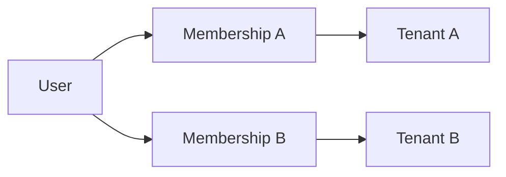
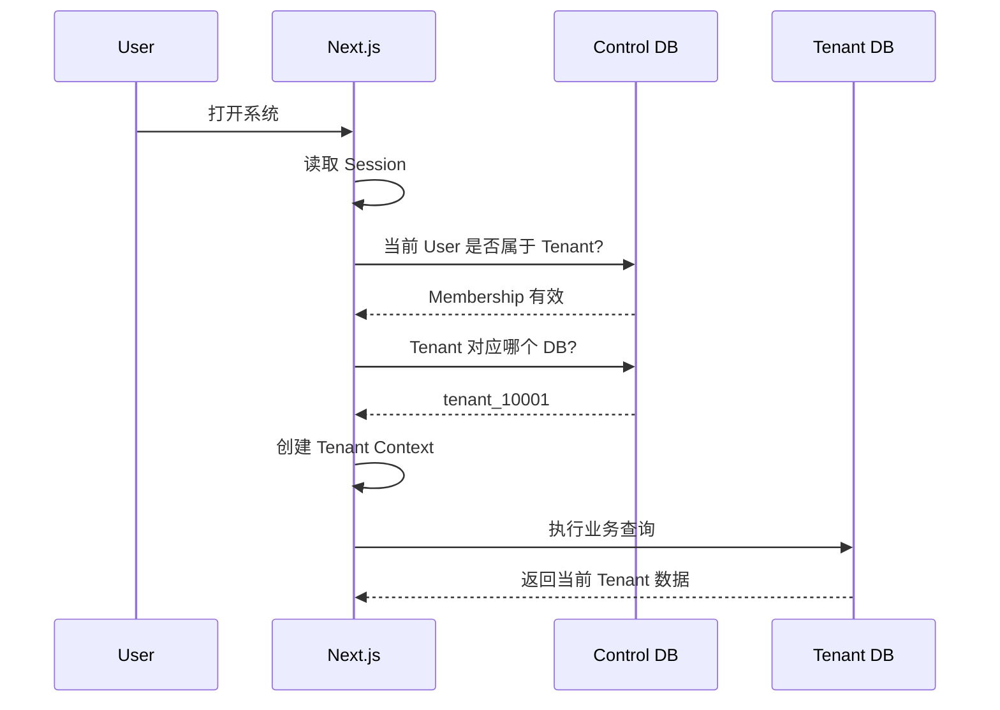
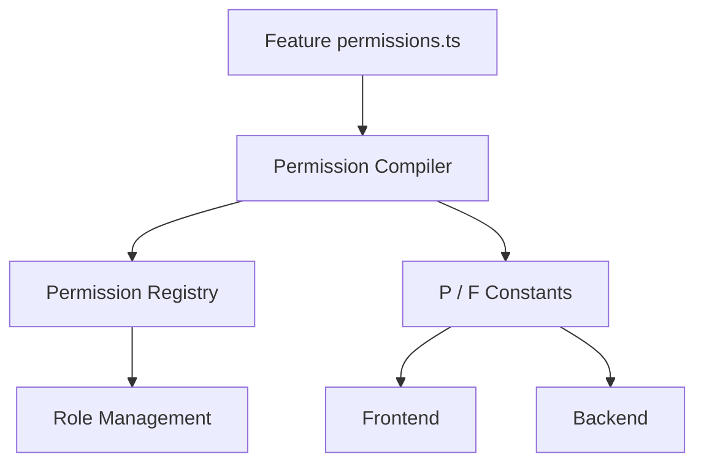
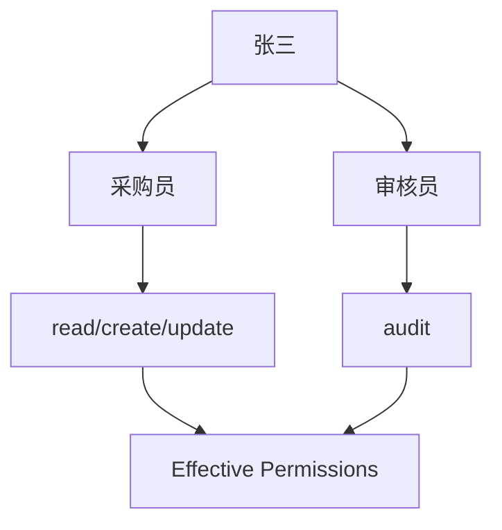
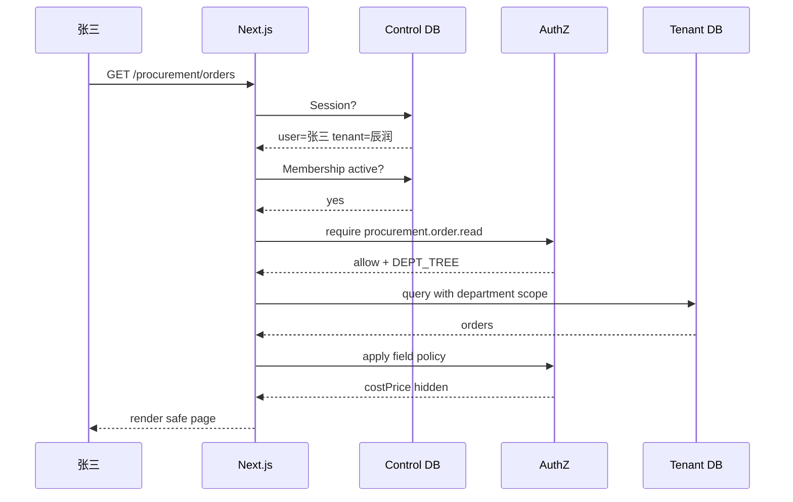
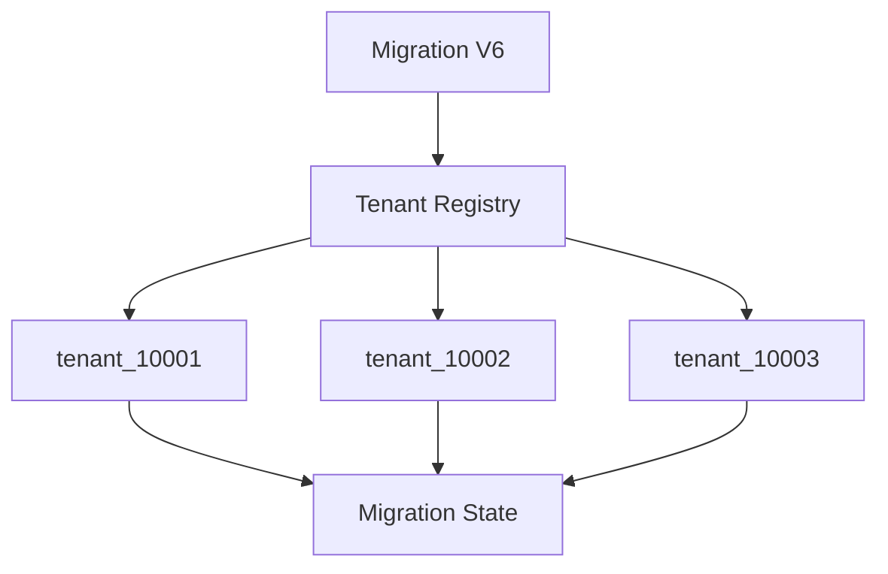
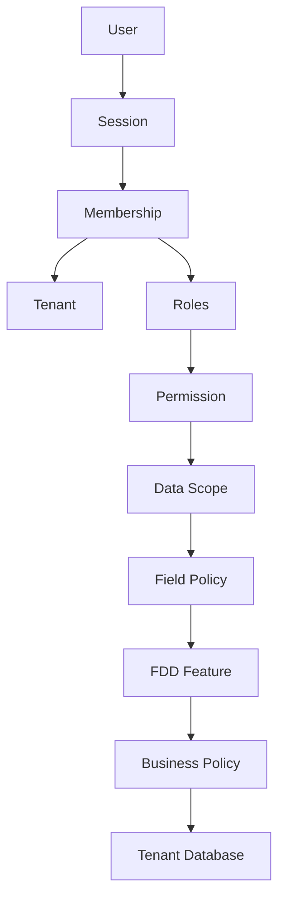

# SaaS Foundation Minimal（最小 SaaS 基础设施）：关键功能学习手册
## 最小、稳定、可扩展的 SaaS（软件即服务）+ 权限基础设施

> 这不是实施蓝图，而是一份“理解架构”的学习文档。  
> 目标是帮助你真正理解：**SaaS 为什么这样拆、权限为什么这样设计、请求实际如何流动、发布迁移为什么必须从第一天考虑。**

---

# 常用英文术语速查

> 文档正文会尽量采用“英文（中文解释）”形式。代码、目录、类名、函数名、权限码等仍保留英文，方便后续直接用于开发。

| 英文 | 中文理解 |
|---|---|
| SaaS | 软件即服务 |
| Tenant | 租户，可理解为一个客户企业/组织 |
| Membership | 用户与某个租户之间的成员关系 |
| Session | 登录会话 |
| Authorization | 授权，判断用户能否执行某项操作 |
| RBAC | 基于角色的访问控制 |
| Permission | 权限 |
| Permission Code | 权限编码 |
| Permission Registry | 权限注册表 / 权限元数据中心 |
| Data Scope | 数据范围权限 |
| Field Policy | 字段权限策略 |
| Business Policy | 业务规则策略 |
| Feature | 业务特性 / 功能模块 |
| FDD | 特性驱动开发 |
| DDD | 领域驱动设计 |
| Harness | 智能体协作工程 / 上下文与门禁体系 |
| Decorator | 装饰器 / 注解 |
| Application Service | 应用服务层 |
| Repository | 仓储 / 数据访问抽象 |
| Server Action | 服务端动作 |
| Server Component | 服务端组件 |
| Client Component | 客户端组件 |
| Migration | 数据库迁移 |
| Control DB | 控制平面数据库 |
| Database-per-Tenant | 每租户独立数据库 |
| MCP | 模型上下文协议 |
| Billing | 计费 |
| Subscription | 订阅 |
| Plan | 套餐 |

---

# 目录

1. 先建立整体认知
2. 这套方案参考了哪些成熟设计
3. SaaS 核心模型
4. 多租户数据库设计
5. 权限系统总体模型
6. RBAC（基于角色的访问控制）：角色与功能权限
7. Permission Registry（权限注册表/权限元数据中心）：权限元数据
8. 前端权限
9. 服务端权限与 Decorator（装饰器/注解）
10. Data Scope（数据范围权限）：数据权限
11. Field Policy（字段权限策略）：字段权限
12. Business Policy（业务规则策略）：业务规则
13. 一次真实请求如何执行
14. 数据库表之间的关系
15. Migration（数据库迁移） 与发布
16. FDD（特性驱动开发） + Harness（智能体协作工程/上下文与门禁体系） 如何配合
17. 典型应用场景
18. 常见错误设计
19. 学习后的最终心智模型

---

# 1. 先建立整体认知

这套基础设施其实没有想象中复杂。

你可以把它理解为四层：

```text
┌────────────────────────────────────┐
│           ① Identity               │
│                                    │
│       User / Login / Session       │
└──────────────────┬─────────────────┘
                   │
                   ▼
┌────────────────────────────────────┐
│            ② Tenant                │
│                                    │
│     Membership / Tenant Context    │
└──────────────────┬─────────────────┘
                   │
                   ▼
┌────────────────────────────────────┐
│        ③ Authorization             │
│                                    │
│ Role                               │
│ ├── Permission                     │
│ ├── Data Scope                     │
│ └── Field Policy                   │
└──────────────────┬─────────────────┘
                   │
                   ▼
┌────────────────────────────────────┐
│           ④ Feature                │
│                                    │
│ 采购 / 库存 / 订单 / 财务 / 生产     │
└────────────────────────────────────┘
```

这四层就是 Foundation V1 的核心。

以后：

```text
MCP
套餐
计费
自定义域名
运营后台
```

都只是加在这四层外围。

---

# 2. 这套方案参考了哪些成熟设计

这不是凭空造出来的一套权限体系。

我们实际上是在组合几个已经成熟的设计思想。

---

## 2.1 Auth0 Organizations：Tenant（租户） + Membership（租户成员关系）

Auth0 的 B2B Organizations 模型里，一个用户可以属于多个 Organization，而且角色可以绑定在 Organization Membership（租户成员关系） 上。

例如：

```text
Alice
├── Company A
│   └── Admin
│
└── Company B
    └── Viewer
```

我们借鉴的就是：

```text
User
  ↓
Membership
  ↓
Tenant
```

而不是：

```text
User
└── tenantId
```

参考：

- Auth0 Organizations  
  https://auth0.com/docs/manage-users/organizations
- Auth0 Organization Members / Role（角色）s  
  https://auth0.com/docs/api/management/v2/organizations

---

## 2.2 Casbin（访问控制框架）：RBAC（基于角色的访问控制） with Domain（领域）s / Tenant（租户）s

Casbin（访问控制框架） 官方支持：

```text
alice
├── tenant1 -> admin
└── tenant2 -> user
```

说明：

> 同一个用户，在不同 Tenant（租户） 中可以拥有不同角色。

我们采用：

```text
Membership
   ↓
Role
```

就是同类思想。

参考：

https://casbin.org/docs/rbac-with-domains

---

## 2.3 若依 RuoYi：Permission Code（权限编码） + 前后端统一

若依的典型方式：

前端：

```text
system:user:add
```

控制按钮。

后端：

```java
@PreAuthorize(...)
```

仍然检查：

```text
system:user:add
```

这说明一个非常成熟的思想：

> **同一个 Permission Code（权限编码） 同时服务 UI（用户界面） 和 Server（服务端）。**

我们使用：

```text
procurement.order.create
```

本质上和它一样。

参考：

https://doc.ruoyi.vip/ruoyi-vue/document/htsc.html

---

## 2.4 CASL：声明式 UI（用户界面） 权限

CASL 在 React 里提供：

```tsx
<Can I="read" a="Post">
```

而且它也支持字段级权限。

我们设计：

```tsx
<Can permission={P.procurement.order.create}>
```

以及：

```tsx
<PermissionField field={F.procurement.order.costPrice}>
```

本质上借鉴的就是：

> **让 UI（用户界面） 权限变成声明式能力。**

参考：

https://github.com/stalniy/casl

---

## 2.5 Azure 多租户架构：共享应用 + 每租户独立数据库

Azure Architecture Center 把：

```text
Shared Application
+
Dedicated Database per Tenant
```

列为常见的多租户架构方式。

这种方式：

```text
应用共享
数据隔离
```

非常适合企业 SaaS。

参考：

https://learn.microsoft.com/en-us/azure/architecture/guide/multitenant/approaches/storage-data

---

# 3. 我们自己的组合是什么

成熟方案提供的是：

```text
Tenant
Membership
RBAC
Permission Code
UI Gate
Data Isolation
Field Authorization
```

我们真正做的工程组合是：

```text
FDD Feature
    ↓
permissions.ts
    ↓
Permission Compiler
    ↓
Permission Registry
    ↓
P / F 类型安全常量
    ↓
前端 + 后端共同使用
```

这部分主要是为了：

```text
Next.js
TypeScript
AI Coding
FDD
Harness
```

特别优化的。

---

# 4. SaaS 到底是什么

很多人会把 SaaS 想得很复杂。

其实 V1 核心问题只有一个：

> **当前这个请求属于哪一个客户？**

比如：

```text
辰润公司
= Tenant A

海鲜供应公司
= Tenant B
```

那么：

```text
张三
```

必须是在：

```text
Tenant A
```

上下文中访问数据。

---

# 5. User、Tenant（租户）、Membership（租户成员关系） 为什么要拆开

错误模型：

```text
User
├── tenantId
└── roleId
```

这个模型只能表达：

> 一个用户属于一个公司，并且只有一个角色。

但真实 SaaS 很容易出现：

```text
同一个邮箱
├── 公司 A：管理员
└── 公司 B：采购员
```

所以正确结构：



Membership（租户成员关系） 的含义是：

> **User 在某个 Tenant（租户） 中的身份关系。**

---

# 6. 一个真实例子

假设：

```text
User:
张三

Tenant A:
辰润中央厨房

Tenant B:
供应链公司
```

张三可以：

```text
辰润中央厨房
└── Membership
    └── 采购员

供应链公司
└── Membership
    └── 财务管理员
```

所以系统判断权限时不能只问：

```text
张三是什么角色？
```

必须问：

```text
张三在当前 Tenant 中是什么角色？
```

---

# 7. Control DB（控制平面数据库） 是干什么的

我们有一个：

```text
saas_control
```

它只保存 SaaS 层的信息。

例如：

```text
User
Session
Tenant
Membership
TenantDatabase
TenantMigration
```

可以理解为：

> **SaaS 的总目录。**

---

# 8. Tenant（租户） DB（租户数据库） 是干什么的

每个 Tenant（租户） 独立一个业务数据库：

```text
tenant_10001
tenant_10002
tenant_10003
```

里面保存：

```text
部门
成员
角色
权限
采购单
库存
订单
生产
财务
...
```

---

# 9. 为什么要 Database-per-Tenant（每租户独立数据库）

假设使用共享数据库：

```text
purchase_order
├── tenant_id = 10001
├── tenant_id = 10002
└── tenant_id = 10003
```

每个 Query 都必须：

```sql
WHERE tenant_id = ?
```

一旦漏掉：

```text
就可能跨租户泄漏。
```

而 Database-per-Tenant（每租户独立数据库）：

```text
tenant_10001.purchase_order
tenant_10002.purchase_order
```

天然多了一层物理隔离。

---

# 10. Database-per-Tenant（每租户独立数据库） 的代价

它不是免费的。

最大代价：

```text
Migration
```

因为：

```text
purchase_order 新增字段
```

不再只更新一个 Database。

而是：

```text
tenant_10001
tenant_10002
tenant_10003
...
```

全部更新。

所以为什么我们的：

```text
Migration Runner
```

必须属于 V1 Core？

答案就在这里。

---

# 11. Tenant（租户） 请求完整流程



这里最关键的是：

```text
Session
+
Membership
+
Tenant Mapping
```

共同决定 Tenant（租户）。

而不是：

```text
客户端自己告诉服务器：
“我是 tenant_10001”
```

---

# 12. 权限系统的总体结构

权限分四层：

```text
1. Functional Permission
2. Data Scope
3. Field Policy
4. Business Policy
```

可以记成：

```text
能干什么？
   ↓
能操作哪些数据？
   ↓
能看/改哪些字段？
   ↓
当前业务状态允许吗？
```

---

# 13. 第一层：RBAC（基于角色的访问控制）

RBAC（基于角色的访问控制）：

```text
Role-Based Access Control
```

即：

> **角色 → 权限。**

例如：

```text
采购员
├── procurement.order.read
├── procurement.order.create
└── procurement.order.update
```

审核员：

```text
审核员
└── procurement.order.audit
```

---

# 14. 为什么 User 和 Role（角色） 是多对多

真实用户：

```text
张三
├── 采购员
└── 审核员
```

所以必须：

```text
Member
   ↓
UserRole
   ↓
Role
```

不能：

```text
Member.roleId
```

---

# 15. 多角色如何合并

V1 很简单：

```text
Allow-only
```

例如：

```text
采购员:
read
create
update

审核员:
audit
```

张三同时拥有两角色：

```text
Effective Permissions:
read
create
update
audit
```

就是集合并集。

---

# 16. Permission Code（权限编码） 是什么

Permission Code（权限编码） 就是一段稳定的业务能力标识。

规范：

```text
<feature>.<resource>.<action>
```

例如：

```text
procurement.order.read
procurement.order.create
procurement.order.update
procurement.order.audit
procurement.order.export
```

---

# 17. 为什么不要做“按钮权限码”

比如：

```text
btn_purchase_order_add
```

这个权限和 UI（用户界面） 强绑定。

未来：

```text
REST API
MCP
Mobile App
```

都很难复用。

所以我们描述的是业务能力：

```text
procurement.order.create
```

至于这个能力表现为：

```text
一个按钮
一个 API
一个 MCP Tool
```

只是入口不同。

---

# 18. Permission Registry（权限注册表/权限元数据中心） 是什么

这是整个权限框架非常关键的一部分。

每个 Feature（业务特性/功能模块） 自己声明：

```text
我提供哪些业务能力。
```

例如：

```typescript
defineResource({
  feature: "procurement",
  resource: "order",

  actions: {
    read: "查看",
    create: "新建",
    update: "修改",
    audit: "审核",
    export: "导出",
  },
});
```

---

# 19. 为什么权限应该属于 Feature（业务特性/功能模块）

错误：

```text
Page
└── Permission
```

正确：

```text
Feature
└── Resource
    └── Permission
```

因为：

```text
采购订单
```

是一项业务资源。

页面只是它的一种表现方式。

---

# 20. Permission Registry（权限注册表/权限元数据中心） 工作流程



所以：

```text
权限只声明一次
```

然后：

```text
管理后台
前端
后端
```

共同消费。

---

# 21. 为什么要生成 P.xxx

如果 AI 自己手写：

```text
procurement.order.create
```

很容易写出：

```text
purchase.order.create
procurement.orders.create
procurement:order:create
```

所以我们生成：

```typescript
P.procurement.order.create
```

IDE 和 TypeScript 会帮助检查。

这对于 AI Coding 非常重要。

---

# 22. 前端权限是怎么工作的

用户登录之后，服务器计算：

```text
Effective Permissions
```

例如：

```json
[
  "procurement.order.read",
  "procurement.order.create",
  "procurement.order.audit"
]
```

前端保存为：

```typescript
Set<PermissionCode>
```

---

# 23. `<Can>` 是什么

例如：

```tsx
<Can permission={P.procurement.order.create}>
  <Button>新建</Button>
</Can>
```

内部逻辑可以简单理解成：

```typescript
if (!permissions.has(permission)) {
  return null;
}
```

就是：

> 没权限就不渲染。

---

# 24. 页面菜单也一样

例如：

```typescript
{
  title: "采购订单",
  href: "/procurement/orders",
  permission: P.procurement.order.read
}
```

系统生成菜单时：

```text
有 read
→ 显示

没有 read
→ 不显示
```

---

# 25. 为什么前端权限不能当安全权限

因为浏览器属于用户。

用户可以：

```text
修改 JS
打开 DevTools
自己发 HTTP Request
```

所以：

```text
按钮隐藏
```

只能代表：

> UX（用户体验）。

真正安全：

```text
Server
```

还要再判断一次。

---

# 26. 服务端权限

服务端：

```typescript
@RequirePermission(P.procurement.order.create)
async createOrder() {
  ...
}
```

它的含义：

```text
调用 createOrder()
     ↓
先检查 Permission
     ↓
没有权限
     ↓
403
```

---

# 27. 为什么 Decorator（装饰器/注解） 很适合这里

权限属于：

```text
Cross-cutting Concern
```

横切关注点。

类似：

```text
权限
事务
审计
Tracing
Validation
```

这些能力会反复出现在很多 Service Method 上。

使用 Decorator（装饰器/注解）：

```typescript
@RequirePermission(...)
@Audit(...)
@Transactional()
async createOrder() {}
```

非常清晰。

---

# 28. Decorator（装饰器/注解） 不应该做什么

不要：

```typescript
@OnlyPendingOrder()
@CannotSelfApprove()
@AmountBelow100000()
```

最后业务逻辑全部隐藏起来。

正确：

```typescript
@RequirePermission(P.procurement.order.audit)
@Transactional()
async auditOrder(id: string) {
  const order = await repo.find(id);

  assertPending(order);
  assertNotSelfApproval(order);

  ...
}
```

记住：

```text
横切能力
→ Decorator

业务规则
→ 显式代码
```

---

# 29. 第二层：Data Scope（数据范围权限）

RBAC（基于角色的访问控制） 回答：

```text
能不能查看订单？
```

但企业系统还有另一个问题：

```text
能看哪些订单？
```

这就是：

```text
Data Scope
```

---

# 30. Data Scope（数据范围权限） 类型

V1：

```text
SELF
DEPT
DEPT_TREE
CUSTOM_DEPT
ALL
```

例如：

```text
销售员
→ SELF

部门经理
→ DEPT_TREE

老板
→ ALL
```

---

# 31. Data Scope（数据范围权限） 例子

张三拥有：

```text
procurement.order.read
```

并不代表：

```text
SELECT * FROM purchase_order;
```

假设：

```text
scope = DEPT
dept_id = 10
```

实际查询类似：

```sql
SELECT *
FROM purchase_order
WHERE dept_id = 10;
```

---

# 32. DEPT_TREE

组织：

```text
总部
├── 采购一部
│   ├── 华东组
│   └── 华南组
│
└── 采购二部
```

采购一部经理：

```text
DEPT_TREE
```

可以看：

```text
采购一部
华东组
华南组
```

但不能看：

```text
采购二部
```

---

# 33. Data Scope（数据范围权限） 最容易漏掉的地方

很多系统只在：

```text
列表
```

做 Data Scope（数据范围权限）。

但必须覆盖：

```text
列表
详情
统计
COUNT
SUM
Dashboard
Export
Batch Update
Batch Delete
```

否则：

```text
列表看不到
```

但：

```text
直接访问详情 URL
```

可能看得到。

---

# 34. 第三层：Field Policy（字段权限策略）

例如采购订单：

```text
商品
数量
采购价
成本价
供应商
```

不同角色：

```text
普通采购员
→ 成本价不可见

采购经理
→ 成本价只读

财务
→ 成本价可编辑
```

所以：

```text
HIDDEN
READONLY
EDITABLE
```

---

# 35. HIDDEN

前端：

```text
不显示
```

后端：

```text
Response 中不返回
```

导出：

```text
不导出
```

这是完整安全模型。

---

# 36. READONLY

前端：

```text
显示
但不可编辑
```

后端：

如果恶意提交：

```json
{
  "costPrice": 123
}
```

服务器仍然：

```text
拒绝
```

不能只相信：

```text
disabled input
```

---

# 37. 为什么 Field Policy（字段权限策略） 很重要

因为：

```text
功能权限
```

通常粒度比较粗。

例如：

```text
order.read
```

并不能表达：

```text
这个人可以看订单，但不能看利润。
```

Field Policy（字段权限策略） 正好补这一层。

---

# 38. 第四层：Business Policy（业务规则策略）

权限永远无法取代业务规则。

例如：

```text
张三有 audit 权限
```

但当前订单：

```text
status = approved
```

那么还是不能审核。

---

# 39. Business Policy（业务规则策略） 例子

```text
只有 Pending 可以审核
申请人不能审核自己的申请
金额 > 100000 必须总经理审核
关账月份禁止修改
冻结库存禁止出库
```

这些都属于：

```text
Domain / Business Rules
```

不是 RBAC（基于角色的访问控制）。

---

# 40. 四层权限放在一起

一次：

```text
审核采购订单
```

完整判断：

```text
① Tenant 对不对？
       ↓
② 有 procurement.order.audit？
       ↓
③ Data Scope 能访问这张订单？
       ↓
④ 相关字段是否可操作？
       ↓
⑤ 当前订单是否 Pending？
       ↓
⑥ 是否自己的订单？
       ↓
ALLOW
```

---

# 41. 角色后台究竟保存什么

Permission Registry（权限注册表/权限元数据中心）：

```text
定义系统“有哪些权限”
```

数据库：

```text
定义角色“被授予了哪些权限”
```

两个职责不同。

---

# 42. 一个角色的例子

```text
角色：
采购经理
```

授权：

```text
procurement.order.read
  scope = DEPT_TREE

procurement.order.create
  scope = DEPT

procurement.order.update
  scope = DEPT

procurement.order.audit
  scope = DEPT_TREE
```

字段：

```text
costPrice = READONLY
```

---

# 43. 一个用户如何得到最终权限



得到：

```text
read
create
update
audit
```

---

# 44. 一次页面请求完整流程

假设张三访问：

```text
/procurement/orders
```

流程：



---

# 45. 一次“新建订单”流程

```text
点击新建按钮
   ↓
<Can> 检查 create
   ↓
显示按钮
   ↓
用户提交
   ↓
Server Action
   ↓
Application Service
   ↓
@RequirePermission(create)
   ↓
Validation
   ↓
Business Rule
   ↓
Transaction
   ↓
Tenant DB
   ↓
Audit
```

---

# 46. 为什么 Application Service（应用服务层） 是中心

不同入口：

```text
Web
REST
MCP
Job
```

最终都应该调用：

```text
Application Service
```

例如：

```text
PurchaseOrderService.createOrder()
```

所以服务端权限：

```typescript
@RequirePermission(...)
```

写一次。

以后 MCP（模型上下文协议） 接进来不需要重新发明权限。

---

# 47. REST 为什么不能自己写业务逻辑

错误：

```text
route.ts
↓
Prisma
```

正确：

```text
route.ts
↓
Application Service
↓
Authorization
↓
Repository
```

这样：

```text
Web
REST
未来 MCP
```

行为一致。

---

# 48. Migration（数据库迁移） 为什么属于基础设施核心

假设：

```text
purchase_order
```

新增：

```text
audit_comment
```

Schema：

```text
V5 -> V6
```

如果有：

```text
100 个 Tenant
```

那么就是：

```text
100 个 Database
```

需要更新。

---

# 49. Migration（数据库迁移） Runner（数据库迁移执行器）



记录：

```text
tenantId
fromVersion
toVersion
status
error
startedAt
finishedAt
```

---

# 50. 为什么 Migration（数据库迁移） 要可重试

假设：

```text
tenant_10001 ✅
tenant_10002 ✅
tenant_10003 ❌
tenant_10004 未执行
```

你不能：

```text
全部重新来一遍
```

应该：

```text
只重试 failed / pending
```

所以 Migration（数据库迁移） State 必须存在。

---

# 51. 一个最简单的 Release（发布） Pipeline（发布流水线）

```text
Code
 ↓
Permission Compile
 ↓
Typecheck
 ↓
Unit Test
 ↓
Integration Test
 ↓
Build
 ↓
Control DB Migration
 ↓
Tenant DB Migration
 ↓
Deploy
 ↓
Smoke Test
```

这就是：

```text
发布
+
数据库升级
```

作为同一个工程过程。

---

# 52. 为什么 Permission（权限） Compile 也属于发布

因为代码新增：

```text
procurement.order.cancel
```

意味着：

```text
系统能力发生变化。
```

所以构建时必须检查：

```text
权限码重复？
权限码是否合法？
Feature 是否存在？
字段权限是否冲突？
```

---

# 53. FDD（特性驱动开发） 在这里做什么

FDD（特性驱动开发）：

```text
Feature-Driven Development
```

我们把业务按 Feature（业务特性/功能模块） 划分。

例如：

```text
procurement-center
inventory-center
order-center
finance-center
```

每个 Feature（业务特性/功能模块）：

```text
高内聚
低耦合
```

---

# 54. Feature（业务特性/功能模块） 内部结构

例如：

```text
procurement-center/
├── permissions.ts
├── contracts/
├── domain/
├── policies/
├── application/
├── infrastructure/
├── ui/
└── index.ts
```

---

# 55. Harness（智能体协作工程/上下文与门禁体系） 在这里做什么

Harness（智能体协作工程/上下文与门禁体系） 不是业务架构。

它解决的是：

```text
人 / AI 怎么安全地开发这个 Feature？
```

对应：

```text
.harness/features/procurement-center/
```

里面：

```text
context.md
scope.md
progress.md
verification.md
handoff.md
```

---

# 56. FDD（特性驱动开发） + Harness（智能体协作工程/上下文与门禁体系） 的关系

```text
Next.js Route
      ↕
Feature Package
      ↕
Harness Context
```

例如：

```text
apps/tenant/src/app/(dashboard)/procurement/**
                    ↕
packages/features/procurement-center/**
                    ↕
.harness/features/procurement-center/**
```

---

# 57. 场景一：普通采购员

角色：

```text
采购员
```

权限：

```text
order.read
order.create
order.update
```

Data Scope（数据范围权限）：

```text
DEPT
```

Field：

```text
costPrice = HIDDEN
```

结果：

```text
能看本部门订单
能创建
能修改
看不到成本价
不能审核
```

---

# 58. 场景二：采购经理

角色：

```text
采购经理
```

权限：

```text
order.read
order.create
order.update
order.audit
order.export
```

Data Scope（数据范围权限）：

```text
DEPT_TREE
```

Field：

```text
costPrice = READONLY
```

结果：

```text
能看本部门及下级
能审核
能导出
能看成本价
不能修改成本价
```

---

# 59. 场景三：财务人员

权限：

```text
order.read
```

Data Scope（数据范围权限）：

```text
ALL
```

Field：

```text
costPrice = EDITABLE
```

可能业务上还增加：

```text
finance.cost.update
```

所以：

```text
能查看所有订单
能维护成本字段
但不能审核采购订单
```

---

# 60. 场景四：部门经理看统计

经理：

```text
DEPT_TREE
```

首页 Dashboard（仪表盘）：

```text
订单总金额
订单数量
采购趋势
```

Data Scope（数据范围权限） 必须作用于：

```text
SUM
COUNT
GROUP BY
```

否则就会出现：

```text
列表只能看本部门
Dashboard 却看到了全公司统计
```

---

# 61. 场景五：导出 Excel

用户拥有：

```text
order.export
```

但：

```text
costPrice = HIDDEN
```

那么导出结果也必须：

```text
不包含 costPrice
```

这就是 Field Policy（字段权限策略） 必须作用于 Export（导出） 的原因。

---

# 62. 场景六：用户手工调用 API（应用程序接口）

前端：

```text
审核按钮被隐藏
```

用户打开 Postman：

```text
POST /api/v1/procurement/orders/123/audit
```

Server（服务端）：

```typescript
@RequirePermission(P.procurement.order.audit)
```

结果：

```text
403
```

所以：

```text
前端只是 UX
Server 才是安全边界
```

---

# 63. 场景七：一个人属于两个租户

```text
张三
├── 辰润
│   └── 采购员
│
└── 供应链公司
    └── Admin
```

登录到辰润：

```text
只加载辰润 Membership
```

所以：

```text
Admin 权限不会带进辰润。
```

---

# 64. 场景八：以后接 MCP（模型上下文协议）

以后：

```text
AI Agent
↓
MCP Tool
↓
Application Service
↓
@RequirePermission
```

所以：

```text
MCP
```

只是新增一个入口。

不会推翻：

```text
RBAC
Data Scope
Field Policy
Tenant Context
```

---

# 65. 场景九：增加新的库存 Feature（业务特性/功能模块）

AI 创建：

```text
packages/features/inventory-center/
```

声明：

```text
inventory.stock.read
inventory.stock.adjust
inventory.stock.export
```

Permission（权限） Compiler：

```text
自动加入 Registry
```

管理员后台：

```text
自动出现库存权限
```

无需手工在数据库创建权限字典。

---

# 66. 场景十：删除一个旧功能

代码删除：

```text
procurement.order.old_action
```

Registry 中消失。

系统可以检查数据库是否还存在：

```text
orphan grant
```

然后提示清理。

所以 Permission Registry（权限注册表/权限元数据中心） 同时也能支持：

```text
权限生命周期管理
```

---

# 67. 场景十一：跨租户数据库访问攻击

客户端伪造：

```text
x-tenant-code: other-company
```

系统不能直接相信。

正确：

```text
Session
↓
Membership
↓
Tenant Mapping
```

决定 Database。

所以伪造 Header：

```text
无效
```

---

# 68. 场景十二：Tenant（租户） DB（租户数据库） Schema 升级失败

100 个 Tenant（租户）：

```text
98 success
1 failed
1 pending
```

发布工具可以：

```text
暂停
报告失败 Tenant
修复
重试
```

而不是：

```text
系统直接进入未知版本状态
```

---

# 69. 常见错误一：把权限放菜单表里

很多老系统：

```text
sys_menu
├── menu
├── page
├── button
└── permission
```

所有权限都围绕：

```text
菜单
```

组织。

问题：

```text
API 怎么办？
MCP 怎么办？
没有页面的后台操作怎么办？
```

所以我们把 Permission（权限） 定义在：

```text
业务 Resource
```

而不是菜单。

---

# 70. 常见错误二：只有 Role（角色），没有 Permission（权限）

例如：

```typescript
if (user.role === "admin") {}
```

随着系统变复杂：

```text
admin
super_admin
finance_admin
purchase_admin
warehouse_admin
...
```

角色会爆炸。

正确：

```text
Role
↓
Permission
```

---

# 71. 常见错误三：只有按钮隐藏

```text
没有权限
→ 隐藏按钮
```

但后端 API（应用程序接口）：

```text
没有检查
```

这是严重漏洞。

所以：

```text
<Can>
+
@RequirePermission
```

必须成对理解。

---

# 72. 常见错误四：字段只在前端隐藏

例如：

```css
display:none
```

但 Response：

```json
{
  "costPrice": 100
}
```

攻击者仍然能看到。

所以：

```text
HIDDEN
```

必须在 Server（服务端） Response 层执行。

---

# 73. 常见错误五：Data Scope（数据范围权限） 只做列表

列表：

```text
DEPT
```

详情接口：

```text
findUnique(id)
```

没 Scope。

攻击者猜 ID：

```text
直接读取其他部门。
```

所以 Scope 必须覆盖所有读取/写入入口。

---

# 74. 常见错误六：把所有业务规则写成 Permission（权限）

例如：

```text
order.audit.pending
order.audit.large
order.audit.self
```

最终 Permission Code（权限编码） 爆炸。

正确：

```text
order.audit
```

只是能力。

状态规则：

```text
Business Policy
```

处理。

---

# 75. 常见错误七：一开始上复杂 ABAC（基于属性的访问控制） / ReBAC（基于关系的访问控制）

不是说：

```text
OpenFGA
Casbin
OPA
```

不好。

而是当前需求：

```text
ERP
部门
角色
按钮
字段
数据范围
```

RBAC（基于角色的访问控制） + Scope + Field 已经足够。

未来真的出现：

```text
资源分享
临时授权
复杂组织关系
外部协作
```

再考虑 ReBAC（基于关系的访问控制）。

---

# 76. 常见错误八：为了 Decorator（装饰器/注解） 隐藏所有逻辑

```typescript
@A
@B
@C
@D
@E
@F
async doSomething() {}
```

最后没人知道业务发生了什么。

所以：

```text
Decorator
= 横切

Business Code
= 显式
```

---

# 77. 常见错误九：SaaS 一开始就做计费平台

你真正要先解决：

```text
谁是谁？
属于哪个 Tenant？
能做什么？
能看什么数据？
Tenant 数据如何隔离？
Schema 怎么升级？
```

而不是：

```text
多少钱？
套餐到期？
优惠券？
账单？
```

所以我们把 Billing（计费） 后移。

---

# 78. 常见错误十：目录先建得非常完整

不要第一天创建：

```text
20 个 Apps
30 个 Packages
50 个 Feature 空目录
```

最小：

```text
apps/tenant
foundation
db-control
db-tenant
ui
shared
一个真实 Feature
```

先跑通。

---

# 79. Foundation V1 完成后的能力

做到 V1 后，你已经有：

```text
用户登录
↓
进入 Tenant
↓
多角色
↓
权限码
↓
菜单/按钮控制
↓
服务端权限
↓
部门数据权限
↓
字段权限
↓
业务规则
↓
独立 Tenant DB
↓
数据库 Migration
```

这已经是一套完整企业后台底座。

---

# 80. 一张图记住整个系统



---

# 81. 一句话分别理解每个概念

```text
User
= 这个人是谁

Tenant
= 他现在在哪个公司

Membership
= 他和这个公司的关系

Role
= 他在这个公司的职责集合

Permission
= 他能做什么

Data Scope
= 他能操作哪些数据

Field Policy
= 他能看/改哪些字段

Business Policy
= 当前业务状态允不允许

Tenant DB
= 这个公司的业务数据在哪里

Migration
= 所有公司的数据库如何一起升级

Feature
= 一块高内聚业务能力

Harness
= 人和 AI 如何安全开发这块 Feature
```

---

# 82. 学习时最值得记住的三个公式

## 公式一：租户上下文

```text
Current Tenant
=
Session
+
Membership
+
Tenant Mapping
```

---

## 公式二：最终权限

```text
ALLOW
=
Permission
+
Data Scope
+
Field Policy
+
Business Policy
```

这里的 `+` 不是数学加法，而是：

```text
都必须满足
```

---

## 公式三：权限定义来源

```text
Feature Declaration
        ↓
Permission Registry
        ↓
Role Assignment
        ↓
Frontend + Backend
```

---

# 83. 最终心智模型

以后你开发任何一个 Feature（业务特性/功能模块），只需要回答五个问题。

例如：

```text
库存调整
```

问：

### 1. 这是什么 Resource（资源）？

```text
inventory.stock
```

### 2. 有哪些 Action（动作）？

```text
read
adjust
export
```

### 3. 数据归属怎么判断？

```text
warehouseId
deptId
ownerId
```

### 4. 哪些字段敏感？

```text
costPrice
profit
```

### 5. 有哪些业务规则？

```text
冻结库存不能调整
关账后不能修改
```

回答完：

```text
权限模型基本就完整了。
```

---

# 84. 最终结论

这套最小 Foundation 的核心不是“功能少”。

而是：

> **只做那些以后很难补、补了会动摇底座的能力。**

因此 V1 必须完整做好：

```text
Tenant
Membership
Database Isolation

Role
Permission
Permission Registry
Data Scope
Field Policy
Business Policy

Server Authorization
Frontend Permission UI

Migration
Release

FDD
Harness
```

而：

```text
MCP
套餐
Billing
Platform
```

全部可以以后自然增加。

这就是“最小、稳定、可扩展”的真正含义。

---

# 参考资料

## 多租户 / SaaS

- Auth0 Organizations  
  https://auth0.com/docs/manage-users/organizations

- Auth0 Organizations API（应用程序接口）  
  https://auth0.com/docs/api/management/v2/organizations

- Azure Multitenant Architecture  
  https://learn.microsoft.com/en-us/azure/architecture/guide/multitenant/overview

- Azure Multitenant Storage / Dedicated Database per Tenant（租户）  
  https://learn.microsoft.com/en-us/azure/architecture/guide/multitenant/approaches/storage-data

## 权限

- Casbin（访问控制框架） RBAC（基于角色的访问控制） with Domain（领域）s  
  https://casbin.org/docs/rbac-with-domains

- RuoYi 权限设计  
  https://doc.ruoyi.vip/ruoyi-vue/document/htsc.html

- CASL  
  https://github.com/stalniy/casl

这些资料提供的是成熟思想。

本项目的：

```text
Permission Registry
+
P / F 类型安全常量
+
FDD
+
Decorator-first
+
Harness
```

属于在这些成熟思想之上，为 Next.js + TypeScript + AI 协作开发做的工程组合。