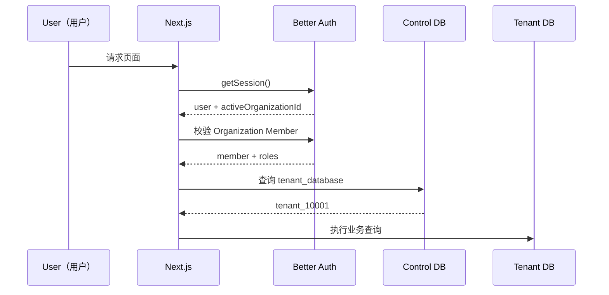
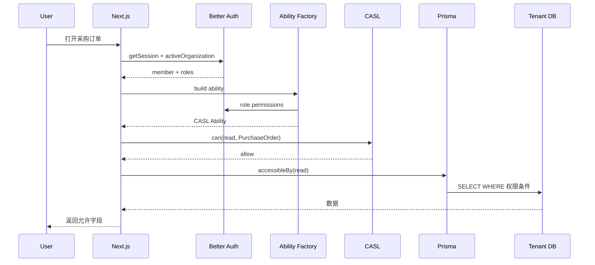

# SaaS Foundation Minimal 学习手册

## 成熟框架版：Better Auth + CASL

> 这份文档用于“学懂”这一版基础设施。  
> 不重点讲文件数量，而重点讲：**为什么选这些框架、每一层解决什么问题、页面/按钮/字段/数据权限到底怎么工作。**

---

# 1. 这一版最大的变化

之前我们的思路是自己实现：

```text
Permission Registry（权限注册表）
Data Scope Engine（数据范围引擎）
Field Policy Engine（字段权限引擎）
Authorization Engine（授权引擎）
```

现在改成：

```text
Better Auth
+
CASL
+
少量 ERP 适配
```

因此核心权限理论和运行时不再自己造。

---

# 2. 两个成熟框架分别负责什么

## Better Auth

负责：

```text
Authentication（认证）
User（用户）
Session（会话）
Organization（组织 / Tenant 租户）
Member（成员）
Invitation（邀请）
Role（角色）
Resource -> Action（功能权限）
```

Better Auth Organization Plugin 已经支持：

```text
多个 Organization
多个角色
Custom Permissions（自定义权限）
Dynamic Roles（动态角色）
```

---

## CASL

负责：

```text
Authorization（授权）
Action（动作）
Subject（资源）
Conditions（条件）
Fields（字段）
React <Can>
Prisma 数据过滤
```

CASL 的官方定位就是：

> 在 UI（用户界面）、API（接口）和数据库查询之间共享授权规则。

---

# 3. 为什么这两个很适合你的需求

你的需求：

```text
SaaS
角色
页面
按钮
字段
数据展示范围
后端权限
```

对应：

| 你的需求 | 成熟框架 |
| --- | --- |
| 登录 / Session | Better Auth |
| Tenant / 成员 | Better Auth Organization |
| 多角色 | Better Auth |
| 页面 / 按钮功能权限 | Better Auth + CASL |
| 字段权限 | CASL Fields |
| 数据范围 | CASL Conditions |
| Prisma 查询过滤 | `@casl/prisma` |
| React 控制 | `@casl/react` |

我们真正需要自己写的很少。

---

# 4. Tenant（租户）是什么

比如：

```text
辰润中央厨房
海鲜供应公司
XX 食品公司
```

每一家客户企业都是一个：

```text
Organization（组织）
```

在我们系统里直接把：

```text
Better Auth Organization
=
Tenant（租户）
```

---

# 5. User（用户）与 Member（成员）

例如：

```text
张三
```

只有一份 User。

但是：

```text
张三
├── 辰润中央厨房：采购员
└── 供应链公司：管理员
```

这两个关系是：

```text
Member / Membership（租户成员关系）
```

Better Auth 已经提供 Organization + Member。

所以我们不需要自己发明 SaaS 用户关系表。

---

# 6. 登录后怎么知道当前 Tenant

Better Auth Session 可以维护：

```text
activeOrganizationId
```

于是：

```text
Session
↓
activeOrganizationId
↓
Member 是否有效
↓
当前 Tenant
```

---

# 7. 为什么还要 Tenant Database Mapping

Better Auth 解决：

```text
当前是哪一个 Tenant
```

但我们还要解决：

```text
这个 Tenant 的业务数据库在哪里
```

所以补一张：

```text
tenant_database
```

---

# 8. SaaS 请求流程



---

# 9. 功能权限不再用自定义 Permission Registry

Better Auth 本身就提供：

```typescript
createAccessControl({
  project: [
    "create",
    "update",
    "delete"
  ]
});
```

所以我们的 ERP 可以定义：

```typescript
const statement = {
  "procurement.order": [
    "read",
    "create",
    "update",
    "audit",
    "export"
  ]
} as const;
```

这就是成熟框架自己的权限目录。

---

# 10. Resource（资源）与 Action（动作）

例如：

```text
Resource:
procurement.order

Actions:
read
create
update
audit
export
```

不要把权限叫：

```text
btn_add_order
page_purchase_order
```

因为按钮和页面只是 UI 表现。

业务能力才是真正权限。

---

# 11. Role（角色）

角色可以是：

```text
采购员
采购经理
审核员
仓库管理员
```

Better Auth Dynamic Access Control（动态访问控制）负责保存：

```text
Role
↓
Resource
↓
Actions
```

例如：

```text
采购员
procurement.order:
  read
  create
  update
```

---

# 12. 为什么一个用户可以有多个角色

张三：

```text
采购员
+
审核员
```

最终功能权限就是两者组合。

Better Auth Organization 支持多角色。

---

# 13. 那 CASL 又是干什么的

Better Auth 回答：

```text
张三有没有 order.read？
```

但企业系统还要问：

```text
张三能看哪些订单？
成本价能不能看？
成本价能不能改？
```

这就是 CASL。

---

# 14. CASL 的四个核心词

```text
Action（动作）
Subject（资源对象）
Conditions（条件）
Fields（字段）
```

例如：

```typescript
can(
  "read",
  "PurchaseOrder",
  ["id", "supplierName"],
  {
    deptId: {
      in: departmentIds
    }
  }
);
```

这句代码同时表达：

```text
动作：read
资源：PurchaseOrder
字段：id / supplierName
数据范围：deptId 属于 departmentIds
```

---

# 15. Data Scope（数据范围）怎么来的

管理员不需要直接写 CASL Conditions。

管理页面还是我们熟悉的：

```text
○ 本人
○ 本部门
● 本部门及下级
○ 指定部门
○ 全部
```

后台把它编译为：

```text
CASL Conditions
```

---

# 16. SELF（本人）

配置：

```text
SELF
```

Ability Factory 生成：

```typescript
can(
  "read",
  "PurchaseOrder",
  {
    createdById: user.id
  }
);
```

---

# 17. DEPT（本部门）

```typescript
can(
  "read",
  "PurchaseOrder",
  {
    deptId: user.deptId
  }
);
```

---

# 18. DEPT_TREE（本部门及下级）

先得到：

```text
当前部门 + 所有下级部门 ID
```

再：

```typescript
can(
  "read",
  "PurchaseOrder",
  {
    deptId: {
      in: deptTreeIds
    }
  }
);
```

---

# 19. ALL（全部）

```typescript
can(
  "read",
  "PurchaseOrder"
);
```

没有 Conditions 就是不限制数据。

---

# 20. 为什么这比自己写 buildDataScope 更安心

因为最后真正的数据查询不是我们自己拼一个：

```text
if scope == ...
```

而是交给：

```text
CASL Rules
↓
@casl/prisma accessibleBy()
↓
Prisma where
```

成熟库负责把授权条件转换成数据库过滤。

---

# 21. Prisma 数据查询示例

```typescript
const ability =
  await abilityFactory.forCurrentUser();

const accessWhere =
  accessibleBy(
    ability,
    "read"
  ).PurchaseOrder;

return prisma.purchaseOrder.findMany({
  where: accessWhere,
});
```

因此数据权限直接进入数据库查询。

---

# 22. 详情权限

先查询：

```text
id + accessibleBy 条件
```

而不是：

```text
findUnique(id)
↓
然后才判断
```

避免越权详情访问。

---

# 23. Field（字段）权限

你需要：

```text
HIDDEN
READONLY
EDITABLE
```

CASL 本身支持 Fields。

我们不额外造 Field Authorization Engine。

---

# 24. HIDDEN 怎么表达

如果角色没有：

```text
read costPrice
```

那么：

```text
costPrice = HIDDEN
```

前端不显示。

后端 Response 不返回。

导出不包含。

---

# 25. READONLY 怎么表达

角色拥有：

```text
read costPrice
```

但没有：

```text
update costPrice
```

于是：

```text
READONLY
```

---

# 26. EDITABLE 怎么表达

同时拥有：

```text
read costPrice
update costPrice
```

就是：

```text
EDITABLE
```

所以三态其实可以由 CASL 的：

```text
read fields
update fields
```

自然推导出来。

---

# 27. React（前端）如何隐藏按钮

CASL 官方提供：

```text
@casl/react
```

可以：

```tsx
<Can
  I="create"
  a="PurchaseOrder"
>
  <Button>新建</Button>
</Can>
```

这就是你以前低代码系统里的：

```text
权限标识控制按钮显示
```

只是现在用成熟 React 授权库完成。

---

# 28. 前端是不是最终安全边界

不是。

```text
<Can>
```

只是：

```text
UX（用户体验）
```

用户可以：

```text
Postman
curl
DevTools
```

绕过 UI。

真正权限仍然必须在服务端 CASL 检查。

---

# 29. 服务端怎么检查

```typescript
const ability =
  await getCurrentAbility();

ForbiddenError
  .from(ability)
  .throwUnlessCan(
    "audit",
    "PurchaseOrder"
  );
```

---

# 30. 为什么还要 Decorator（装饰器）

因为你喜欢注解式代码，而且权限属于横切能力。

我们可以封装：

```typescript
@RequireAbility(
  "audit",
  "PurchaseOrder"
)
async auditOrder() {}
```

但里面没有新权限算法。

只是调用 CASL。

---

# 31. Data Scope + Field 一起工作的例子

采购员：

```text
功能：
read / create / update

数据：
DEPT

字段：
supplierName = EDITABLE
costPrice = HIDDEN
```

最终 Ability 类似：

```typescript
can(
  "read",
  "PurchaseOrder",
  ["id", "supplierName", "quantity"],
  { deptId: currentDeptId }
);

can(
  "update",
  "PurchaseOrder",
  ["supplierName", "quantity"],
  { deptId: currentDeptId }
);
```

---

# 32. 采购经理例子

```text
功能：
read / create / update / audit / export

数据：
DEPT_TREE

字段：
costPrice = READONLY
```

Ability：

```typescript
can(
  "read",
  "PurchaseOrder",
  [
    "id",
    "supplierName",
    "quantity",
    "costPrice"
  ],
  {
    deptId: {
      in: deptTreeIds
    }
  }
);

can(
  "update",
  "PurchaseOrder",
  [
    "supplierName",
    "quantity"
  ],
  {
    deptId: {
      in: deptTreeIds
    }
  }
);
```

因为 update fields 不含 `costPrice`：

```text
costPrice = READONLY
```

---

# 33. Business Policy（业务规则）

即使有：

```text
audit
```

也不能说明：

```text
任何订单都能审核
```

还要：

```text
Pending 才能审核
不能自审
```

这些保留显式代码。

---

# 34. 为什么业务规则不放 CASL

CASL 可以写很多 Conditions。

但不要把所有状态机都塞进去。

原则：

```text
访问控制
→ CASL

领域业务规则
→ Feature Domain / Policy
```

这样更清楚。

---

# 35. Role Data Scope 为什么还有一张小表

Better Auth 动态角色只负责：

```text
Resource -> Actions
```

它不知道 ERP 的：

```text
SELF / DEPT / DEPT_TREE
```

所以我们只补：

```text
role_data_scope
```

这是配置，不是新权限引擎。

---

# 36. Role Field Policy 为什么还有一张小表

同样：

```text
Better Auth
```

没有业务字段三态模型。

所以只补：

```text
role_field_policy
```

然后 Ability Factory 把配置翻译成 CASL Fields。

---

# 37. Ability Factory 是干什么的

可以理解成：

> **翻译器。**

输入：

```text
Better Auth Role Permissions
+
Data Scope Config
+
Field Config
+
当前用户部门信息
```

输出：

```text
CASL Ability
```

---

# 38. 它不是什么

它不是：

```text
新的 Authorization Engine
新的 Permission Framework
新的 DSL
```

真正授权算法是 CASL。

---

# 39. 为什么这一版比自定义 Permission Registry 更主流

因为现在核心概念直接来自成熟框架：

```text
Better Auth:
Resource / Action / Role / Organization

CASL:
Action / Subject / Conditions / Fields
```

我们没有再发明一套新的核心数据结构。

---

# 40. Migration（数据库迁移）为什么仍然是核心

权限框架成熟不等于 SaaS 数据库迁移消失。

因为：

```text
Database-per-Tenant
```

意味着：

```text
100 个租户
= 100 个业务数据库要升级
```

所以 Migration Runner 仍是我们必须实现的 SaaS 基础设施。

---

# 41. FDD（特性驱动开发）

每个业务模块：

```text
procurement-center
inventory-center
order-center
```

独立组织。

Feature 使用统一：

```text
Ability
TenantDb
Auth
```

而不是自己重复实现权限。

---

# 42. Harness（智能体协作工程）

Harness 只解决：

```text
AI / 人能修改哪里
需要加载什么上下文
怎么验证
怎么交接
```

它不参与权限运行时。

---

# 43. 一次真实请求



---

# 44. 常见场景

## 场景 A：按钮隐藏

```text
没有 create
→ <Can> 不渲染按钮
```

---

## 场景 B：直接请求 API

```text
前端按钮没有显示
但手工 POST
→ 服务端 CASL 再检查
→ 403
```

---

## 场景 C：只能看本部门

```text
role_data_scope = DEPT
→ CASL Condition
→ Prisma where deptId = 当前部门
```

---

## 场景 D：成本价只读

```text
read costPrice = yes
update costPrice = no
→ READONLY
```

---

## 场景 E：导出

```text
export 功能权限
+
accessibleBy 数据过滤
+
字段过滤
→ 最终 Excel
```

---

# 45. V1 不做什么

```text
不做 Cerbos PDP
不做 OpenFGA
不做 OPA
不做微服务
不做计费
不做套餐
```

因为当前一个 TypeScript 模块化单体中：

```text
Better Auth + CASL
```

已经很完整。

---

# 46. 什么时候再考虑 Cerbos

以后出现：

```text
Go 服务
Python 服务
多个独立 API
多个 MCP Server
跨服务统一授权
```

此时：

```text
集中 PDP
```

价值会明显变大。

再评估：

```text
Cerbos
```

而不是现在提前增加服务复杂度。

---

# 47. 最终心智模型

只记：

```text
Better Auth
= 你是谁、在哪个 Tenant、有哪些 Role、有哪些功能 Action

CASL
= 对哪些数据、哪些字段，最终能不能做

Prisma
= 把数据权限真正落进 SQL

Feature
= 真正业务规则
```

---

# 48. 官方参考

## Better Auth

- <https://better-auth.com/docs/introduction>
- <https://better-auth.com/docs/plugins/organization>
- <https://better-auth.com/docs/integrations/next>
- <https://better-auth.com/docs/adapters/prisma>

## CASL

- <https://github.com/stalniy/casl>
- <https://github.com/stalniy/casl-examples>

## Prisma

- <https://docs.prisma.io/docs/orm/core-concepts/supported-databases/postgresql>
