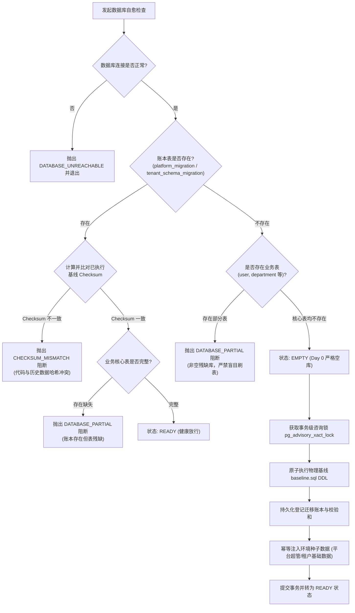

# 系统 ERP 数据库自愈与演进引擎架构解析 (Database Migration & Self-Healing Engine)

> **文档定位**：本文档为系统数智 ERP 专用数据库演进与自愈引擎 (`tooling/db-migrate`) 的专项深度技术设计与实现原理解析文档，涵盖 12-Factor 原则践行、运行期零 Prisma CLI 依赖、动态切片 Schema 聚合 (`@db-migrate-extension`)、Day 0 数据库自愈状态机与分布式咨询锁机制。
> **关联架构索引**：[《系统整体架构白皮书》](../ARCHITECTURE.md) | [《生产与多环境部署实战指南》](../deployment/DEPLOYMENT.md) | [ADR-002: Database-per-tenant 物理隔离战略](../../.harness/memory/adr/ADR-002-database-per-tenant.md)

---

## 一、 设计背景与 12-Factor 原则考量

在传统全栈 Next.js + Prisma 项目中，常见的数据库迁移方案往往依赖在容器启动脚本中运行 `prisma migrate deploy` 或在应用服务中通过 `child_process.exec` 动态唤起 Prisma CLI。但在云原生生产部署与多租户企业级架构下，该方案存在三大致命问题：

1. **Next.js Turbopack / Webpack 编译黑盒与文件丢失**：
   在 Next.js standalone 打包后，源码中的 `prisma/schema.prisma` 与 `migrations/` 磁盘物理路径被改写或丢失，导致生产容器启动时报 `ENOENT` 崩溃。
2. **容器镜像与安全反模式**：
   生产 Docker 镜像被迫预装完整的 Node.js 开发依赖、Prisma CLI 二进制与编译器（高达数百兆），严重破坏容器轻量化与最小安全攻击面原则。
3. **租户开辟并发惊群与非原子性**：
   面对数百个租户物理库的动态开辟与升级，通过子进程反复派生 CLI 进程极其缓慢且容易超时，一旦建表过程中断，极易残留不可控的半成品数据库。

为此，系统 ERP 自主设计了轻量级、确定性的数据库演进引擎 **`tooling/db-migrate`**，严格践行云原生 **12-Factor App 原则**（特别是 Codebase、Build/Release/Run、Admin Processes、Disposability）。

---

## 二、 核心架构：开发态物理工件生成与运行时纯 SQL 动态加载

系统将数据库迁移彻底拆分为**开发态工件生成 (Dev-Time Artifact Generation)** 与 **运行态纯 SQL 动态加载执行 (Runtime-Zero-CLI)**：

```text
┌─────────────────────────────────────────────────────────────────────────────┐
│                       开发期 / 构建期 (Dev & Build Time)                    │
│  - 开发者修改各切片 prisma/schema.prisma                                     │
│  - 聚合器解析 @db-migrate-extension 注解并完成 Schema 合并                   │
│  - 执行 pnpm db:migrate:generate / baseline 产出物理 SQL 工件                 │
│  - 产出磁盘物理清单: baselines/* (baseline.sql) 与 migrations/* (migration.sql)│
└──────────────────────────────────────┬──────────────────────────────────────┘
                                       │ 物理目录部署打入应用镜像 (包含 .sql 与 manifest.json)
┌──────────────────────────────────────┴──────────────────────────────────────┐
│                        生产运行态 (Production Runtime)                      │
│  - 生产镜像内 0 Prisma CLI，0 TS 常量黑盒，0 子进程派生                      │
│  - 动态文件扫描加载: getMigrationCatalog(scope) 毫秒级读取真实 SQL 资产      │
│  - 纯 pg 驱动原生直连执行，带 SHA-256 防篡改校验和比对                      │
│  - Day 0 自愈引擎配合分布式咨询锁保障绝对原子性与并发安全                  │
└─────────────────────────────────────────────────────────────────────────────┘
```

### 1. 物理 SQL 资产与清单目录 (`baselines/` 与 `migrations/`)

系统彻底废弃了将 SQL 转换为 TypeScript 代码常量的脆弱模式，100% 采用物理文件系统动态加载真实 SQL 资产：

```text
tooling/db-migrate/
├── baselines/                # 各作用域的完整基线快照
│   └── <scope>/<version>/
│       ├── baseline.sql      # 全量建表原生 DDL
│       ├── manifest.json     # 基线元数据、SHA-256 校验和与 Schema 哈希
│       └── schema.prisma     # 对应的 canonical 聚合 Schema
└── migrations/               # 增量版本迁移目录
    └── <scope>/<version>_<name>/
        ├── migration.sql     # 升级 SQL (up)
        ├── down.sql          # 回滚 SQL (down)
        ├── manifest.json     # 风险等级标记、校验和与审批元数据
        └── schema.snapshot.prisma # 本次变更对应的 Schema 快照
```

运行时通过 `getMigrationCatalog(scope)`（位于 `src/runtime/catalog.ts` 与 `src/core/artifacts.ts`）在应用启动或执行升级时实时加载：

- `loadLatestBaseline(root, scope)`：动态读取最新版本的 `baseline.sql` 并核验 SHA-256；
- `loadMigrationArtifacts(root, scope)`：按版本升序扫描所有已发布的增量迁移目录，严格核验每个 `migration.sql` 的完整性与风险批准签名。

---

## 三、 多切片 Schema 动态聚合机制 (`@db-migrate-extension`)

在 Feature-based Vertical Slice 业务模块架构下，租户模型并非集中存放在单一巨石 Schema 中，而是由各业务区域就近声明：

- **基础组织人事**：`packages/db-tenant/prisma/schema.prisma`
- **采购管理中心**：`packages/features/procurement-center/prisma/schema.prisma`
- **客户与门店中心**：`packages/features/customer-center/prisma/schema.prisma`

为了解决跨包外键关系（例如采购单需要关联部门 `Department`，客户订单需要关联业务员 `EmployeeProfile`），`tooling/db-migrate/src/schema/aggregate.ts` 实现了创新的关系扩展注解机制：

```prisma
// packages/features/procurement-center/prisma/schema.prisma
// @db-migrate-extension Department
model Department {
  id     String          @id
  orders PurchaseOrder[]
  @@map("department")
}
```

### 聚合器工作机制

1. **模型归属判定 (Owner Identification)**：每个业务模型有且仅有一个主归属切片（例如 `Department` 的唯一拥有者是 `packages/db-tenant`）。
2. **关系字段合并 (Field Stitching)**：标记为 `@db-migrate-extension` 的声明被识别为反向关联扩展，聚合器自动将 `orders PurchaseOrder[]` 字段抽取并注入到主模型的定义中。
3. **冲突校验 (Conflict Detection)**：若两个切片尝试主声明同名模型或声明了互斥字段，聚合器在构建期立即抛出明确错误并阻断，杜绝模型污染。

---

## 四、 Day 0 数据库自愈与状态机引擎

在服务冷启动阶段（如运行 `./init.sh` 或生产容器部署时的初始化阶段），系统通过 `DatabaseInitializationInspection` 状态机执行严格的状态探查与自愈决策：



### 状态机四大核心状态定义

1. **`EMPTY` (纯净空库)**：
   数据库中既无迁移账本表，也无任何业务核心表（如 `user`、`organization`、`session`，即使预装了 PostGIS 扩展表如 `spatial_ref_sys` 也不会被误判）。且必须提供初始超管配置（`CONTROL_BOOTSTRAP_ADMIN_*`），方可自动执行 Day 0 初始化。
2. **`READY` (健康就绪)**：
   账本存在，所有登记的基线与增量迁移 SHA-256 校验和与磁盘物理工件中的 `baseline.sql` / `migration.sql` 严格吻合，核心表完整存在，直接放行系统启动。
3. **`PARTIAL` (非空残缺库 - Fail-Closed 阻断)**：
   库中存在部分业务表，但迁移账本不存在；或者账本虽在但核心表发生物理丢失。系统判定为“脏库或遭到非正常篡改”，**严禁自动运行任何建表语句**，立即抛出致命错误，要求人工运维介入，防止覆盖破坏存量数据。
4. **`CHECKSUM_MISMATCH` (校验和冲突 - 防架构漂移阻断)**：
   数据库中记录的历史迁移 SQL 哈希与当前磁盘物理迁移工件中的哈希不一致，说明代码或迁移文件发生了未经过正式迁移的私自篡改，立即阻断部署。

### 💡 核心设计问答与排障指南 (FAQ)

#### Q1: 为什么在 Navicat / DBeaver 中手动删除了所有表，系统仍然无法自愈初始化？

这是本地开发排查中最常见的问题，根本原因在于**Fail-Closed 故障闭锁安全哲学**与**严格空库判定**：

1. **删表不彻底被判定为 `PARTIAL`**：
   通过 GUI 客户端手动右键批量删表时，常因外键约束拦截、删表顺序或未提交事务等，残留了部分表或隐藏依赖。只要残留了核心业务表（`user`、`organization`、`session` 等），系统就会判定为**非空残缺库（`PARTIAL`）**，绝对不会自动补建表，而是直接阻断。
   > **正确的清空方式**：在数据库客户端直接执行以下原生 SQL：

> ```sql
> DROP SCHEMA public CASCADE;
> CREATE SCHEMA public;
> ```

2. **缺少初始超级管理员环境变量 (`SEED_CONFIGURATION_MISSING`)**：
   平台总控库的 Day 0 初始化不仅是跑 DDL 建表，还必须同时向 Better Auth 写入初始超管账号以供系统能够正常登录。如果未在 `apps/control/.env.local` 中配置以下变量，即便库是彻底干净的，也会抛出错误阻断初始化：
   - `CONTROL_BOOTSTRAP_ADMIN_EMAIL`
   - `CONTROL_BOOTSTRAP_ADMIN_NAME`
   - `CONTROL_BOOTSTRAP_ADMIN_PASSWORD` (长度不得少于 12 位)

#### Q2: 删除了整个物理数据库 (DROP DATABASE) 为什么应用无法自愈？

应用运行时建立的数据库连接池是绑定特定数据库名称（如 `control_db`）的。如果物理 Database 彻底不存在，PostgreSQL 在 TCP 握手与鉴权阶段就会报致命错误 `FATAL: database "control_db" does not exist`。应用层无权也无法在未连接的状态下跨库执行 `CREATE DATABASE`。物理 Database 必须先由 Docker 或基础设施层预先创建完毕。

---

## 五、 事务级分布式咨询锁 (`pg_advisory_xact_lock`)

在多容器并发部署（如 Kubernetes 多副本 Rolling Update）或并发租户开通时，多个进程可能同时检测到数据库为空并试图执行初始化。

系统通过 PostgreSQL 事务级咨询锁提供绝对的防并发重入保护：

```sql
BEGIN;
-- 设置锁获取超时，避免无限期死锁等待
SET LOCAL lock_timeout = '15s';
-- 904202601 为平台库全局常量锁 ID，租户库使用租户 hash 锁 ID
SELECT pg_advisory_xact_lock(904202601);

-- 获取锁后执行 Double-Check 复检：
-- 如果前一个并发事务已经完成了建表并提交，本次直接感知为 READY，无缝跳过！
...
COMMIT; -- 事务提交时，锁自动释放，天然免疫长连接泄漏与 PgBouncer 事务连接池悬挂
```

---

## 六、 核心源码地图索引与指引

| 架构职责           | 权威源码文件路径                                    | 核心类 / 导出                            | 架构说明                                                 |
| :----------------- | :-------------------------------------------------- | :--------------------------------------- | :------------------------------------------------------- |
| **物理工件目录**   | `tooling/db-migrate/baselines/`, `migrations/`      | `baseline.sql`, `migration.sql`          | 物理原生 DDL/DML 与 SHA-256 校验和清单单一事实源         |
| **运行时 Catalog** | `tooling/db-migrate/src/runtime/catalog.ts`         | `getMigrationCatalog`                    | 动态从物理文件系统加载基线与增量迁移工件并校验哈希       |
| **工件加载与断言** | `tooling/db-migrate/src/core/artifacts.ts`          | `loadLatestBaseline`, `loadMigration...` | 物理 SQL 文件安全加载器，带 SHA-256 强校验与高危操作审批 |
| **Schema 聚合器**  | `tooling/db-migrate/src/schema/aggregate.ts`        | `buildCanonicalSchema`                   | 解析 `@db-migrate-extension` 注解，聚合跨切片业务模型    |
| **平台库执行器**   | `tooling/db-migrate/src/runtime/platform-runner.ts` | `PlatformMigrationRunner`                | 平台集中管控库 Day 0 自愈、迁移升级与 Advisory 锁管理    |
| **租户库执行器**   | `tooling/db-migrate/src/runtime/tenant-runner.ts`   | `TenantMigrationRunner`                  | 多租户物理库版本预检、Advisory 锁并发保护与舰队批量升级  |
| **租户库开通器**   | `tooling/db-migrate/src/runtime/provisioner.ts`     | `TenantDatabaseProvisioner`              | 租户物理库原子开通、Baseline 批量执行与健康自检          |
| **迁移 CLI 入口**  | `tooling/db-migrate/src/cli.ts`                     | `baseline`, `generate`, `check`, ...     | 命令行脚手架调度入口                                     |
