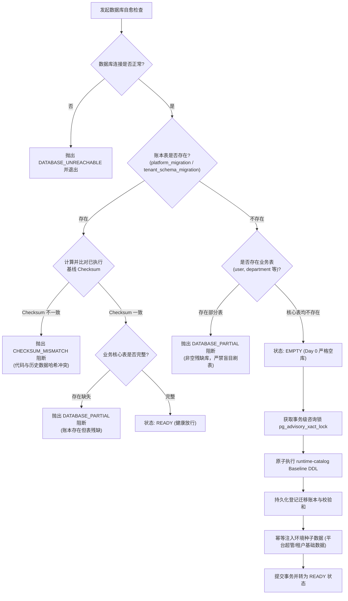

# 系统 ERP 数据库自愈与演进引擎架构解析 (Database Migration & Self-Healing Engine)

> **文档定位**：本文档为系统数智 ERP 专用数据库演进与自愈引擎 (`tooling/db-migrate`) 的专项深度技术设计与实现原理解析文档，涵盖 12-Factor 原则践行、运行期零 Prisma CLI 依赖、动态切片 Schema 聚合 (`@db-migrate-extension`)、Day 0 数据库自愈状态机与分布式咨询锁机制。
> **关联架构索引**：[《系统整体架构白皮书》](../ARCHITECTURE.md) | [《生产与多环境部署实战指南》](../deployment/DEPLOYMENT.md) | [ADR-002: Database-per-tenant 物理隔离战略](../../.harness/memory/adr/ADR-002-database-per-tenant.md)

---

## 一、 设计背景与 12-Factor 原则考量

在传统全栈 Next.js + Prisma 项目中，常见的数据库迁移方案往往依赖在容器启动脚本中运行 `prisma migrate deploy` 或在应用服务中通过 `child_process.exec` 动态唤起 Prisma CLI。但在云原生生产部署与多租户企业级架构下，该方案存在三大致命问题：

1. **Next.js Turbopack / Webpack 编译黑盒与文件丢失**：
   在 Next.js standalone 打包后，源码中的 `prisma/schema.prisma` 与 `migrations/` 磁盘物理路径被改写或丢失，导致生产容器启动时报 `ENOENT` 崩溃。
2. **容器镜像与安全反模式**：
   生产 Docker 镜像被迫预装完整的 Node.js 开发依赖、Prisma CLI 二进制与编译器（高达数百兆），严重破坏容器轻量化与最小安全攻击面原则。
3. **租户开辟并发惊群与非原子性**：
   面对数百个租户物理库的动态开辟与升级，通过子进程反复派生 CLI 进程极其缓慢且容易超时，一旦建表过程中断，极易残留不可控的半成品数据库。

为此，系统 ERP 自主设计了轻量级、确定性的数据库演进引擎 **`tooling/db-migrate`**，严格践行云原生 **12-Factor App 原则**（特别是 Codebase、Build/Release/Run、Admin Processes、Disposability）。

---

## 二、 核心架构：开发态编译与运行时静态目录

系统将数据库迁移彻底拆分为**开发编译态 (Dev/Build-Time)** 与 **运行时无状态执行态 (Runtime-Zero-CLI)**：

```text
┌─────────────────────────────────────────────────────────────────────────────┐
│                       开发期 / 构建期 (Dev & Build Time)                    │
│  - 开发者修改各切片 prisma/schema.prisma                                     │
│  - 执行 pnpm db:catalog:build 生成预编译工件                                 │
│  - 聚合器解析 @db-migrate-extension 注解并完成 Schema 合并                   │
│  - 生成只读静态常量: tooling/db-migrate/generated/runtime-catalog.ts        │
└──────────────────────────────────────┬──────────────────────────────────────┘
                                       │ 编译打包进生产镜像 (无任何磁盘文件依赖)
┌──────────────────────────────────────┴──────────────────────────────────────┐
│                        生产运行态 (Production Runtime)                      │
│  - 生产镜像内 0 Prisma CLI，0 磁盘 Schema 依赖，0 子进程派生                │
│  - 纯 TS 代码引入: import { PLATFORM_CATALOG, TENANT_CATALOG }             │
│  - 纯 pg 驱动原生驱动，毫秒级直接执行预编译 SQL 文本                        │
│  - Day 0 自愈引擎配合分布式咨询锁保障绝对原子性与并发安全                  │
└─────────────────────────────────────────────────────────────────────────────┘
```

### 1. 运行时静态目录工件 (`runtime-catalog.ts`)

编译输出的静态目录包含迁移所需的全部元数据、基线全量 DDL 与增量迁移列表：

```typescript
// tooling/db-migrate/generated/runtime-catalog.ts (节选)
export const TENANT_CATALOG = {
  scope: "tenant",
  baseline: {
    version: "20260910141219",
    checksum: "6882650be6ba13b35522e8486001258ef9c7bb72911bfbe2427aae69c36280b2",
    sql: `
      CREATE TABLE IF NOT EXISTS "department" (
        "id" TEXT NOT NULL,
        "name" TEXT NOT NULL,
        "parent_id" TEXT,
        ...
      );
      ...
    `,
  },
  migrations: [
    // 历史增量迁移文件及其 SHA-256 校验和
  ],
} as const;
```

---

## 三、 多切片 Schema 动态聚合机制 (`@db-migrate-extension`)

在 Feature-based Vertical Slice 业务模块架构下，租户模型并非集中存放在单一巨石 Schema 中，而是由各业务区域就近声明：

- **基础组织人事**：`packages/db-tenant/prisma/schema.prisma`
- **采购管理中心**：`packages/features/procurement-center/prisma/schema.prisma`
- **客户与门店中心**：`packages/features/customer-center/prisma/schema.prisma`

为了解决跨包外键关系（例如采购单需要关联部门 `Department`，客户订单需要关联业务员 `EmployeeProfile`），`tooling/db-migrate/src/schema/aggregate.ts` 实现了创新的关系扩展注解机制：

```prisma
// packages/features/procurement-center/prisma/schema.prisma
// @db-migrate-extension Department
model Department {
  id     String          @id
  orders PurchaseOrder[]
  @@map("department")
}
```

### 聚合器工作机制

1. **模型归属判定 (Owner Identification)**：每个业务模型有且仅有一个主归属切片（例如 `Department` 的唯一拥有者是 `packages/db-tenant`）。
2. **关系字段合并 (Field Stitching)**：标记为 `@db-migrate-extension` 的声明被识别为反向关联扩展，聚合器自动将 `orders PurchaseOrder[]` 字段抽取并注入到主模型的定义中。
3. **冲突校验 (Conflict Detection)**：若两个切片尝试主声明同名模型或声明了互斥字段，聚合器在构建期立即抛出明确错误并阻断，杜绝模型污染。

---

## 四、 Day 0 数据库自愈与状态机引擎

在服务冷启动阶段（如运行 `./init.sh` 或生产容器部署时的初始化阶段），系统通过 `DatabaseInitializationInspection` 状态机执行严格的状态探查与自愈决策：



### 状态机四大核心状态定义

1. **`EMPTY` (纯净空库)**：
   数据库中既无迁移账本表，也无任何业务表（即使预装了 PostGIS 扩展表如 `spatial_ref_sys` 也不会被误判）。允许自动执行 Day 0 初始化。
2. **`READY` (健康就绪)**：
   账本存在，所有登记的基线与增量迁移 SHA-256 校验和与代码中的 `runtime-catalog.ts` 严格吻合，核心表完整存在，直接放行系统启动。
3. **`PARTIAL` (非空残缺库 - Fail-Closed 阻断)**：
   库中存在部分业务表，但迁移账本不存在；或者账本虽在但核心表发生物理丢失。系统判定为“脏库或遭到非正常篡改”，**严禁自动运行任何建表语句**，立即抛出致命错误，要求人工运维介入，防止覆盖破坏存量数据。
4. **`CHECKSUM_MISMATCH` (校验和冲突 - 防架构漂移阻断)**：
   数据库中记录的历史迁移 SQL 哈希与当前代码预编译工件中的哈希不一致，说明代码发生了未经过正式迁移的私自篡改，立即阻断部署。

---

## 五、 事务级分布式咨询锁 (`pg_advisory_xact_lock`)

在多容器并发部署（如 Kubernetes 多副本 Rolling Update）或并发租户开通时，多个进程可能同时检测到数据库为空并试图执行初始化。

系统通过 PostgreSQL 事务级咨询锁提供绝对的防并发重入保护：

```sql
BEGIN;
-- 设置锁获取超时，避免无限期死锁等待
SET LOCAL lock_timeout = '15s';
-- 904202601 为平台库全局常量锁 ID，租户库使用租户 hash 锁 ID
SELECT pg_advisory_xact_lock(904202601);

-- 获取锁后执行 Double-Check 复检：
-- 如果前一个并发事务已经完成了建表并提交，本次直接感知为 READY，无缝跳过！
...
COMMIT; -- 事务提交时，锁自动释放，天然免疫长连接泄漏与 PgBouncer 事务连接池悬挂
```

---

## 六、 核心源码地图索引与指引

| 架构职责 | 权威源码文件路径 | 核心类 / 导出 | 架构说明 |
| :--- | :--- | :--- | :--- |
| **运行时静态目录** | `tooling/db-migrate/generated/runtime-catalog.ts` | `PLATFORM_CATALOG`, `TENANT_CATALOG` | 预编译全量基线 DDL、增量迁移与校验和常量 |
| **Schema 聚合器** | `tooling/db-migrate/src/schema/aggregate.ts` | `aggregateSchemas` | 解析 `@db-migrate-extension` 注解，聚合跨切片模型 |
| **状态机探查器** | `tooling/db-migrate/src/runtime/inspection.ts` | `inspectDatabaseState` | 判定 `EMPTY` / `READY` / `PARTIAL` / `CHECKSUM_MISMATCH` |
| **平台库执行器** | `tooling/db-migrate/src/runtime/platform-runner.ts` | `PlatformMigrationRunner` | 平台集中管控库 Day 0 自愈、迁移升级与 Advisory 锁管理 |
| **租户库开通器** | `tooling/db-migrate/src/runtime/provisioner.ts` | `TenantDatabaseProvisioner` | 租户物理库原子开通、Baseline 批量执行与健康自检 |
| **迁移 CLI 入口** | `tooling/db-migrate/src/cli.ts` | `db:catalog:build`, `db:platform:ensure` | 开发与部署期命令行工具 |
