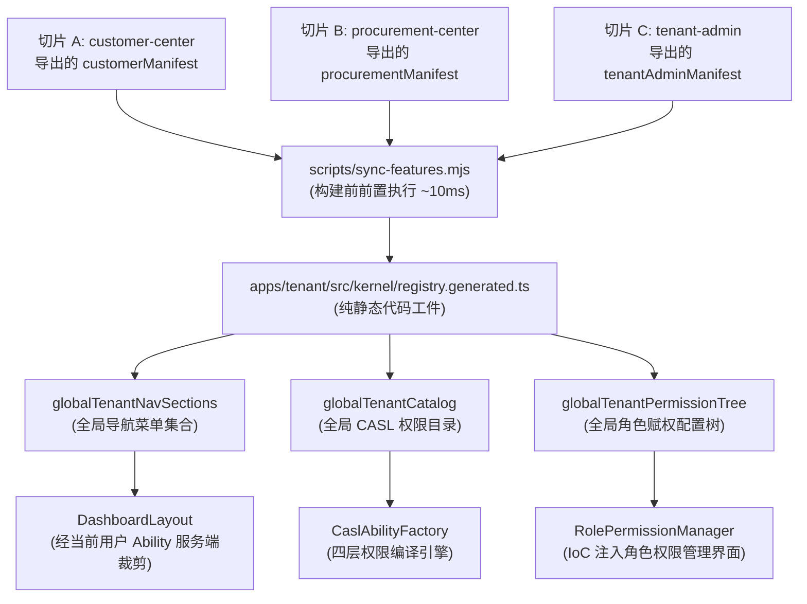

# 辰润 ERP 垂直切片与动态自发现架构解析 (FDD & Dynamic Discovery Architecture)

> **文档定位**：本文档为辰润数智 ERP 垂直切片规范 (Feature-Driven Development)、构建期动态自发现机制 (Feature Manifest)、切片解耦防腐治理与工业风 UI/UX 设计哲学的专项技术解析文档。
> **关联架构索引**：[《系统整体架构白皮书》](../ARCHITECTURE.md) | [《特性清单与动态自发现规范》](./Feature_Manifest_and_Dynamic_Discovery_Architecture.md) | [ADR-001: FDD 架构](../../.harness/memory/adr/ADR-001-fdd-and-harness.md) | [ADR-005: 动态自发现](../../.harness/memory/adr/ADR-005-feature-manifest-and-build-time-discovery.md) | [ADR-006: 租户应用 Kernel 装配与切片解耦](../../.harness/memory/adr/ADR-006-app-kernel-assembly-and-slice-decoupling.md)

---

## 一、 FDD 垂直切片设计哲学 (Vertical Slices)

在大型企业级 ERP 系统的演进过程中，传统的“按技术横向分层（例如所有控制器放一处、所有服务放一处、所有页面放一处）”往往会导致严重的架构腐化：修改一个业务功能需要跨越四五个平铺目录，模块边界模糊，导致多人协作频繁冲突。

辰润 ERP 全面推行 **FDD (Feature-Driven Development) 垂直切片架构**：

- **物理自包含**：每个业务切片是一个完全独立的高内聚 NPM 包（位于 `packages/features/*`，如 `procurement-center`、`customer-center`、`tenant-admin`）。
- **包含完整生命周期**：单一切片涵盖该业务领域的数据模型（`prisma/schema.prisma`）、纯数据权限契约（`contracts/`）、业务领域服务（`services/`）、安全服务端动作（`actions.ts`）与高密度交互组件（`components/`）。
- **对外暴露严格最小化**：切片内部的私有工具、辅助计算绝不导出，仅通过 `manifest.ts` 和根目录 `index.ts` 暴露受控公共接口。

```text
packages/features/<slice-name>/
├── prisma/schema.prisma     # 【领域模型】切片专有模型与 @db-migrate-extension 扩展
├── src/
│   ├── contracts/           # 【契约中枢】纯数据受控字段字典、操作动作与页面权限契约 (SSoT)
│   ├── services/            # 【领域服务】核心业务逻辑用例、Prisma 事务下推
│   ├── actions.ts           # 【安全 Action】Next.js Server Actions (集成 CASL 校验)
│   ├── components/          # 【高密度交互】纯粹展示组件与受控交互积木 (DataTable, Modal)
│   ├── manifest.ts          # 【自描述清单】向宿主应用贡献的导航、模块与受控页面契约
│   └── index.ts             # 【包导出入口】严格最小化导出
```

---

## 二、 纯数据契约事实源 (`contracts/`)

为了防止前端 UI 组件、后端 Action 拦截器与管理后台角色赋权树各自硬编码权限字段，架构强制推行**契约单一事实源 (SSoT)**。

以客户中心 (`packages/features/customer-center/src/contracts/customer.contract.ts`) 为例：

```typescript
export const CustomerSubject = "Customer";

export const CustomerField = {
  CREDIT_LIMIT: "creditLimit",
  SETTLEMENT_DAYS: "settlementDays",
  // ...
} as const;

export const customerPageContract: FeaturePagePermissionDescriptor = {
  pageKey: "customer_list",
  moduleKey: "customer",
  subject: CustomerSubject,
  name: "客户档案管理",
  standardActions: [StandardAction.READ, StandardAction.CREATE, StandardAction.UPDATE, StandardAction.EXPORT],
  customActions: [
    { action: "toggle_status", label: "启停客户", description: "允许启用或冻结客户合作资格" }
  ],
  configurableFields: [
    { field: CustomerField.CREDIT_LIMIT, label: "授信额度", sensitive: true, description: "客户最高赊账额度" },
  ],
};
```

### 契约收益

1. **类型安全推导**：前端表单控件与后端 Action 校验直接从 `CustomerField` 衍生 TypeScript 类型。
2. **零重复定义**：后台角色权限配置面板（`RolePermissionManager`）无需手动维护权限树，直接消费该契约自动生成可视化的“功能动作复选框”与“字段三态下拉选择器”。

---

## 三、 构建期动态自发现机制 (Feature Manifest)

在 Next.js 16 (Turbopack) 下，由于运行期代码经过打包转译，无法在服务启动时动态扫描文件系统 (`fs.readdir`)。

系统创新采用 **构建期静态生成 + 应用内核装配** 模式（详见 ADR-005 与 ADR-006）：



### 极速生成脚本 (`scripts/sync-features.mjs`)

在 `pnpm dev` 与 `pnpm build` 运行前，`sync-features.mjs` 仅耗时约 10ms 即可完成对 `packages/features/*/src/manifest.ts` 的静态 AST 扫描，并将聚合好的清单写入 `apps/tenant/src/kernel/registry.generated.ts`。

---

## 四、 切片间依赖解耦与架构防腐 (ADR-006 拨乱反正)

在系统早期探索中，曾一度将切片清单注册表置于 `tenant-admin` 中，导致 `tenant-admin`（管理切片）反向依赖了业务切片（`procurement-center`、`customer-center`），形成了糟糕的循环依赖隐患与架构耦合。

**ADR-006 确立了权威解耦法则**：

```text
       【拓扑顶层：宿主装配层】
       apps/tenant (应用装配内核)
       ├── src/kernel/registry.generated.ts (汇聚全局清单)
       └── src/app/(dashboard)/settings/roles/page.tsx
                │
                │ 依赖倒置 / 控制反转 (IoC)
                │ SSR 阶段向组件传递 globalTenantPermissionTree
                ▼
       【业务切片层：绝对平级，杜绝横向依赖】
  ┌───────────────────┼───────────────────┐
  ▼                   ▼                   ▼
packages/features/  packages/features/  packages/features/
tenant-admin        procurement-center  customer-center
(仅负责组织人员)    (仅负责采购业务)    (仅负责客户门店)
```

1. **切片彼此平级**：任何业务切片绝不引用同级的兄弟切片。
2. **宿主统筹装配**：`apps/tenant` 位于依赖图的最顶层，扮演“总装配厂”角色。
3. **控制反转 (IoC) 注入**：`tenant-admin` 提供的角色权限配置组件 `RolePermissionManager` 不再内置全局权限树，而是通过 Props 接收由宿主页面注入的 `permissionTree`。

---

## 五、 现代工业风高密度 UI/UX 哲学

辰润 ERP 专为高节奏、严谨度极高的工业制造与供应链作业环境量身定制，在前端交互规范上严格践行五大铁律：

1. **无白屏 (No Blank Out)**：
   - 绝不出现全屏跳转导致的闪烁白屏；
   - 统一利用 React Suspense 与高密度 Skeleton 骨架屏进行局部流式渲染；
   - 路由切换时保持外层 Layout 与侧边栏稳定，仅对内容区域执行增量更新。
2. **静默同步与 URL 状态持久化 (Silent Sync)**：
   - 表格的分页、搜索关键词、分面过滤状态严格同步至浏览器 URL Query (`use-list-url-nav.ts`)；
   - 刷新页面、浏览器前进后退或将当前链接分享给同事时，能够完全无损还原当前的筛选结果。
3. **单次确认与防重护栏 (Safe Action & Single Confirm)**：
   - 严禁弹窗套弹窗的低效交互；
   - 破坏性操作（如停用租户、作废订单）通过单次模态对话框 `ConfirmDialog` 确认；
   - Action 提交期间按钮立即展示 Loading 状态并锁定防重，彻底避免重复扣减库存或多次制单。
4. **轻量 Toast 反馈 (Sonner)**：
   - 操作反馈由右上角轻量 Toast 弹出，不打断业务人员的视线流；
   - 成功提示轻巧自退，失败报错展示明确的业务原因与错误码追踪。
5. **工业级高密度 DataTable**：
   - 提供列宽动态配置（Column Settings）、分面过滤（Faceted Filter）、批量操作栏（Batch Bar）以及侧滑详情抽屉（Detail Drawer），单屏信息吞吐量提升 300%。

---

## 六、 核心源码地图索引与指引

| 架构职责 | 权威源码文件路径 | 核心类 / 导出 | 架构说明 |
| :--- | :--- | :--- | :--- |
| **切片自描述清单** | `packages/features/customer-center/src/manifest.ts` | `customerManifest` | 切片向应用声明的导航菜单、权限模块与受控页面契约 |
| **页面受控契约** | `packages/features/customer-center/src/contracts/customer.contract.ts` | `customerPageContract` | 字段字典、敏感字段白名单与操作动作单一事实源 |
| **动态聚合内核** | `apps/tenant/src/kernel/registry.generated.ts` | `ALL_TENANT_MANIFESTS`, `globalTenantCatalog` | 构建期预编译生成的全局切片、导航与权限树装配工件 |
| **清单同步脚本** | `scripts/sync-features.mjs` | Node.js 扫描脚本 | 极速扫描各切片 Manifest 并重新生成内核注册表 |
| **全局导航引擎** | `apps/tenant/src/kernel/navigation.ts` | `getAuthorizedTenantNavSections` | 服务端基于 CASL Ability 执行导航菜单动态裁剪 |
| **角色权限配置器** | `packages/features/tenant-admin/src/components/RolePermissionManager.tsx` | `RolePermissionManager` | 采用 IoC 模式，由宿主注入权限树完成角色四层权限分配 |
