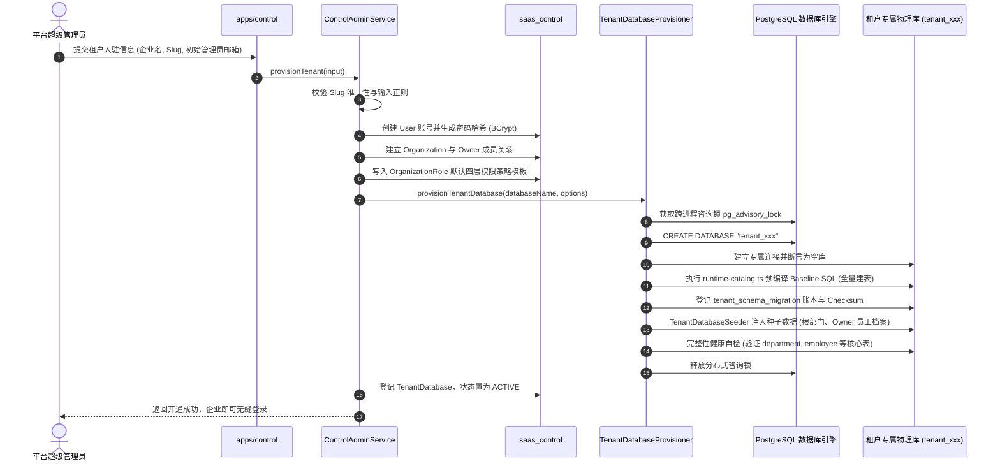

# 系统 ERP 多租户 SaaS 架构与隔离机制深度解析 (Multi-Tenant SaaS Architecture)

> **文档定位**：本文档为系统数智 ERP 多租户 SaaS 基础设施的专项深度技术设计与实现原理解析文档，涵盖 Control Plane 与 Data Plane 双平面分工、Database-per-Tenant 物理隔离机制、动态连接池治理 (`TenantDbManager`)、凭据安全解耦与租户全生命周期闭环。
> **关联架构索引**：[《系统整体架构白皮书》](../ARCHITECTURE.md) | [ADR-002: Database-per-tenant 物理隔离战略](../../.harness/memory/adr/ADR-002-database-per-tenant.md) | [《生产与多环境部署实战指南》](../deployment/DEPLOYMENT.md)

---

## 一、 系统拓扑与双平面设计 (Dual-Plane Topology)

在现代化企业级供应链与工业制造 SaaS 场景中，数据安全、商业机密（原料配方、阶梯采购价、供应商授信等）与多租户自治具有最高优先级。系统 ERP 彻底摒弃了易导致跨租户数据泄露的单库多租户模型，将整个系统划分为**控制平面 (Control Plane)** 与 **数据平面 (Data Plane)** 两个物理隔离的独立运行域：

```text
┌─────────────────────────────────────────────────────────────────────────────┐
│                            Control Plane (平台管控平面)                     │
│  应用入口: apps/control (:3001) | ORM 客户端: @base/db-control           │
│  底层数据库: saas_control (集中管理库)                                       │
│  ─────────────────────────────────────────────────────────────────────────  │
│  - 平台运维超级管理员统一控制台 (/overview, /tenants, /migrations)          │
│  - 全局企业租户总账本 (Organization, User, Account, Session)                │
│  - 物理数据库映射拓扑 (TenantDatabase: clusterCode, databaseName, secretRef)│
│  - 租户专属角色策略模板库 (OrganizationRole: 4层权限 JSON)                  │
│  - 跨租户数据演进控制中枢 (PlatformMigration, TenantMigration)              │
│  - 企业租户初始化开通 (Provisioning) 与租户生命周期管控 (ACTIVE/SUSPENDED)  │
└──────────────────────────────────────┬──────────────────────────────────────┘
                                       │ 动态路由 / 凭据解析 / 上下文解耦
┌──────────────────────────────────────┴──────────────────────────────────────┐
│                             Data Plane (租户数据平面)                       │
│  应用入口: apps/tenant (:3000)  | ORM 客户端: @base/db-tenant             │
│  底层数据库: tenant_<slug> (各企业专属物理数据库，完全物理隔离)              │
│  ─────────────────────────────────────────────────────────────────────────  │
│  - 企业入驻租户日常生产经营平台 (组织架构、员工档案、采购中心、客户门店等)  │
│  - 纯粹的业务实体存储 (department, employee_profile, purchase_order, etc.)   │
│  - 租户本地事务迁移账本 (tenant_schema_migration) 保障数据独立演进闭环       │
│  - 严禁直连管控库，所有访问由会话 activeOrganizationId 路由至专属物理库      │
└─────────────────────────────────────────────────────────────────────────────┘
```

---

## 二、 Database-per-Tenant 物理隔离设计

### 1. 为什么坚决选用物理分库而不是行级共享隔离？

在 B2B ERP 系统中，共享数据库加 `tenant_id` 过滤（Row-Level Security）虽然开发门槛低，但在工业制造级场景存在致命缺陷：

- **越权泄露灾难 (No Accidental Leaks)**：手写复杂 SQL 统计、开发人员在 Prisma 查询中偶然遗漏 `where: { tenantId }`，就会直接导致 A 企业的底价或商业机密被 B 企业看到。物理分库从操作系统与数据库引擎层面实施彻底隔离。
- **独立备份与数据合规 (Data Compliance & Disaster Recovery)**：制造企业客户常要求对其数据拥有独立备份、物理脱敏与物理销毁权利。分库架构天然支持单个租户库的 `pg_dump`、按需恢复与独立迁移。
- **连接资源与冷热隔离 (Resource Isolation)**：大客户批量计算与小客户日常操作物理隔离，慢查询与锁竞争不会横向波及其他租户。

### 2. 双库数据模型分工

#### (1) 控制平面核心模型 (`packages/db-control/prisma/schema.prisma`)

- **`Organization`**：企业租户主体记录，记录企业名称、标识（`slug`）与创建时间。
- **`TenantDatabase`**：物理数据库拓扑映射表：
  - `clusterCode`：所属物理集群标识，支持多集群水平扩展与跨机房分片；
  - `databaseName`：物理数据库名称，采用规范命名（如 `tenant_apple`）；
  - `secretRef`：连接凭据安全引用（严禁在数据库明文存储数据库连接密码）；
  - `schemaVersion`：租户物理库当前应用的最新基线版本；
  - `status`：生命周期状态机（`PROVISIONING`、`ACTIVE`、`SUSPENDED`、`FAILED`）。
- **`OrganizationRole`**：租户专属角色定义，持久化四层权限配置（JSON 格式存储 `statement`、`dataScopes` 与 `fieldPolicies`）。
- **`TenantMigration` / `PlatformMigration`**：平台与租户升级执行账本，记录版本号、SQL 校验和、耗时与执行状态。

#### (2) 租户物理库核心模型 (`packages/db-tenant/prisma/schema.prisma`)

- **人事组织底盘**：`department`（自引用树形结构）、`employee_profile`（工号、入职/停用/离职状态）、`position`（岗位职责字典）。
- **垂直业务切片数据**：
  - 采购中心模型（`purchase_order`、`purchase_order_item` 等）；
  - 客户中心模型（`customer`、`customer_store`、`customer_quote` 等）。
- **本地自治账本**：`tenant_schema_migration`，由租户物理库自主记录已应用的迁移版本与 SHA-256 校验和。

---

## 三、 动态连接池治理与路由机制 (`TenantDbManager`)

在 Next.js 服务端运行时环境下，动态路由到不同的租户物理库面临两大严峻挑战：

1. **Next.js 开发期 HMR 连接句柄泄漏**：在 Turbopack / Webpack 热重载时，模块频繁重新执行，极易造成数据库连接池重复创建，迅速耗尽 PostgreSQL 连接上限。
2. **并发防击穿 (Thundering Herd Protection)**：高并发场景下，同一个租户的多个并行请求如果在冷启动时同时初始化连接池，会引发竞争与资源浪费。

系统 ERP 在 `@base/db-tenant` 中设计了企业级动态连接池管理器：

### 1. 核心架构与并发防护实现

```typescript
// packages/db-tenant/src/pool/manager.ts
export class TenantDbManager<Client extends TenantDbClient> {
  private readonly clients = new Map<string, Client>();
  private readonly initializing = new Map<string, Promise<Client>>();
  private state: "open" | "closing" | "closed" = "open";

  async getClient(organizationId: string): Promise<Client> {
    this.assertOpen();

    // 1. 优先命中已就绪的内存客户端池
    const cached = this.clients.get(organizationId);
    if (cached) return cached;

    // 2. 并发防击穿：复用正在初始化的 Promise
    const pending = this.initializing.get(organizationId);
    if (pending) return pending;

    // 3. 开启单例初始化任务并登记到 initializing 锁表中
    const initialization = (async () => {
      try {
        const client = await this.createClient(organizationId);
        this.clients.set(organizationId, client);
        return client;
      } finally {
        this.initializing.delete(organizationId);
      }
    })();

    this.initializing.set(organizationId, initialization);
    return initialization;
  }
}
```

### 2. Next.js HMR 句柄泄漏防护

在模块导出层，管理器单例被绑定到全局变量 `globalThis`：

```typescript
const GLOBAL_TENANT_DB_MANAGER_KEY = Symbol.for("chenrun.tenant-db-manager");

export function getTenantDbManager(): TenantDbManager<TenantDbClient> {
  const globalStore = globalThis as unknown as Record<symbol, TenantDbManager<TenantDbClient>>;
  if (!globalStore[GLOBAL_TENANT_DB_MANAGER_KEY]) {
    globalStore[GLOBAL_TENANT_DB_MANAGER_KEY] = new TenantDbManager(...);
  }
  return globalStore[GLOBAL_TENANT_DB_MANAGER_KEY];
}
```

当 Next.js 重新编译服务端模块时，直接复用已有的管理器单例与活跃连接池，杜绝连接泄露。

### 3. `secretRef` 凭据安全解耦机制

- **安全红线**：控制平面数据库表 `tenant_database` 严禁明文存放数据库密码。
- **解析机制**：表内仅存储 `secretRef`（例如 `"env:TENANT_DB_ALPHA"` 或 `"cluster:default"`）。
- **`SecretResolver` 动态求值**：
  连接池在创建 Client 时，通过解耦的 `SecretResolver` 从受控的操作系统环境变量或集中配置中心安全提取数据库连接参数，防止内部运维人员或 SQL 注入者通过导出 `tenant_database` 表盗取租户库凭证。

### 4. 淘汰与停机排空机制 (`Eviction & Drain`)

- **`evict(organizationId)`**：
  当租户被停用、数据库配置变更或完成结构迁移时，主动调用 `evict`。管理器会从池中移除该实例并异步调用 `$disconnect()`，释放连接句柄。
- **`closeAll()`**：
  在应用优雅停机或进程退出时，将管理器状态切为 `closing`，并行等待所有正在建立的连接完成后彻底断开全部租户池，防止出现孤儿悬挂连接。

---

## 四、 企业租户生命周期与开通闭环 (Tenant Lifecycle)

租户的创建与开通由 `packages/features/control-admin` 的应用服务与 `tooling/db-migrate` 的 `TenantDatabaseProvisioner` 协同完成，保证百分之百的**事务原子性与失败自愈**。

### 1. 租户开通全流程 (Provisioning Flow)



### 2. 租户停用与恢复治理 (Suspend & Resume)

- **停用租户 (SUSPEND)**：
  - 管控后台触发停用后，平台库 `TenantDatabase.status` 变更为 `SUSPENDED`；
  - 立即触发 `TenantDbManager.evict(orgId)` 物理切断现有活跃连接；
  - 租户端所有后续请求在解析租户库时触发 Fail-Closed 断言，抛出 `TENANT_DATABASE_INACTIVE`，前置彻底拦截。
- **恢复租户 (ACTIVATE)**：
  - 状态恢复为 `ACTIVE`，后续业务请求自动按需重新初始化物理连接池。

---

## 五、 核心源码地图索引与指引

| 架构职责 | 权威源码文件路径 | 核心类 / 函数 / 导出 | 架构说明 |
| :--- | :--- | :--- | :--- |
| **动态连接池管理** | `packages/db-tenant/src/pool/manager.ts` | `TenantDbManager`, `getTenantDbManager` | 租户物理连接池管理单例，实现防击穿与 HMR 防泄露 |
| **凭据解耦解析** | `packages/db-tenant/src/pool/secret.ts` | `SecretResolver`, `resolveTenantSecret` | `secretRef` 安全映射求值，避免明文密码入库 |
| **租户物理开通器** | `tooling/db-migrate/src/runtime/provisioner.ts` | `TenantDatabaseProvisioner` | 事务级建库、Baseline 应用、种子数据灌装与自检 |
| **租户种子数据** | `packages/db-tenant/src/seed/tenant-seeder.ts` | `TenantDatabaseSeeder` | 新租户开通时根组织架构与 Owner 档案自动化灌装 |
| **平台管控服务** | `packages/features/control-admin/src/services/control-admin.ts` | `ControlAdminService` | 租户开辟、状态启停、初始用户与角色赋权总控 |
| **控制库 Schema** | `packages/db-control/prisma/schema.prisma` | `Organization`, `TenantDatabase`, `OrganizationRole` | 平台集中管控数据模型与租户物理库映射表 |
| **租户库 Schema** | `packages/db-tenant/prisma/schema.prisma` | `Department`, `EmployeeProfile`, `tenant_schema_migration` | 租户物理业务库核心底盘模型 |
