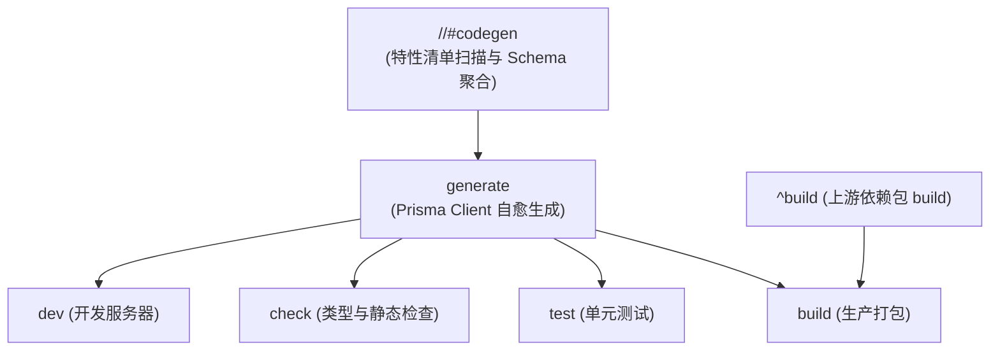

# Turborepo 任务拓扑与缓存编排规范 (turbo.json)

本文件是根目录 `turbo.json` 的**权威架构设计与配置说明文档 (SSoT)**。

Turborepo 在本项目中作为 **Monorepo 构建与任务拓扑调度引擎**，负责管理全仓工作区包（双端应用 `apps/*`、平台底座 `@base/*`、中台资产 `@biz/*`、平台套件 `@platform/*`、业务切片 `@domain/*` 以及迁移工具）之间的编译期依赖关系、任务执行顺序与增量缓存。

---

## 一、核心配置概览

```json
{
  "$schema": "https://turbo.build/schema.json",
  "ui": "tui",
  "cacheMaxSize": "2GB",
  "cacheMaxAge": "7d",
  "tasks": {
    "//#codegen": { ... },
    "generate": { ... },
    "build": { ... },
    "lint": { ... },
    "check": { ... },
    "test": { ... },
    "dev": { ... }
  }
}
```

### 全局参数说明

- **`ui: "tui"`**：在交互式终端下启用 Turborepo 现代 TUI 界面，清晰分屏展示各包并行日志。
- **`cacheMaxSize: "2GB"`**：本地文件缓存上限为 2GB，超出时自动淘汰最久未使用的构建产物。
- **`cacheMaxAge: "7d"`**：本地缓存有效期为 7 天。

---

## 二、任务拓扑与依赖流向 (Task Graph)



---

## 三、各任务详细配置与作用解析

### 1. `//#codegen`（根任务：物理 Schema 与特性注册表聚合）

- **类型**：Root Task（前缀 `//#` 表示只在根目录执行一次，不拆分到各个子 package）。
- **职责**：
  1. 调用 `scripts/sync/sync-features.mjs`：全自动扫描所有垂直业务切片 (`packages/domains/*`) 的 `src/manifest.ts`，动态生成 `packages/runtime/tenant/src/registry.ts`（包含导航树、Manifest 注册表与 CASL 权限目录）；
  2. 调用 `scripts/sync/sync-tenant-schema.mjs`：将所有业务切片的 `prisma/schema.prisma` 与底座 Schema 自动聚合为 `packages/runtime/db/prisma/schema.prisma`。
- **监听输入 (`inputs`)**：
  - `packages/features/**/src/manifest.ts`
  - `packages/features/**/prisma/schema.prisma`
  - `packages/features/**/package.json`
  - `packages/db-tenant/prisma/schema.prisma`
  - `scripts/sync/**`
- **缓存产物 (`outputs`)**：
  - `packages/runtime/tenant/src/registry.ts`
  - `packages/runtime/db/prisma/schema.prisma`
- **增量缓存效果**：当上述输入文件未发生变动时，Turborepo 会在 **20ms** 内命中缓存，直接跳过生成过程。

---

### 2. `generate`（Prisma 客户端自愈生成）

- **依赖关系 (`dependsOn`)**：`["//#codegen"]`
- **缓存策略 (`cache`)**：`false`
- **职责**：在 `//#codegen` 产出聚合 Schema 之后，触发 `packages/db-control` 和 `packages/db-tenant` 生成最新的强类型 Prisma Client。
- **定位**：作为 `dev`、`build`、`check`、`test` 的前置基石，确保任何下游任务运行前，客户端类型与数据库映射已经 100% 同步就绪。

---

### 3. `build`（生产全端构建）

- **依赖关系 (`dependsOn`)**：`["generate", "^build"]`
  - `generate`：必须先有最新的 Prisma Client；
  - `^build`：拓扑依赖，必须先构建本模块依赖的底层 workspace 兄弟包（如 UI、Shared、Auth 等）。
- **监听输入 (`inputs`)**：
  - `"$TURBO_DEFAULT$"`（源码文件）
  - `".env*"`、`".env.local"`（环境变量变动将导致构建缓存失效）
- **缓存产物 (`outputs`)**：
  - `".next/**"`（Next.js 生产产物）
  - `"!.next/cache/**"`、`"!.next/dev/**"`（排除开发缓存，减少存储浪费）
  - `"dist/**"`（各底层库打包出口）

---

### 4. `check`（全仓强类型与门禁静态扫描）

- **依赖关系 (`dependsOn`)**：`["generate", "^check"]`
- **缓存策略 (`cache`)**：`false`
- **职责**：并发调度各子包执行 `tsc --noEmit` 以及迁移一致性检查（`db-migrate check`）。前置依赖保证在类型扫描时不会因缺少生成的客户端代码而误报。

---

### 5. `test`（单元测试调度）

- **依赖关系 (`dependsOn`)**：`["generate", "^test"]`
- **缓存策略 (`cache`)**：`false`
- **职责**：执行各包同级单测。确保测试运行时能读取到最新的 Schema 与生成的类型定义。

---

### 6. `lint`（代码规范扫描）

- **依赖关系 (`dependsOn`)**：`["^lint"]`
- **职责**：拓扑调度 ESLint，对代码规范、边界引用（`eslint-plugin-boundaries`）进行严格审查。

---

### 7. `dev`（本地多端微服务并行启动）

- **依赖关系 (`dependsOn`)**：`["generate"]`
- **缓存策略 (`cache`)**：`false`
- **常驻服务 (`persistent`)**：`true`（告知 Turbo 这是常驻进程，不会退出）
- **职责**：并行拉起 `apps/control`（平台管控端，默认 3001）与 `apps/tenant`（租户业务端，默认 3000）。

---

## 四、常见问题与最佳实践

1. **为什么根目录没有把 `clean` 放在 turbo 里，而是用 `node scripts/clean.mjs`？**
   - Turborepo 的核心强项是**按 DAG 拓扑构建与产物缓存**；
   - 清理缓存（如删除根目录的 `.turbo` 本身以及 `apps/*/.next`）属于破坏性操作，如果用 Turbo 执行清理 `.turbo`，容易引起进程锁竞争或自我清理冲突。
   - 因此根目录的 `pnpm clean:cache` 采用独立的 Node.js 跨平台脚本 `node scripts/clean.mjs` 进行优雅安全的物理清理。

2. **如何单独运行某个包的任务？**
   - 租户端：`pnpm --filter tenant dev` 或 `pnpm dev:tenant`
   - 总控端：`pnpm --filter control dev` 或 `pnpm dev:control`
   - 特定特性：`pnpm --filter @domain/customer-center test`
