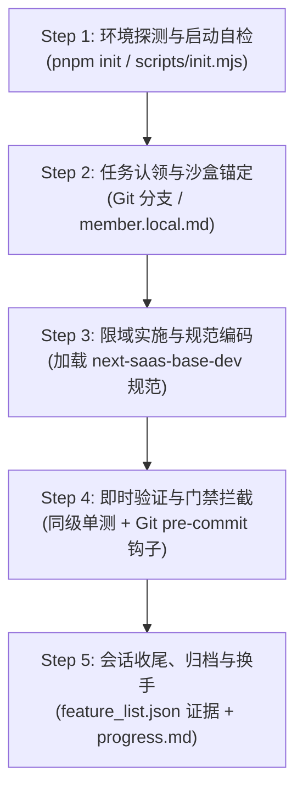

# 智能体全生命周期开发工作流指南 (Agent Development Workflow Guide)

> **规范定位与适用范围**：
> 本指南为本现代多租户 SaaS 基础设施与业务底座中 **AI 智能体（Coding Agent）与人类开发者共同遵循的标准全生命周期开发作业指导书 (SOP)**。
> 本项目既是完整的功能系统，也是可裁剪复用的通用基座。后续无论是针对现有系统进行迭代演进，还是抽离业务后作为种子模板衍生开发新的 SaaS 项目，**所有智能体在开展编码与协作时均必须严格遵循本工作流程**。

---

## 一、 双轨运行模式 (Dual Operating Modes)

在实际软件工程中，过度编排会带来严重的效率损耗与 Token 浪费。本系统定义了两种互补的智能体运行模式：

```text
┌─────────────────────────────────────────────────────────────────────────┐
│                           智能体运行模式选型                            │
├────────────────────────────────────┬────────────────────────────────────┤
│   单智能体端到端模式 (默认 95% 场景)    │   多智能体协同编排模式 (按需 5% 场景)   │
├────────────────────────────────────┼────────────────────────────────────┤
│ • 适用：功能切片开发、增删改查、页面    │ • 适用：跨多包大规模重构、方案竞态探 │
│   与表单设计、Action/Query 编写、    │   查验证、上下文严重超限的复杂长周期任务│
│   数据库迁移、Bug 修复与单测编写   │ • 遵循 Coordinator 集中消化模式，禁 │
│ • 特点：一人负责端到端闭环，零调度 │   止盲目派生与透传模糊需求         │
│   摩擦，开发效率与响应速度最高     │ • 严格单级 Fork 隔离与只读/写入沙盒│
└────────────────────────────────────┴────────────────────────────────────┘
```

---

## 二、 智能体标准五步闭环流水线 (The 5-Step Lifecycle Loop)

无论单智能体还是多智能体协同，每一次开发会话均严格遵循以下 5 步闭环：



---

### Step 1: 环境探测与启动自检 (Bootstrap & Baseline Check)

**目标**：确保运行环境基线无损，自动装配物理门禁，杜绝“带病开工”。

1. **确认工作区目录**：

   ```bash
   pwd # 确保输出位于工程根目录
   ```

2. **执行一键自检启动脚本**：

   ```bash
   pnpm init # 或 node scripts/init.mjs
   ```

   `pnpm init` 将自动完成以下关键校验：
   - 检查核心规范底座与治理文件完整性（`bootstrap.mjs`）；
   - 检测 Node.js (>= 22)、pnpm (>= 10) 与 Git 环境；
   - **自动装载 Git `pre-commit` 物理门禁钩子**；
   - 检查平台管控端与租户端 `.env.local` 环境变量；
   - 执行 Control DB Day 0 平台库自愈检查；
   - 打印当前会话锚点（`session-start.mjs`）。

---

### Step 2: 任务认领与沙盒上下文锚定 (Claiming & Sandboxing)

**目标**：明确开发边界，防止跨模块越权窜改，实现团队与多智能体并发开发时的物理隔离。

#### 1. 特性锁定判定机制 (三级自适应解析)

系统通过 `.harness/lifecycle/resolve-feature.mjs` 自动解析当前工作的目标特性：

| 优先级 | 判定方式 | 适用场景与优势 |
| :--- | :--- | :--- |
| **优先 1** | **`member.local.md` 本地覆写** | 根目录存在该文件且配置了 `active_feature_id` 时生效。适合在单分支内临时锁定某个特定沙盒。 |
| **优先 2** | **Git 分支名自动识别 (推荐)** | 分支名为 `feat/<feature_id>`、`feature/<feature_id>` 或 `fix/<feature_id>`。**团队原生推荐，零手动配置，切分支即自动切换沙盒**。 |
| **优先 3** | **`feature_list.json` SSoT 状态** | `feature_list.json` 中唯一状态为 `in_progress` 的特性。 |
| **兜底级** | **全局基线模式 (未锁定)** | 处于 `main` 分支且无特定特性锁定时，自动放行全局修改（用于底层 `@base/*` 基建升级或全局 Bug 修复）。 |

#### 2. 渐进式加载上下文 (Progressive Disclosure)

智能体必须遵循**按需渐进式加载原则**，严禁开局全库盲目通读：

1. **加载沙盒上下文**：阅读 `.harness/features/<feature_id>/context.md` 并锁定 `scope.md` 白名单；
2. **加载开发规范事实源**：加载技能手册 **`.agents/skills/next-saas-base-dev/`** 及其对应的 `references/` 子文档；
3. **查阅底层协议与决策**：按需检索 `docs/ARCHITECTURE.md`、`docs/permissions/` 或 `.harness/memory/adr/`，杜绝重复发明轮子或违背既有架构决策。

---

### Step 3: 限域实施与规范编码 (Scoped Implementation)

**目标**：在白名单约束内编写高质量、高内聚、契约对齐的生产代码。

#### 1. 业务切片开发标准（8 阶段排期推进）

若任务属于业务切片（`packages/features/*`），必须严格遵循技能中的 8 阶段标准：

- **Phase 0 (拓扑骨架)**：建立 `src/features/<feature>/` 目录骨架，在 `package.json#exports` 声明 Client-Safe 与 `/server` 双语义子路径，消除平铺；
- **Phase 1 (数据建模)**：定义模型，强制包含 **8 大基础审计与软删除字段 (ADR-009)**，由 `@base/db-tenant` 统一驱动多租户物理分库迁移；
- **Phase 2 (纯数据契约)**：在 `contract.ts` 中声明纯数据契约（无 JSX/DOM），契约作为权限、受控字段与按钮动作的单一事实源 (SSoT)；
- **Phase 3 (服务与只读)**：封装领域服务，编写 RSC server-only Query，行级数据范围通过 `accessibleBy` 自动下推为 Prisma Where 物理 SQL 条件；
- **Phase 4 (安全 Actions)**：写操作必须由 `defineServerAction` 包装，执行认证校验、CASL 守卫 (`assert*Ability`) 与 `toPlainData` 跨端序列化；
- **Phase 5 (工业风交互)**：基于 `@base/ui` 纯标准原子套件构建；消费官方 `TenantAbilityProvider` 与 `useAbility()`；破坏性操作单次确认；右上角 Toast 反馈；杜绝全页强刷；
- **Phase 6 (路由装配)**：租户端 `layout.tsx` 挂载 `*AbilityBoundary`，`manifest.ts` 注册页面元数据并经由 `@runtime/tenant#codegen`（`sync-features.mjs`）静态接入全局导航树；
- **Phase 7 (对齐单测)**：编写视图与契约 100% 对齐的自动化单元测试。

#### 2. 平台基座与基础设施框架迭代（四大铁律）

若任务涉及横向底层基础设施（`@base/*`、`tooling/db-migrate` 等），必须严格遵循：

- **严禁反向依赖**：基础设施包绝对禁止引用任何业务切片；
- **抽象防腐**：基础设施组件与连接池不得嵌入具体业务字段或表结构；
- **运行期轻量无状态**：所有清单汇总与 SQL 预编译必须收敛于构建期，禁止在运行期动态派生 CLI 子进程；
- **三级共享体系**：Level 1 (纯技术 `shared`/`ui`) → Level 2 (跨业务中台 `biz-shared`) → Level 3 (切片内私有复用)。

---

### Step 4: 即时验证与物理门禁拦截 (Verification & Hard Gates)

**目标**：通过机械化门禁手段硬性拦截不合规代码，彻底杜绝带病交付。

#### 1. 日常即时反馈（只测改动文件，不跑全量门禁）

日常编码过程中，智能体与开发者**严禁频繁手动执行全量 `pnpm verify`**（耗时且消耗资源），即时反馈通过以下轻量方式进行：

```bash
# 1. 针对当前改动文件运行同级单测 (Colocation)
pnpm --filter <target-package> test

# 2. 针对改动文件执行 LSP 诊断检查
pnpm --filter <target-package> check
```

#### 2. Git 物理门禁硬拦截 (Pre-commit Hook)

提交代码时执行 `git commit`，`.git/hooks/pre-commit` 会自动触发 `pnpm verify`（`scripts/verify.mjs`）极速验证流水线：

1. **元数据格式校验**：验证 `feature_list.json` JSON 语法与依赖合法性；
2. **沙盒白名单拦截 (`check-boundary.mjs`)**：比对工作区改动文件，**一旦修改了当前特性 `scope.md` 白名单以外的业务文件，直接硬报错阻断提交**；
3. **架构红线扫描 (`check-redlines.mjs`)**：扫描内部 HTTP 伪接口自调、跨包内部穿透引用、危险全页刷新等反模式；
4. **业务实体基线检查 (`check-entity-baseline.mjs`)**：自动解析 Prisma 模型，非白名单实体缺少 8 大审计软删除字段时硬拦截；
5. **业务切片拓扑检测 (`check-vertical-slices.mjs`)**：拦截在工作区包根平铺历史废弃文件；
6. **门禁与红线自测保障**：执行红线检查器自身的单元测试；
7. **全栈静态类型检查与单测套件**：全仓 TypeScript 0 错误，测试 100% PASS。

> ⚠️ **绝对红线**：**绝对严禁用 `git commit --no-verify` 绕过门禁钩子！** 门禁报错必须现场修复，带病提交视为最高级违规。

---

### Step 5: 会话收尾、状态归档与换手交接 (Session End & Handoff)

**目标**：确保开发成果有据可查，无缝跨会话接力，工作区随时可重新启动。

1. **回填进度与交付证据**：
   - 更新目标特性沙盒 `.harness/features/<id>/progress.md` 勾选已完成任务；
   - 若当前特性已满足 Definition of Done，在 `feature_list.json` 中将 `status` 更新为 `completed`，并填写详实的 `evidence` 验证记录。
2. **技术债沉淀**：
   - 若在开发中发现非当前沙盒范围的架构坏味道或遗留缺陷，**严禁擅自修改**，统一登记到 `.harness/memory/technical-debt.md`。
3. **换手交接记录 (Handoff)**：
   - 若本次会话未能彻底闭环，在 `.harness/features/<id>/handoff.md` 明确记录已完成内容、剩余任务与下一步操作建议，使下一任智能体或人员可秒级接力。
4. **提交代码与收尾自检**：
   - 提交代码触发 pre-commit 验证；
   - 可选运行 `node .harness/lifecycle/session-end.mjs` 确认工作区无孤儿文件且交付状态完备；
   - 保证工作区干净整洁，随时可重新执行 `pnpm init`。

---

## 三、 多智能体协同编排规范 (Multi-Agent Protocol)

> **仅在用户明确要求、或任务规模超出单会话窗口、或需要并行探查验证时按需启用。**

当启用多智能体协同流水线时，严格遵循以下四角色契约与编排机制：

```text
阶段 1: Research (架构调研)
   └── researcher: 只读调研，输出结构化发现与技术选型分析 (只读工具，严禁修改代码)
          ↓
阶段 2: Plan & Spec (规格消化与拆解)
   └── coordinator: 消化调研结果，转化为自包含、精准且限定白名单的 Task Spec (严禁直接改代码)
          ↓
阶段 3: Implement (限域实现)
   └── implementer: 干净上下文启动，严格在目标沙盒白名单内编写业务代码与同级单测
          ↓
阶段 4: Review (审计与把关)
   └── reviewer: 独立审计代码质量、红线规范与测试覆盖率，输出验收报告
```

### 多智能体协作四大铁律

1. **协调者负责消化，绝不透传未消化的需求 (Synthesize, Not Delegate Understanding)**：Coordinator 必须将上游输出消化成精准、自包含的实施规格，严禁直接把模糊需求抛给下游；
2. **单级派生隔离 (Single-Level Fork Guard)**：子智能体严禁继续递归派生子智能体，防范调用树失控与 Token 爆炸；
3. **零上下文继承 (Zero Context Inheritance)**：派发任务给子智能体时，以全新干净上下文启动，仅注入精准任务说明与目标沙盒，不继承冗长父级历史；
4. **角色工具沙盒限制**：调研与审计角色仅授予只读工具，编写角色受限于 `scope.md` 白名单。

---

## 四、 异常阻断与升级机制 (Escalation Protocol)

智能体在开发过程中遇到以下任何一种情况时，**必须立即停止当前修改，主动向人类提问升级，严禁自行猜测或强行编码**：

1. **架构决策冲突**：涉及多租户分库路由策略、鉴权协议、或跨包反向依赖冲突；
2. **需求与白名单冲突**：实现目标需求必须修改超出当前特性 `scope.md` 白名单以外的文件；
3. **反复测试/类型失败**：连续排查 2 轮仍未定位的底层框架或依赖兼容性报错；
4. **环境基线损坏**：运行 `pnpm init` 失败，且根因不在当前任务改动范围内。
