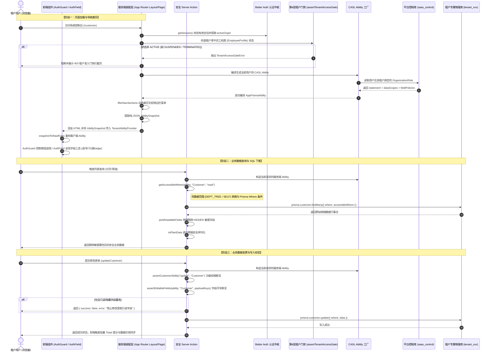

# 辰润 ERP 权限系统全链路架构与原理解析 (Permission Architecture Deep-Dive)

> **文档定位**：本文档为辰润数智 ERP 权限系统的专项深度技术设计与实现原理解析文档，涵盖前端声明式门禁、后端四层权限模型、CASL 规则编译、SQL 自动下推、字段物理剥离以及从登录到查询的全链路端到端时序。
> **关联架构索引**：[《系统整体架构白皮书》](../ARCHITECTURE.md) | [《字段级权限设计资产》](./Field_Level_Permission_Architecture_and_Implementation.md) | [ADR-003: Better Auth 与 CASL 四层权限闭环](../../.harness/memory/adr/ADR-003-four-tier-permissions.md)

---

## 一、 权限系统总体设计理念

辰润 ERP 面向现代化工业制造与供应链，业务涵盖多层级组织、复杂审批流与高敏感商业机密（采购成本价、客户阶梯报价、供应商授信额度等）。权限系统的设计严格确立三大工程哲学：

1. **Fail-Closed（默认关闭与绝对拒绝）**：
   任何未经显式授权的路由、操作动作（Action）、数据行（Row）或数据字段（Field），一律默认为“拒绝访问/不可见”。
2. **前后端双向闭环阻断 (Double-Gated Enforcement)**：
   前端的权限拦截（按钮禁用、页面重定向、字段隐藏）仅作为**用户体验交互层**；后端（Server Action、服务层、SQL 下推层）必须建立**坚不可摧的物理阻断防线**，杜绝“仅靠前端隐藏绕过 API 抓包”的安全隐患。
3. **职责分离与单一事实源 (SSoT)**：
   - **认证与会话 (Authentication & Identity)**：由 **Better Auth** 统一管理，负责多租户上下文 `organizationId`、用户会话凭证与基础角色。
   - **授权与决策 (Authorization & Rule Engine)**：由 **CASL (`@casl/ability` & `@casl/prisma`)** 统一管理，负责功能操作、行级数据范围与敏感字段三态策略的编译与决策。
   - **页面契约 (Contracts)**：各业务切片的受控字段字典与权限动词收敛在 `contracts/` 中，作为前端组件渲染、管理后台权限树配置与后端校验的唯一事实源。

---

## 二、 核心架构：四层细粒度权限模型 (Four-Tier Access Control)

系统将权限划分为四个严格递进的防线层次：

```text
┌─────────────────────────────────────────────────────────────────────────────┐
│                    第 4 层：租户准入门禁 (Tenant Access Gate)               │
│  - 校验当前租户物理库中的员工档案 EmployeeProfile                           │
│  - 状态为 ACTIVE 允许；状态为 SUSPENDED 或 TERMINATED (离职) 立即硬阻断       │
└──────────────────────────────────────┬──────────────────────────────────────┘
                                       ▼
┌─────────────────────────────────────────────────────────────────────────────┐
│                    第 1 层：功能操作权限 (Functional Action)                │
│  - 基于 CASL Statement: resource:action (例如 Customer.read, Order.audit)   │
│  - 驱动前端按钮显隐 (AuthGuard / Can) 与 Server Action 动作拦截             │
└──────────────────────────────────────┬──────────────────────────────────────┘
                                       ▼
┌─────────────────────────────────────────────────────────────────────────────┐
│                    第 2 层：行级数据范围权限 (Data Scope)                   │
│  - 范围枚举: ALL (全量) / DEPT_TREE (本部门及下级) / DEPT / SELF / CUSTOM   │
│  - 结合部门树拓扑，由 CaslAbilityFactory 编译为 CASL 条件，通过            │
│    accessibleBy(ability, "read") 直接下推为 Prisma Where SQL 索引查询       │
└──────────────────────────────────────┬──────────────────────────────────────┘
                                       ▼
┌─────────────────────────────────────────────────────────────────────────────┐
│                    第 3 层：敏感字段三态策略 (Field Policy)                 │
│  - 字段策略: EDITABLE (可编辑) / READONLY (只读) / HIDDEN (隐藏不可见)       │
│  - 读取时：后端 pickReadableFields 物理剔除，前端 AuthField 不渲染 DOM      │
│  - 写入时：后端 assertEditableFields 拦截非法篡改，前端表单控件锁定只读     │
└─────────────────────────────────────────────────────────────────────────────┘
```

### 1. 第 4 层：租户准入门禁 (`Tenant Access Gate`)

- **源码实现**：`packages/auth/src/context/tenant-context.ts` -> `assertTenantAccessGate()`
- **原理**：虽然用户在平台库（Control DB）可能拥有全局合法的账户和有效 Session，但在具体企业租户的物理库中，该员工可能处于“待入职”、“停职审查（`SUSPENDED`）”或“已离职（`TERMINATED`）”状态。
- **执行机制**：任何租户业务请求在进入前，必须通过 `assertTenantAccessGate` 查询目标物理库的 `employee_profile` 表。非 `ACTIVE` 状态直接抛出 `TenantAccessGateError`，全链路阻断后续数据查询。

### 2. 第 1 层：功能操作权限 (`Statement`)

- **源码实现**：`packages/authorization/src/core/actions.ts` 与 `ability-factory.ts`
- **标准化动词**：`StandardAction.READ`、`StandardAction.CREATE`、`StandardAction.UPDATE`、`StandardAction.DELETE`、`StandardAction.AUDIT`、`StandardAction.EXPORT`、`StandardAction.MANAGE`。
- **自定义动词支持**：业务切片可按需拓展特有动作（如采购单的 `submit`、`cancel`；客户的 `toggle_status`）。
- **执行机制**：通过 `ability.can(action, subject)` 进行原子布尔判定。

### 3. 第 2 层：行级数据范围权限 (`Data Scope`)

- **源码实现**：`packages/authorization/src/scopes/data-scope.ts`
- **五种标准范围枚举**：
  - `ALL`：全公司所有数据（通常面向企业 Owner、总经理）。
  - `DEPT_TREE`：本部门及所有下级子部门的数据（面向部门总监、区域经理）。
  - `DEPT`：仅本部门的数据（面向车间班组长、基层主管）。
  - `SELF`：仅当前用户创建或归属的数据（面向一线业务员、采购员）。
  - `CUSTOM`：自定义选定部门列表。
- **部门树拓扑解析与防穿透保护**：
  - `resolveDataScopeConditions` 接收当前员工的 `UserDepartmentTopology`（当前部门 ID 及递归算出的子部门 ID 集合 `departmentTreeIds`）。
  - **Fail-Closed 异常防护**：如果用户角色配置了 `DEPT` 范围，但该员工在人事系统中暂未分配部门（`departmentId` 为空），系统**绝不**返回空条件（避免 Prisma 忽略 `undefined` 字段退化为全表查询），而是自动注入：

    ```typescript
    { [mapping.departmentField]: "__NO_DEPARTMENT_FAIL_CLOSED__" }
    ```

    强制使 SQL 查询结果为空，杜绝无部门员工误读全企业数据的重大漏洞。

### 4. 第 3 层：敏感字段三态控制 (`Field Policy`)

- **源码实现**：`packages/authorization/src/fields/field-policy.ts`
- **三态定义**：
  - `EDITABLE`：具备读写完整权限。
  - `READONLY`：仅允许查看，禁止在表单中提交或修改。
  - `HIDDEN`：彻底不可见，不可读且不可写。
- **CASL 反向规则绑定**：
  在 `snapshotToRawRules` 中，`HIDDEN` 字段被映射为对 `read`、`create`、`update` 的反向规则（`inverted: true`）；`READONLY` 字段被映射为对 `create`、`update` 的反向规则。

---

## 三、 前端权限体系与交互实现

前端权限体系旨在实现**“极薄装配线、零白屏体验、无状态序列化与声明式组件消费”**。

### 1. RSC 跨端序列化防线与 `AbilitySnapshot`

由于 Next.js App Router 架构下 Server Components (RSC) 与 Client Components 之间只能通过 JSON 序列化传递数据，带有类方法与不可序列化函数的 CASL `Ability` 实例**严禁直接跨端传输**。

架构设计了轻量级纯数据快照契约 `AbilitySnapshot`：

```typescript
// packages/authorization/src/adapters/client-ability.ts
export interface AbilitySnapshot {
  readonly subject: string;
  readonly actions: readonly string[];
  readonly fieldPolicies?: Readonly<Record<string, string>>;
}
```

1. **服务端生成快照**：在 RSC（如页面 Layout）中调用 `getTenantSubjectPermissions(subject)`，通过后端 `CaslAbilityFactory` 计算出当前用户针对该实体的纯 JSON 快照。
2. **客户端动态重建**：
   - 客户端组件 `TenantAbilityProvider` 接收快照数组；
   - 调用 `snapshotToRawRules(snapshots)` 将纯 JSON 还原为 CASL `RawRuleOf<AppClientAbility>[]`；
   - 调用 `createAbilityFromSnapshot(snapshots)` 生成客户端轻量 `AppClientAbility` 实例，注入 React Context。

### 2. 声明式门禁组件：`AuthGuard` 与 `Can`

- **`AuthGuard` (`packages/ui/src/components/composite/auth/AuthGuard.tsx`)**：

  ```tsx
  <AuthGuard action="create" subject="Customer">
    <Button onClick={openCreateModal}>新增客户</Button>
  </AuthGuard>
  ```

  若未显式指定 `subject`，`AuthGuard` 自动从外层 `DataTableContext` 向上回溯继承当前页面的默认 Subject。
- **`Can` (`packages/authorization/src/adapters/react.tsx`)**：
  直接提供强类型 Catalog 的 `<Can I="export" a="Customer">...</Can>` 语法糖。

### 3. 受控表单字段三态组件：`AuthField`

- **源码路径**：`packages/ui/src/components/composite/auth/AuthField.tsx`
- **三态推导算法 (`deriveFieldMode`)**：

  ```typescript
  const readable = ability.can("read", subject, field);
  const writable = ability.can(action, subject, field); // 默认 action 为 "update"
  if (!readable) return FieldPolicy.HIDDEN;
  if (!writable) return FieldPolicy.READONLY;
  return FieldPolicy.EDITABLE;
  ```

- **视觉呈现规范**：
  - **`HIDDEN`**：返回 `fallback`（默认 `null`），在 DOM 树中物理彻底不渲染。
  - **`READONLY`**：自动通过 React `cloneElement` 向子输入组件注入 `disabled={true}` 和 `readOnly={true}`，外层打上 `data-disabled` 属性，并在字段 Label 旁边自动渲染工业风高对比度 `Badge` 标注 **「只读」**。
  - **`EDITABLE`**：正常渲染受控输入组件。

### 4. 表格操作列与按钮级权限集成

- **`DataTableActionButton`**：
  内置 `unauthorizedStrategy` 参数：
  - `"hidden"`（默认）：无权时静默返回 `null`，保持界面精简；
  - `"disabled-tooltip"`：无权时按钮保持呈现但处于置灰禁用状态，鼠标悬停时呼出 Tooltip 提示“暂无操作权限”，提升企业级软件的操作可预期性。
- **`DataTableRowActions`**：
  针对每行数据的操作列（编辑、查看、删除、自定义动作），在渲染前遍历每个操作项执行 `ability.can(action, subject)`，无权动作自动从行操作按钮与更多操作下拉浮层中剔除。

### 5. Layout 层服务端路由门禁与导航菜单动态裁剪

在 `apps/tenant/src/app/(dashboard)/layout.tsx` 中：

1. **服务端会话校验**：调用 `runtime.auth.api.getSession` 校验会话，未登录跳转 `/login`。
2. **导航菜单服务端裁剪 (`filterNavSections`)**：
   从系统注册表拉取所有已挂载特性的导航项，针对每一项调用 `ability.can("read", item.subject)`。若用户对某页面无 `read` 权限，该菜单项在服务端组装 HTML 时即被剔除；若某一导航分组下的所有子页面均无权限，整组自动隐去，杜绝出现空白侧边栏。

---

## 四、 后端权限拦截与数据库下推实现

### 1. SQL 自动下推引擎 (`accessibleBy` 与 `getAccessibleWhere`)

- **源码实现**：`packages/authorization/src/ability/prisma-access.ts`
- **机制原理**：
  传统权限系统常将全量数据加载至 Node.js 内存，再通过循环过滤。在面对数十万条制造工单或采购明细时，会引发严重性能瓶颈与内存溢出（OOM）。
  辰润 ERP 深度结合 `@casl/prisma`，在构建 `PrismaAbility` 时将数据范围转换为 CASL 规则条件：

  ```typescript
  export function getAccessibleWhere<TSubject extends string>(
    ability: AppPrismaAbility,
    subject: TSubject,
    action: string = "read",
  ): PrismaQueryCondition {
    const where = accessibleBy(ability, action)[subject];
    // 1. 无权直接访问或 CASL 返回空拒绝集合
    if (!where || (Array.isArray(where.OR) && where.OR.length === 0)) {
      return { AND: [{ id: "__NO_PERMISSION_FAIL_CLOSED__" }] };
    }
    // 2. 超管或全量范围
    if (Object.keys(where).length === 0) {
      return {};
    }
    // 3. 正常拼接数据范围 Where 条件
    return where;
  }
  ```

- **服务层实战调用**：

  ```typescript
  // 在 ProcurementOrderService 中：
  const accessibleWhere = getAccessibleWhere(ability, "PurchaseOrder", "read");
  const orders = await prisma.purchaseOrder.findMany({
    where: {
      AND: [
        accessibleWhere,
        searchQuery ? { orderNo: { contains: searchQuery } } : {},
      ],
    },
  });
  ```

  PostgreSQL 引擎直接利用索引命中范围条件（`WHERE dept_id IN (...)`），实现真正的纳秒级存储下推。

### 2. 字段级权限后端双向防线

#### (1) 读取时：敏感数据物理剥离 (`pickReadableFields`)

- **源码实现**：`packages/authorization/src/fields/field-policy.ts`
- **执行逻辑**：

  ```typescript
  export function pickReadableFields<T extends Record<string, unknown>>(
    ability: SubjectAbilityLike,
    subject: string,
    record: T,
  ): T {
    // 提取当前成员对该 Subject 具备 read 权限的所有白名单字段
    const allowed = new Set(permittedFieldsOf(ability, "read", subject));
    // 物理剥离未授权字段，生成全新的干净数据传输对象 (DTO)
    const result: Record<string, unknown> = {};
    for (const [key, value] of Object.entries(record)) {
      if (allowed.has(key)) {
        result[key] = value;
      }
    }
    return result as T;
  }
  ```

  即便客户端通过修改网络请求试图刺探敏感数据，接口返回的 JSON payload 中也绝不包含未授权的字段键值，杜绝抓包泄密。

#### (2) 写入时：不可变字段强校验 (`assertEditableFields`)

- **源码实现**：`packages/authorization/src/fields/field-policy.ts`
- **执行逻辑**：
  在执行 `create` 或 `update` Server Action 时，传入提交参数的键集合：

  ```typescript
  assertEditableFields(ability, "Customer", Object.keys(updatePayload));
  ```

  如果用户角色对 `creditLimit` 配置了 `READONLY` 或 `HIDDEN`，但 payload 中包含了该字段，`assertEditableFields` 立即抛出 CASL `ForbiddenError`，拒绝写入事务。

### 3. Server Action 统一安全包装与错误处理 (`defineServerAction`)

- **源码实现**：`packages/shared/src/api/action.ts`
- **职责**：
  1. 拦截未捕获的 `ForbiddenError` 并映射为结构化安全响应：

     ```json
     { "success": false, "error": "没有执行当前操作的权限: Cannot execute update on Customer" }
     ```

  2. 自动集成 `toPlainData`，解决 Prisma `Decimal`、`Date` 和 `BigInt` 在 React Server Components 跨端网络传输时的非序列化崩溃问题。

---

## 五、 全链路端到端流转时序图 (End-to-End Sequence)

从用户在浏览器发起请求，到后端完成四层校验并由数据库下推查询的完整全链路闭环：



---

## 六、 核心源码地图索引与指引

| 模块类别 | 权威文件路径 | 核心导出 / 关键符号 | 职责说明 |
| :--- | :--- | :--- | :--- |
| **租户门禁** | `packages/auth/src/context/tenant-context.ts` | `assertTenantAccessGate`, `resolveTenantContext` | 解析租户会话上下文，执行第 4 层离职/停职硬阻断 |
| **规则编译** | `packages/authorization/src/ability/ability-factory.ts` | `CaslAbilityFactory`, `serializeRolePermissions` | CASL 权限规则总编译工厂，处理四层模型合并 |
| **SQL 下推** | `packages/authorization/src/ability/prisma-access.ts` | `getAccessibleWhere` | 桥接 `@casl/prisma`，将数据范围无缝编译为 SQL Where 条件 |
| **数据范围** | `packages/authorization/src/scopes/data-scope.ts` | `DataScope`, `resolveDataScopeConditions` | 解析五类数据范围并生成防穿透部门树过滤条件 |
| **字段策略** | `packages/authorization/src/fields/field-policy.ts` | `pickReadableFields`, `assertEditableFields` | 字段读写控制：读取时物理剥离脱敏、写入时白名单校验 |
| **快照序列化** | `packages/authorization/src/adapters/client-ability.ts` | `AbilitySnapshot`, `createAbilityFromSnapshot` | RSC 纯数据快照与客户端 CASL 实例双向转换 |
| **前端 Provider** | `packages/authorization/src/adapters/ability-provider.tsx` | `TenantAbilityProvider`, `useOptionalAbility` | 前端 React 上下文挂载与无白屏安全取值钩子 |
| **字段三态 UI** | `packages/ui/src/components/composite/auth/AuthField.tsx` | `AuthField`, `deriveFieldMode` | 受控表单输入三态渲染（编辑 / 只读 Badge / 物理隐藏） |
| **操作列门禁** | `packages/ui/src/components/composite/data-table/` | `DataTableActionButton`, `DataTableRowActions` | 表格动作按钮、行操作列与批量操作栏动态鉴权 |
| **导航裁剪** | `apps/tenant/src/kernel/navigation.ts` | `getAuthorizedTenantNavSections` | 服务端依据 Ability 动态计算并裁剪侧边栏菜单 |
| **安全 Action** | `packages/shared/src/api/action.ts` | `defineServerAction` | Server Action 包装闭包，捕获鉴权异常并规范化序列化 |
| **切片契约** | `packages/features/*/src/contracts/*.contract.ts` | `FeaturePagePermissionDescriptor` | 特性切片受控字段清单与权限动作单一事实源 (SSoT) |
