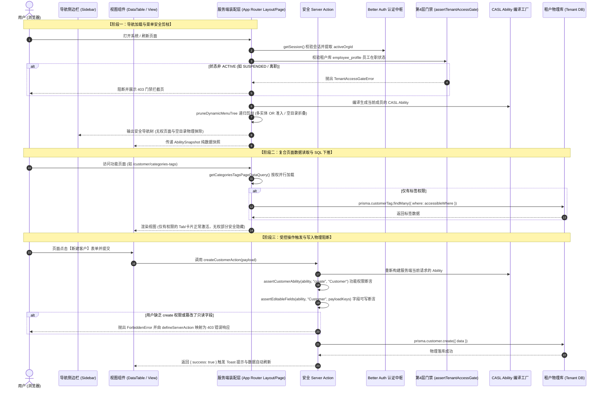

# 系统数智 ERP 权限系统全链路架构与原理解析 (Permission Architecture Deep-Dive)

> **文档定位**：本文档为系统数智 ERP（Next.js 16 + React 19 + TypeScript + CASL + PostgreSQL）权限系统的权威技术白皮书与原理解析手册。全面覆盖**动态导航菜单控制、四层权限模型、前端交互效果呈现、后端物理级防线拦截、行级数据范围 SQL 自动下推、敏感字段物理脱敏、复合页面多实体优雅降级**，以及从数据持久化、规则编译到端到端拦截的完整流转链路。
>
> **关联架构索引**：[《系统整体架构白皮书》](../ARCHITECTURE.md) | [《字段级权限设计资产》](./Field_Level_Permission_Architecture_and_Implementation.md) | [ADR-003: Better Auth 与 CASL 四层权限闭环](../../.harness/memory/adr/ADR-003-four-tier-permissions.md) | [全栈开发规范 Skill](../../.agents/skills/next-saas-base-dev/SKILL.md)

---

## 一、 权限系统总体设计理念

在现代化多租户供应链与制造 ERP 系统中，业务涵盖复杂的跨部门协同、高敏感商业机密（如配方 BOM、采购成本价、阶梯客户报价、授信额度）与多层级组织。系统的权限架构确立了以下四大核心工程哲学：

1. **Fail-Closed（默认关闭与绝对拒绝）**：
   任何未经显式授权的路由菜单、操作动作（Action）、数据行（Row）或敏感字段（Field），一律默认为“拒绝访问 / 物理不可见”。
2. **前后端双向闭环阻断 (Double-Gated Enforcement)**：
   - **前端交互防线**：控制菜单显隐、按钮禁用/隐藏、表格列剔除、表单控件只读锁定，保障极致的用户体验（所见即所得）；
   - **后端物理防线**：在 Server Action、RSC Server Query、数据服务层与 SQL 下推层建立坚不可摧的阻断机制，严禁仅依靠前端判断，彻底杜绝直接抓包或伪造 HTTP 请求的越权攻击。
3. **职责分离与单一事实源 (SSoT)**：
   - **认证与会话 (Authentication & Identity)**：由 `@base/auth`（基于 Better Auth 核心与官方 `tenantCredentialsPlugin` 扩展插件）统一管理，负责总控平台超管认证、企业三要素（`organizationSlug + account + password`）独立凭据校验、跨租户物理隔离、会话凭据、租户上下文（`organizationId`）与底层角色标识。
   - **授权与决策 (Authorization & Rule Engine)**：由 `@base/authorization`（CASL 规则编译引擎）统一管理，负责四层细粒度权限的定义、编译、决策与 SQL 下推。
   - **业务切片契约 (Contracts)**：各业务切片在 `packages/domains/<domain>/src/features/<feature>/contract.ts` 中自包含维护自己的实体名（Subject）、资源名（Resource）、受控字段枚举与页面权限契约，杜绝硬编码魔法字符串。
4. **页面认知容器与受控数据模型解耦 (Page-Container & Entity-Subject Decoupling)**：
   - **导航页面（Page / Route）**：是用户日常操作的认知与导航入口，支持动态菜单自由编排；
   - **受控数据模型（Subject / Entity）**：是真正承载操作权限、数据范围与字段策略的安全控制单元。一个复合页面（如“分类与标签”、“工艺BOM”）可内聚挂载多个数据实体模型。

---

## 二、 核心架构：四层细粒度权限模型 (Four-Tier Access Control)

系统将安全控制划分为四个严格递进的防线层次：

```text
┌─────────────────────────────────────────────────────────────────────────────┐
│                    第 4 层：租户准入门禁 (Tenant Access Gate)               │
│  - 校验目标租户物理库中的员工档案 EmployeeProfile                           │
│  - 状态为 ACTIVE 允许进入；SUSPENDED 或 TERMINATED (离职) 立即硬阻断         │
└──────────────────────────────────────┬──────────────────────────────────────┘
                                       ▼
┌─────────────────────────────────────────────────────────────────────────────┐
│                    第 1 层：功能操作权限 (Functional Action)                │
│  - 基于 CASL Statement: resource -> actions[] (如 Customer: [read, update])  │
│  - 驱动前端按钮显隐 (DataTable / useSubjectCan) 与 Server Action 动作拦截   │
└──────────────────────────────────────┬──────────────────────────────────────┘
                                       ▼
┌─────────────────────────────────────────────────────────────────────────────┐
│                    第 2 层：行级数据范围权限 (Data Scope)                   │
│  - 范围枚举: ALL (全量) / DEPT_TREE (本部门及下级) / DEPT / SELF / CUSTOM   │
│  - 结合用户部门树拓扑，由 CaslAbilityFactory 编译为 CASL Prisma 规则，通过  │
│    getAccessibleWhere 自动下推为 PostgreSQL WHERE 条件执行索引过滤          │
└──────────────────────────────────────┬──────────────────────────────────────┘
                                       ▼
┌─────────────────────────────────────────────────────────────────────────────┐
│                    第 3 层：敏感字段三态策略 (Field Policy)                 │
│  - 字段三态: EDITABLE (读写) / READONLY (只读) / HIDDEN (隐藏不可见)         │
│  - 读取时：后端 pickReadableFields 物理剔除，前端 DataTable 物理剔除该列     │
│  - 写入时：后端 assertEditableFields 拦截非法篡改，前端 AuthField 锁定只读   │
└─────────────────────────────────────────────────────────────────────────────┘
```

---

## 三、 菜单权限控制（显隐与动态安全剪枝）

### 1. 前端效果体现

- **页面级显隐**：用户登录后，左侧导航栏（Sidebar）只呈现当前角色被授予查看权限的页面；无权页面在 DOM 中彻底不存在。
- **目录级防空抽屉**：如果某个折叠分组（如“客户中心”或“物料与工艺中心”）下的所有子页面均被判定为无权访问，**整个目录大项会在侧边栏中自动物理隐藏**，绝不会残留一个空荡荡的分组标题。
- **复合页面按权准入**：对于聚合了多个实体的页面（如“分类与标签”），如果用户只有“标签”权限没有“分类”权限，菜单依然正常展示，进入页面后标签功能正常使用，无权区域安全占位，不崩溃白屏。

### 2. 数据流转全链路

1. 租户管理员在 `/settings/navigation` 编排菜单树，持久化于租户物理库的 `tenant_menu_item` 表；
2. 用户发起页面请求时，服务端组件调用 `apps/tenant/src/kernel/navigation.ts` 的 `getAuthorizedTenantNavSections()`；
3. 从数据库提取租户自定义菜单树 `customTree`；
4. 传入 `packages/base/authorization/src/core/manifest.ts` 的 `pruneDynamicMenuTree(customTree, pageCatalog, can)` 进行**深度优先递归剪枝**；
5. 剪枝后的纯净 JSON 传递给 `@base/ui` 的 `Sidebar` 组件，无权页面的任何路由或信息**根本不会下发给前端 DOM**。

### 3. 实现原理与真实代码

#### (1) 服务端动态菜单装配 (`apps/tenant/src/kernel/navigation.ts`)

```typescript
export async function getAuthorizedTenantNavSections(): Promise<FeatureNavSection[]> {
  try {
    const reqHeaders = await headers();
    const runtime = getServerAuthRuntime();
    const tenantCtx = await getCurrentTenantContext(reqHeaders);
    const factory = new CaslAbilityFactory(
      runtime.tenantContextRepository,
      globalTenantCatalog,
    );
    const ability = await factory.createForTenant(tenantCtx);

    const can = (action: string, subject: string) =>
      ability.can(action as never, subject as never);

    // 1. 系统基座菜单：按 CASL 权限自动控制显示/隐藏
    const systemBaseSections = filterNavSections(
      tenantAdminManifest.navSections ?? [],
      can,
    );

    // 2. 从当前租户物理库查询自定义业务菜单配置
    let customTree: TenantMenuNode[] = [];
    try {
      customTree = await getTenantCustomMenuTree(tenantCtx.organizationId);
    } catch {
      customTree = [];
    }

    // 3. 动态业务菜单安全剪枝
    const dynamicBusinessSections =
      customTree.length > 0
        ? pruneDynamicMenuTree(customTree, globalTenantPageCatalog, can)
        : [];

    // 4. 组装最终侧边栏结构并返回
    ...
  } catch {
    return [];
  }
}
```

#### (2) 递归安全剪枝与多 Subject OR 准入 (`packages/base/authorization/src/core/manifest.ts`)

```typescript
export function pruneDynamicMenuTree(
  tree: readonly TenantMenuNode[],
  pageMap: Map<string, StandardPageDescriptor> | ReadonlyMap<string, StandardPageDescriptor>,
  can: (action: string, subject: string) => boolean,
): FeatureNavSection[] {
  function pruneNode(node: TenantMenuNode): (FeatureNavItem | FeatureNavGroup) | null {
    if (node.isVisible === false) return null;
    if (node.itemType === "LINK") {
      return { id: node.id, label: node.customLabel || "外部链接", href: node.externalUrl || "#", ... };
    }

    if (node.itemType === "GROUP") {
      const sortedChildren = [...(node.children || [])]
        .filter((c) => c.isVisible !== false)
        .sort((a, b) => (a.sortOrder ?? 0) - (b.sortOrder ?? 0));

      const allowedChildren: (FeatureNavItem | FeatureNavGroup)[] = [];
      for (const child of sortedChildren) {
        const pruned = pruneNode(child);
        if (pruned) allowedChildren.push(pruned);
      }

      // 若当前目录下的所有后代子项均被裁切，整组自动物理隐藏，消除空抽屉
      if (allowedChildren.length === 0) {
        return null;
      }

      return {
        id: node.id,
        label: node.customLabel || "未命名分组",
        icon: node.customIcon || undefined,
        items: allowedChildren as readonly FeatureNavItem[],
      };
    }

    // PAGE 功能页面
    if (!node.pageKey) return null;
    const pageMeta = pageMap.get(node.pageKey);
    if (!pageMeta) return null;

    // 安全权限校验：复合页面支持多 Subject OR 准入原则（拥有任意一个实体的 READ 权限即可访问页面）
    const hasAccess = (() => {
      if (pageMeta.subjects && pageMeta.subjects.length > 0) {
        const action = pageMeta.requiredAction || "read";
        return pageMeta.subjects.some((subj) => can(action, subj));
      }
      if (pageMeta.requiredSubject && pageMeta.requiredAction) {
        return can(pageMeta.requiredAction, pageMeta.requiredSubject);
      }
      return true;
    })();

    if (!hasAccess) {
      return null;
    }

    return {
      id: node.id,
      label: node.customLabel || pageMeta.defaultLabel,
      href: pageMeta.href,
      icon: node.customIcon || pageMeta.defaultIcon || undefined,
      badge: pageMeta.badge,
      requiredAction: pageMeta.requiredAction,
      requiredSubject: pageMeta.requiredSubject,
      subjects: pageMeta.subjects,
    };
  }

  // 遍历根节点生成导航
  ...
}
```

---

## 四、 功能操作权限控制（按钮显隐与方法物理拦截）

系统严格遵循“前后端双向闭环”原则，既在前端界面给予极致交互反馈，又在后端坚壁清野进行物理阻断。

### 0. 权限上下文链路：如何获取、如何跨端传递与如何注入 UI

在 Next.js App Router 架构下，服务端拥有全量租户 DB 与用户角色信息，而前端 UI 组件运行在浏览器客户端。为了确保极致性能并严守“RSC 严禁向客户端传递不可序列化的函数/类实例”的红线，系统构建了清晰的**四阶段注入与消费链路**：

```text
[阶段 1: 服务端获取与校验]
 Next.js RSC (例如 apps/tenant/src/app/(dashboard)/customer/layout.tsx)
   │
   ▼ 调用 getTenantSubjectPermissions(Subject)
   ├─ 读取 Request Headers 获取当前租户会话 (TenantContext)
   ├─ CaslAbilityFactory 结合数据库角色权限编译出当前租户当前用户的完整 CASL Ability
   └─ 纯数据快照化 (toPlainData): 生成纯 JSON 结构 { actions: ['read', 'create', ...], fieldPolicies: {...} }

[阶段 2: 跨端序列化传输]
 RSC 将纯 JSON 权限快照作为 props 传入 Client 边界组件
 (例如 <CustomerAbilityBoundary permissions={{ customer, category, tag, ... }}>)

[阶段 3: 客户端上下文重建与双层 Provider 注入]
 CustomerAbilityBoundary (Client Component)
   │
   ├─ createAbilityFromSnapshot(snapshots): 在浏览器端无损重建 CASL Ability 实例
   ├─ <TenantAbilityProvider snapshots={...}> 注入 CASL 官方 Context (@casl/react)
   └─ <UiAbilityProvider ability={ability}> 注入 @base/ui 抽象权限 Context (UiAbilityContext)

[阶段 4: UI 组件按需消费与自动受控]
 方式 A (自动感应):
   DataTable.Root 接收 subject="CustomerTag" 并挂载 DataTableContext
   内部的 <DataTableActionButton action="create"> 与 <DataTableRowActions>
   自动通过 useDataTableContext() 取到 subject，通过 useUiAbility() 取到 ability
   自动计算 ability.can(action, subject)，无权时物理隐藏或置灰，业务层零胶水代码！

 方式 B (手动/灵活读取):
   自定义页面/非 DataTable 页面 (例如 CategoryTagView.tsx):
   调用 useAbility() 拿到 CASL 实例，手动执行 can(action, subject) 精准控制自定义按钮。
   或者向 DataTable 显式传递 ability={customAbility} 手动覆盖上下文。
```

#### (1) 服务端权限纯数据获取 (`apps/tenant/src/kernel/permissions.ts`)

服务端 RSC 通过 `getTenantSubjectPermissions` 获取当前用户的权限快照：

```typescript
export async function getTenantSubjectPermissions(
  subject: string,
): Promise<TenantSubjectPermissions> {
  const reqHeaders = await headers();
  const runtime = getServerAuthRuntime();
  const tenantCtx = await getCurrentTenantContext(reqHeaders);
  const factory = new CaslAbilityFactory(
    runtime.tenantContextRepository,
    globalTenantCatalog,
  );
  const ability = await factory.createForTenant(tenantCtx);

  // 严格遵循 Fail-Closed：仅提取契约中声明且当前用户真正拥有的动作列表
  const declaredActions = globalTenantCatalog.getDeclaredActions(subject);
  const allowedActions = declaredActions.filter((act) =>
    ability.can(act as never, subject as never),
  );
  const fieldPolicies = await factory.resolveFieldPoliciesForSubject(
    tenantCtx,
    subject,
  );

  // 经 toPlainData 转换为纯 JSON 扁平数据，杜绝 Date/Class/Function 跨端序列化报错
  return toPlainData({ actions: allowedActions, fieldPolicies });
}
```

#### (2) 领域 Layout 一次性装配与注入 (`apps/tenant/src/app/(dashboard)/customer/layout.tsx`)

业务大区 Layout 是 Server Component，一次性并行拉取该大区内各 Subject 的权限快照：

```typescript
export default async function CustomerLayout({ children }: { children: React.ReactNode }) {
  const [customer, store, quote, category, tag] = await Promise.all([
    getTenantSubjectPermissions(CustomerSubject),
    getTenantSubjectPermissions(CustomerStoreSubject),
    getTenantSubjectPermissions(CustomerQuoteSubject),
    getTenantSubjectPermissions(CustomerCategorySubject),
    getTenantSubjectPermissions(CustomerTagSubject),
  ]);

  return (
    <CustomerAbilityBoundary permissions={{ customer, store, quote, category, tag }}>
      {children}
    </CustomerAbilityBoundary>
  );
}
```

#### (3) 客户端 Ability 重建与双层 Provider 广播 (`packages/domains/customer-center/.../CustomerAbilityBoundary.tsx`)

`CustomerAbilityBoundary` 接收到纯 JSON 快照后，将其转化为浏览器端的 CASL Ability，并同时通过两个 Provider 向下广播：

1. **`TenantAbilityProvider`**（基于 `@casl/react`）：供业务自定义组件通过 `useAbility()` 或 `useSubjectCan()` 读取；
2. **`UiAbilityProvider`**（基于 `@base/ui` 的 `UiAbilityContext`）：为通用 UI 复合套件（如 DataTable、DataTableRowActions）提供解耦的纯接口能力（`UiAbilityLike { can(action, subject, field): boolean }`）。

```typescript
export function CustomerAbilityBoundary({ permissions, children }: CustomerAbilityBoundaryProps) {
  const snapshots = React.useMemo(() => buildCustomerAbilitySnapshots(permissions), [permissions]);
  const ability = React.useMemo(() => createAbilityFromSnapshot(snapshots), [snapshots]);

  return (
    <TenantAbilityProvider snapshots={snapshots}>
      <UiAbilityProvider ability={ability}>{children}</UiAbilityProvider>
    </TenantAbilityProvider>
  );
}
```

---

### 1. 前端按钮显隐与交互控制

- **前端效果体现**：
  - **表格工具栏按钮**：若角色无 `create` 权限，表格右上角【新建】按钮物理消失；若无 `export` 权限，【导出】按钮消失；
  - **行级操作列按钮**：若角色无 `update` 权限，行右侧【编辑】按钮消失；若无 `delete` 权限，【删除】按钮消失；若无 `audit` 权限，【审核】按钮消失；
  - **只读模式**：当用户仅具备 `read` 权限时，界面呈现纯净的数据阅读模式，不可产生任何写操作交互。

#### (1) 工具栏按钮受控组件 (`packages/base/ui/src/components/composite/table/DataTableActions.tsx`)

```typescript
export function DataTableActionButton({
  action,
  subject: explicitSubject,
  field,
  unauthorizedStrategy = "hidden",
  unauthorizedTooltip = "暂无操作权限",
  children,
  disabled,
  className,
  ...props
}: DataTableActionButtonProps) {
  const { subject: contextSubject } = useDataTableContext();
  const ability = useUiAbility();

  const targetSubject = explicitSubject || contextSubject;

  // Fail-Closed：声明了 action 却缺 subject/ability 时拒绝；未声明 action 视为非受控按钮
  const hasPermission = React.useMemo(() => {
    if (!action) return true;
    if (!targetSubject || !ability) return false;
    return ability.can(action, targetSubject, field);
  }, [action, ability, targetSubject, field]);

  if (!hasPermission) {
    if (unauthorizedStrategy === "hidden") {
      return null; // 物理不渲染 DOM
    }

    return (
      <TooltipProvider>
        <Tooltip>
          <TooltipTrigger asChild>
            <span className="inline-block cursor-not-allowed">
              <Button disabled className={cn("pointer-events-none opacity-50", className)} {...props}>
                {children}
              </Button>
            </span>
          </TooltipTrigger>
          <TooltipContent>{unauthorizedTooltip}</TooltipContent>
        </Tooltip>
      </TooltipProvider>
    );
  }

  return <Button className={className} disabled={disabled} {...props}>{children}</Button>;
}
```

#### (2) 行操作栏受控组件 (`packages/base/ui/src/components/composite/table/DataTableRowActions.tsx`)

```typescript
export function DataTableRowActions<TRecord>({
  record,
  onView,
  onEdit,
  onDelete,
  ...
}: DataTableRowActionsProps<TRecord>) {
  const { subject } = useDataTableContext();
  const ability = useUiAbility();

  // Fail-Closed：缺 ability 或 subject 一律拒绝
  const canPerform = (actionName: string) => {
    if (!subject || !ability) return false;
    return ability.can(actionName, subject);
  };

  const canView = canPerform("read");
  const canEdit = canPerform("update");
  const canDelete = canPerform("delete");

  // 构建内置操作列表项：无权限的操作项直接被 filter 过滤，不进入渲染队列
  const builtInActions: RowActionItem<TRecord>[] = React.useMemo(() => {
    const list: RowActionItem<TRecord>[] = [];
    if (!hideView && (canView || keepUnauthorized)) {
      list.push({ label: "详情", action: "read", icon: <Eye className="size-3.5" />, onClick: () => onView?.(record) });
    }
    if (!hideEdit && (canEdit || keepUnauthorized)) {
      list.push({ label: "编辑", action: "update", icon: <Edit2 className="size-3.5" />, onClick: () => onEdit?.(record) });
    }
    return list;
  }, [hideView, hideEdit, canView, canEdit, onView, onEdit, record, subject, ability]);
  ...
}
```

#### (3) 响应式权限钩子 (`packages/base/authorization/src/adapters/ability-provider.tsx`)

```typescript
export function useSubjectCan(subject: string, action: string): boolean {
  const ability = useOptionalAbility();
  if (!ability) {
    return false; // Fail-Closed
  }
  return ability.can(action, subject);
}
```

---

### 2. 后端方法/Action 拦截全链路（防穿透）

- **安全威胁场景**：
  恶意用户绕过前端浏览器 UI，使用 Postman、Curl 或直接在浏览器控制台调用 Next.js Server Action 执行越权变更。
- **后端拦截实现原理**：
  1. **Server Action 包装器防护 (`packages/base/shared/src/api/action.ts`)**：

     ```typescript
     export function defineServerAction<
       TArgs extends readonly unknown[],
       TReturn,
     >(
       actionFn: (...args: TArgs) => Promise<TReturn>,
       defaultErrorMessage = "操作执行失败，请稍后重试",
     ): (...args: TArgs) => Promise<ServerActionResult<TReturn>> {
       return async (...args: TArgs): Promise<ServerActionResult<TReturn>> => {
         try {
           const result = await actionFn(...args);
           return { success: true, data: toPlainData(result) };
         } catch (err: unknown) {
           const message =
             err instanceof Error ? err.message : defaultErrorMessage;
           return { success: false, error: message || defaultErrorMessage };
         }
       };
     }
     ```

  2. **上下文强类型断言 (`packages/domains/customer-center/src/assembly/context.ts`)**：

     ```typescript
     export function assertCustomerAbility(
       ability: AppPrismaAbility,
       action: string,
       subject: string,
     ): void {
       // 利用 CASL 原生 ForbiddenError 强校验：
       ForbiddenError.from(ability).throwUnlessCan(action, subject);
     }
     ```

  3. **业务 Server Action 拦截代码 (`packages/domains/customer-center/src/features/customer-management/actions.ts`)**：

     ```typescript
     export const updateCustomerAction = defineServerAction(
       async (customerCode: string, input: UpdateCustomerInput) => {
         const { client, ability, userId } = await getTenantCustomerContext();

         // 物理拦截点 1：功能权限断言。若无 update 权限，此处直接抛出 ForbiddenError
         assertCustomerAbility(ability, StandardAction.UPDATE, CustomerSubject);

         // 物理拦截点 2：字段可写断言。若修改了 READONLY 或 HIDDEN 字段，直接抛出 ForbiddenError
         assertEditableFields(
           ability as unknown as AnyMongoAbility,
           CustomerSubject,
           extractControlledPayload(
             input as unknown as Record<string, unknown>,
           ),
         );

         const updated = await CustomerService.updateCustomer(
           client,
           customerCode,
           input,
           { userId },
         );
         revalidatePath("/customer/customers");
         return updated;
       },
       "更新客户失败",
     );
     ```

  4. **拦截结果**：当 `ForbiddenError` 抛出时，`defineServerAction` 捕获该异常，向客户端返回统一的结构化错误：
     `{ "success": false, "error": "Cannot execute \"update\" on \"Customer\"" }`。事务物理阻断在数据库之外。

---

## 五、 行级数据范围控制与 SQL 自动物理下推 (Data Scope)

数据范围权限是多租户企业级应用中最核心的数据隔离防线，系统通过 CASL 与 Prisma Driver Adapter 深度绑定，实现了将部门拓扑计算与 SQL 物理下推无缝衔接。

### 1. 数据流转与 SQL 自动下推链路

```text
当前登录用户 (userId, deptId, departmentTreeIds)
                      │
                      ▼
CaslAbilityFactory.createForTenant()
  - 解析角色的 RoleDataScopeConfig (例如 resource: "customer.customer", scopeType: "DEPT_TREE")
  - 调用 resolveDataScopeConditions 解析部门拓扑
  - 生成 CASL Prisma 条件: can("read", "Customer", { deptId: { in: ['dept_1', 'dept_2'] } })
                      │
                      ▼
后端 Query: getAccessibleWhere(ability, "Customer", "read")
  - 调用 @casl/prisma: accessibleBy(ability, "read").as("Customer")
  - 直接转换为 Prisma 标准 WhereInput 语法树对象
                      │
                      ▼
Prisma ORM 执行物理查询
  prisma.customer.findMany({
    where: {
      isDeleted: false,
      AND: [ accessibleWhere ] // 核心下推点
    }
  })
                      │
                      ▼
PostgreSQL 执行真实索引 SQL
  SELECT * FROM "customer"
  WHERE "is_deleted" = false
    AND "dept_id" IN ('dept_1', 'dept_2', 'dept_3')
```

### 2. 真实代码落脚点

#### (1) 部门拓扑条件编译器 (`packages/base/authorization/src/scopes/data-scope.ts`)

```typescript
export function resolveDataScopeConditions(
  scopeType: DataScopeType,
  topology: UserDepartmentTopology,
  fieldMapping?: DataScopeFieldMapping,
): Record<string, unknown> {
  const userField = fieldMapping?.userIdField ?? "createdById";
  const deptField = fieldMapping?.departmentIdField ?? "deptId";

  switch (scopeType) {
    case DataScope.ALL:
      return {}; // 全量放行
    case DataScope.SELF:
      return { [userField]: topology.userId }; // 仅本人
    case DataScope.DEPT:
      // Fail-Closed 保护：员工无部门时绝不放行全表
      if (!topology.departmentId) {
        return { [deptField]: "__NO_DEPARTMENT_FAIL_CLOSED__" };
      }
      return { [deptField]: topology.departmentId };
    case DataScope.DEPT_TREE:
      const treeIds = topology.departmentTreeIds ?? [];
      if (treeIds.length === 0) {
        return { [deptField]: "__NO_DEPARTMENT_FAIL_CLOSED__" };
      }
      return { [deptField]: { in: treeIds } };
    case DataScope.CUSTOM:
      return { [deptField]: { in: customDeptIds } };
  }
}
```

#### (2) Prisma SQL 下推转换器 (`packages/base/authorization/src/ability/prisma-access.ts`)

```typescript
export function getAccessibleWhere<T>(
  ability: AppPrismaAbility,
  subject: string,
  action: string = StandardAction.READ,
): Record<string, unknown> {
  // 调用 @casl/prisma 原生能力无损提取 Where 条件
  const accessible = accessibleBy(ability, action as never);
  return (accessible as Record<string, unknown>)[subject] ?? {};
}
```

#### (3) 业务 Query 中的端到端四层整合实战 (`packages/domains/customer-center/src/features/customer-management/queries.ts`)

```typescript
export async function listCustomersQuery(filter: ListCustomerFilter = {}) {
  const { client, ability } = await getTenantCustomerContext();

  // 第 1 层：功能操作门禁 (assertAbility)
  assertCustomerAbility(ability, StandardAction.READ, CustomerSubject);

  // 第 2 层：数据范围下推 (SQL accessibleWhere)
  const accessibleWhere = getAccessibleWhere(ability, CustomerSubject, "read");
  const result = await CustomerService.listCustomers(
    client,
    filter,
    accessibleWhere,
  );

  // 第 3 层：敏感字段脱敏 (pickReadableFields)
  const items: CustomerListItem[] = result.items.map((item) => {
    const readable = pickReadableFields(
      ability,
      CustomerSubject,
      item as Record<string, unknown>,
    );
    return {
      id: item.customerCode,
      ...readable,
    } as unknown as CustomerListItem;
  });

  // 安全跨端纯数据序列化
  return toPlainData({ ...result, items });
}
```

---

## 六、 敏感字段三态策略与脱敏防护 (Field Policy)

防止敏感数据（如采购价、授信额度、手机号）通过网页 DOM 查看、浏览器 Network 抓包刺探、或导出 Excel 文件泄露。

### 1. 前端效果与组件渲染

#### (1) 表格视图物理列剔除 (`packages/base/ui/src/components/composite/table/DataTableContent.tsx`)

```typescript
// CASL 字段 HIDDEN + 用户列设置 visibleColumnIds 双重过滤
const visibleColumns = useMemo(() => {
  return columns.filter((col) => {
    if (!visibleColumnIds.has(col.id)) return false;
    // 业务受控列：向 CASL 校验当前操作员对该字段的读取能力
    if (!col.field || !ability || !subject) return true;
    return ability.can("read", subject, col.field);
  });
}, [columns, visibleColumnIds, ability, subject]);
```

**效果**：当字段为 `HIDDEN` 时，`visibleColumns` 排除该列，`<th>` 和 `<td>` 从 DOM 中**物理级彻底消失**，绝非 CSS `display: none`。

#### (2) 受控表单输入三态积木 (`packages/base/ui/src/components/composite/auth/AuthField.tsx`)

```typescript
export function deriveFieldMode(
  ability: AbilityLike | null | undefined,
  subject: string,
  field: string,
  action: string = "update",
  overrideMode?: FieldAccessMode,
): FieldAccessMode {
  if (overrideMode) return overrideMode;
  if (!ability) return FieldPolicy.HIDDEN;

  const readable = ability.can("read", subject, field);
  const writable = ability.can(action, subject, field);

  if (!readable) return FieldPolicy.HIDDEN;
  if (!writable) return FieldPolicy.READONLY;
  return FieldPolicy.EDITABLE;
}

export function AuthField({ ability, subject, field, action, children, label, fallback = null }: AuthFieldProps) {
  const currentMode = deriveFieldMode(ability, subject, field, action);

  if (currentMode === FieldPolicy.HIDDEN) {
    return <>{fallback}</>; // 物理不渲染表单控件
  }

  if (currentMode === FieldPolicy.READONLY) {
    // 自动克隆输入控件并注入 readOnly / disabled 属性，显示只读标记
    return (
      <Field>
        {label && <FieldLabel>{label} <Badge variant="secondary" size="sm">只读锁定</Badge></FieldLabel>}
        {cloneElement(children, { disabled: true, readOnly: true })}
      </Field>
    );
  }

  return (
    <Field>
      {label && <FieldLabel>{label}</FieldLabel>}
      {children}
    </Field>
  );
}
```

### 2. 后端物理脱敏与篡改拦截 (`packages/base/authorization/src/fields/field-policy.ts`)

```typescript
// 1. 读取响应物理脱敏
export function pickReadableFields<T extends Record<string, unknown>>(
  ability: AnyMongoAbility,
  subject: string,
  record: T,
): T {
  const allowed = new Set(permittedFieldsOf(ability, "read", subject));
  const result: Record<string, unknown> = {};
  for (const [key, value] of Object.entries(record)) {
    if (allowed.has(key)) {
      result[key] = value;
    }
  }
  return result as T;
}

// 2. 写入事务防篡改校验
export function assertEditableFields(
  ability: AnyMongoAbility,
  subject: string,
  payloadKeys: readonly string[],
  action = "update",
): void {
  for (const field of payloadKeys) {
    if (!ability.can(action, subject, field)) {
      throw new FieldPolicyError(
        `禁止修改受限只读或隐藏字段: ${subject}.${field}`,
      );
    }
  }
}
```

---

## 七、 复合页面多实体权限与优雅降级机制

真实工业 ERP 中，大量页面属于**复合型聚合页面**（一个路由下展示多张表单或多个数据源）。例如：

- `/customer/categories-tags`：聚合了 `CustomerCategory`（客户分类）与 `CustomerTag`（客户标签）；
- `/materials/categories`：聚合了商品分类、商品品种与商品等级；
- `/materials/units`：聚合了系统单位与多单位换算；
- `/materials/boms`：聚合了工艺 BOM、工序模板与生产线。

### 1. 架构原则：页面为容器，实体为叶子

```text
📁 客户中心 (菜单分组)
   └─ 📄 分类与标签 (/customer/categories-tags) [包含 2 个数据实体模块] [全选本页]
         ├─ 客户分类 (customer.category)  [查看] [新建] [修改] [删除] | [-]        | [配置字段]
         └─ 客户标签 (customer.tag)       [查看] [新建] [修改] [删除] | [本部门 ▼]  | [配置字段]
```

1. **切片清单显式挂载 `subjects` 数组**：
   在 `manifest.ts` 中声明 `subjects: [CustomerCategorySubject, CustomerTagSubject]`。静态门禁（`scripts/check/check-permission-contracts.mjs`）对此执行物理级强校验，杜绝漏配。
2. **权限配置中心树状行内嵌套展开 (`packages/platform/tenant-admin/src/features/role-management/ui/RolePermissionManager.tsx`)**：
   复合页面作为容器行，支持一键“全选本页 / 清空本页”；展开后每个子实体模块拥有**独立的操作权限复选框、独立的数据范围下拉框、独立的字段策略**。
3. **服务端 Query 细粒度按权加载，杜绝 403 白屏 (`packages/domains/customer-center/src/features/customer-management/classification/queries.ts`)**：

   ```typescript
   export async function getCategoriesTagsPageDataQuery(): Promise<CategoriesTagsPageData> {
     const { client, ability } = await getTenantCustomerContext();
     const canReadCategory = ability.can(
       StandardAction.READ,
       CustomerCategorySubject,
     );
     const canReadTag = ability.can(StandardAction.READ, CustomerTagSubject);

     // 彻底阻断完全越权 (Fail-Closed)
     if (!canReadCategory && !canReadTag) {
       assertCustomerAbility(
         ability,
         StandardAction.READ,
         CustomerCategorySubject,
       );
     }

     // 细粒度按需加载：有权则查，无权安全回退 null
     const [categories, tags] = await Promise.all([
       canReadCategory
         ? toPlainData(await CustomerCategoryTagService.getCategoryTree(client))
         : Promise.resolve(null),
       canReadTag
         ? toPlainData(await CustomerCategoryTagService.listTags(client))
         : Promise.resolve(null),
     ]);

     return { categories, tags, canReadCategory, canReadTag };
   }
   ```

   - 客户端视图组件（`CategoryTagView.tsx`）智能感知权限：当用户仅有标签权限时，默认激活并仅呈现业务标签 Tab，分类区域隐藏，体验平滑，彻底消除 403 白屏。

---

## 八、 全链路端到端数据流转时序图 (End-to-End Sequence)



---

## 九、 权威源码地图与工程落脚点速查

| 功能维度             | 核心实现文件路径                                                          | 核心关键符号 / 函数 / 组件                       | 功能说明与实现原理                                                               |
| :------------------- | :------------------------------------------------------------------------ | :----------------------------------------------- | :------------------------------------------------------------------------------- |
| **第4层租户门禁**    | `packages/base/auth/src/context/tenant-context.ts`                        | `assertTenantAccessGate`                         | 校验租户库中员工档案在职状态，离职/停职直接阻断                                  |
| **规则编译中枢**     | `packages/base/authorization/src/ability/ability-factory.ts`              | `CaslAbilityFactory`                             | 将 DB 中持久化的 statement, scopes, fields 编译为 CASL `AppPrismaAbility`        |
| **数据范围编译**     | `packages/base/authorization/src/scopes/data-scope.ts`                    | `resolveDataScopeConditions`                     | 解析 5 类数据范围并注入防穿透 `__NO_DEPARTMENT_FAIL_CLOSED__`                    |
| **SQL 自动下推**     | `packages/base/authorization/src/ability/prisma-access.ts`                | `getAccessibleWhere`                             | 桥接 `@casl/prisma`，将 Ability 规则自动转换为 Prisma Where 语法树               |
| **字段三态控制**     | `packages/base/authorization/src/fields/field-policy.ts`                  | `pickReadableFields`<br>`assertEditableFields`   | 服务端安全网：读取时物理剥离未授权字段，写入时拦截只读字段篡改                   |
| **导航菜单裁剪**     | `packages/base/authorization/src/core/manifest.ts`                        | `pruneDynamicMenuTree`                           | 深度优先递归剪枝，支持多 Subject OR 准入，自动物理隐藏空抽屉目录                 |
| **权限树菜单对齐**   | `packages/base/authorization/src/core/manifest.ts`                        | `deriveMenuAlignedPermissionTree`                | 将全局契约映射到租户当前菜单目录，按路由聚合多实体契约，消灭系统内置孤儿         |
| **跨端快照传输**     | `packages/base/authorization/src/adapters/client-ability.ts`              | `AbilitySnapshot`<br>`createAbilityFromSnapshot` | RSC 与 Client 之间的纯 JSON 序列化快照转换契约                                   |
| **客户端上下文**     | `packages/base/authorization/src/adapters/ability-provider.tsx`           | `TenantAbilityProvider`<br>`useSubjectCan`       | 在前端重建 CASL Ability 内存实例，提供响应式权限判定钩子                         |
| **表格工具栏按钮**   | `packages/base/ui/src/components/composite/table/DataTableActions.tsx`    | `DataTableActionButton`                          | 根据 `action` 和 `subject` 调用 `ability.can`，无权限物理返回 `null`             |
| **表格行操作按钮**   | `packages/base/ui/src/components/composite/table/DataTableRowActions.tsx` | `DataTableRowActions`                            | 行级操作栏，根据 `canPerform` 自动过滤 `onView/onEdit/onDelete`                  |
| **表格声明式列控**   | `packages/base/ui/src/components/composite/table/DataTableContent.tsx`    | `DataTableContent`                               | 根据 `columns[].field` 结合 `ability.can("read", subject, col.field)` 物理剔除列 |
| **受控表单字段**     | `packages/base/ui/src/components/composite/auth/AuthField.tsx`            | `AuthField`<br>`deriveFieldMode`                 | 表单字段三态渲染：EDITABLE 正常输入、READONLY 置灰锁定、HIDDEN 不渲染            |
| **安全 Action 包装** | `packages/base/shared/src/api/action.ts`                                  | `defineServerAction`                             | 拦截 Server Action 未捕获的 `ForbiddenError`，映射为友好结构化错误响应           |
| **角色权限配置中心** | `packages/platform/tenant-admin/.../RolePermissionManager.tsx`            | `RolePermissionManager`                          | 管理后台权限矩阵：对齐菜单目录，行内树状嵌套展开复合页面各实体权限               |
| **契约静态门禁**     | `scripts/check/check-permission-contracts.mjs`                            | 静态合规检测脚本                                 | 编译与提交门禁：强制校验 Subject 契约覆盖、复合页面 `subjects` 显式声明          |
