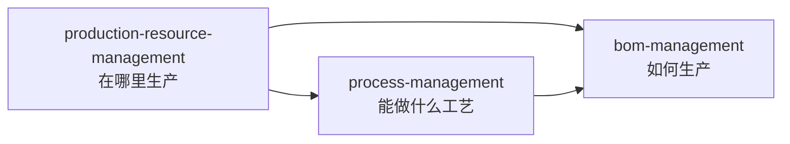
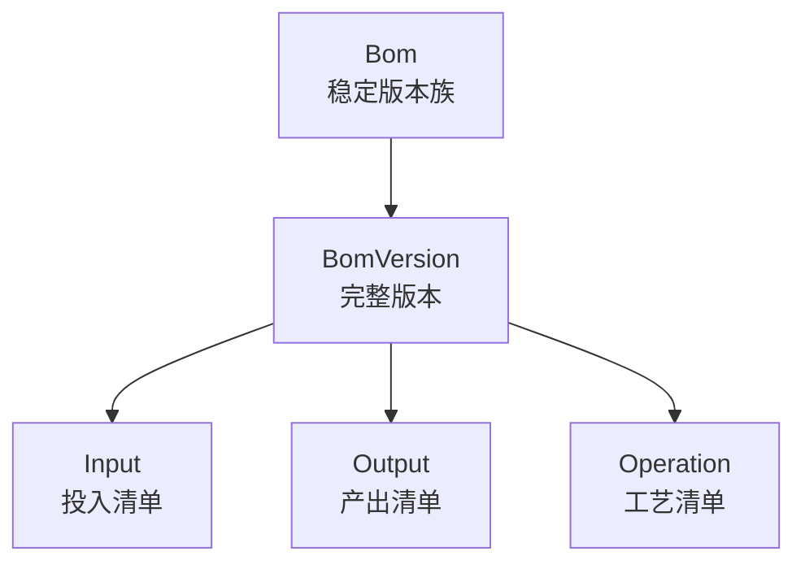
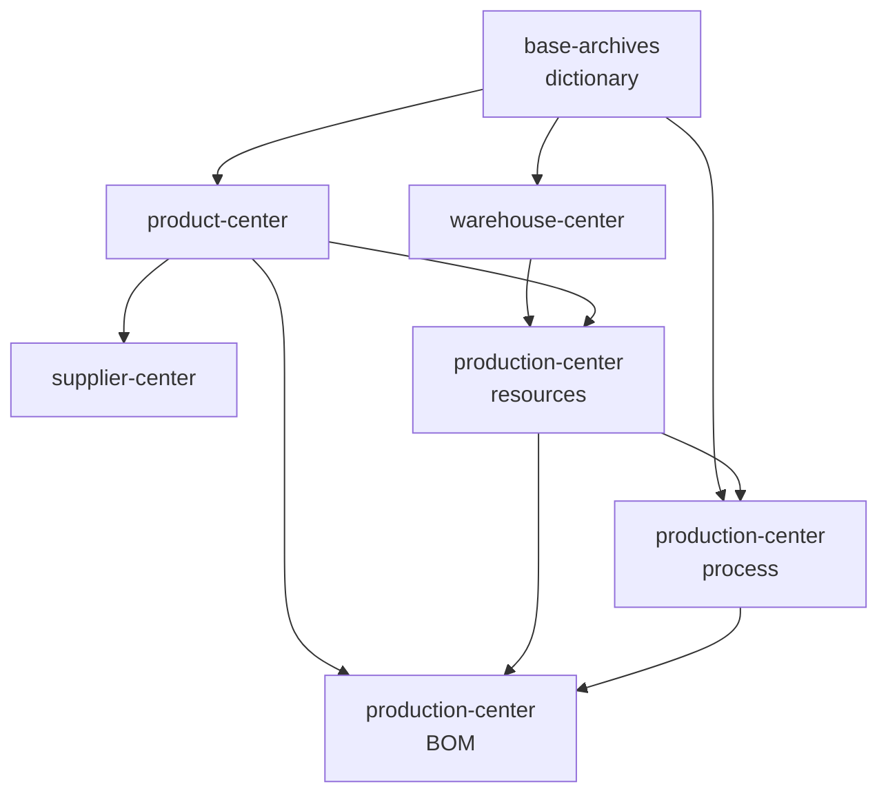
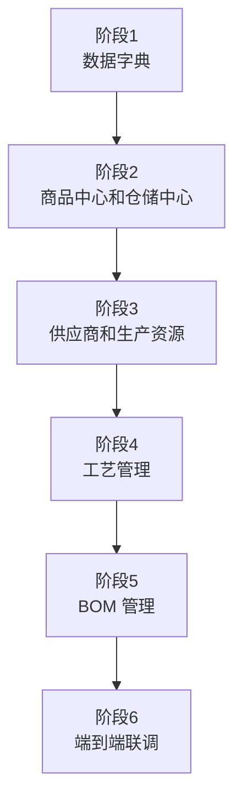

# 中央厨房 ERP 第一版业务域、Feature 与开发分工

版本：1.1  
日期：2026-09-22  
适配架构：独立业务域 Package + Feature-based Vertical Slice

## 1. 调整结论

上一版把 `base-archives` 当成了“所有主数据的容器”。虽然表被拆进不同 Feature，但商品、供应商、仓储、生产资源仍被放在同一个业务域中，业务边界不够内聚。

结合项目当前真实结构，本版使用以下层级：

```text
domains/
└── 业务域 Package
    ├── prisma
    └── src
        ├── assembly
        ├── features
        │   └── Feature
        │       └── Vertical Slice
        └── shared
```

最终将 23 张表拆分为：

- 5 个承载本批实体的业务域 Package；
- 7 个可独立开发的 Feature；
- Feature 内继续按业务用例拆 Vertical Slice；
- 每张表有且只有一个所有者。

现有 `customer-center` 保持不变，本批 23 张表不归入客户中心。

## 2. 如何理解三个层级

### 2.1 业务域 Package

业务域是最高业务边界，并且对应一个独立 workspace package，例如当前已有的：

```text
domains/customer-center
```

一个业务域拥有自己的 Prisma、Feature、领域内共享代码、装配入口、Feature 注册信息和对外导出。

### 2.2 Feature

Feature 是业务域中一组可以独立交付的完整能力，例如当前已有的：

```text
customer-center/src/features/customer-management
customer-center/src/features/quotation-management
customer-center/src/features/store-management
```

Feature 应拥有明确的数据所有权、业务规则、页面、Commands、Queries 和测试。

### 2.3 Vertical Slice

Vertical Slice 是 Feature 内部的具体子业务或用例，例如当前结构中的：

```text
customer-management/category
customer-management/tag
```

因此，本项目的拆分方法是：

```text
业务域负责边界
Feature 负责完整能力
Vertical Slice 负责具体子业务或用例
Entity/Table 归属于某个 Feature
```

## 3. 最终业务域与 Feature

| 业务域 Package | Feature | 表数 | 业务职责 |
|---|---|---:|---|
| `base-archives` | `dictionary-management` | 1 | 租户全域共享数据字典 |
| `product-center` | `product-management` | 6 | 商品、分类、计量、换算、等级和标签 |
| `supplier-center` | `supplier-management` | 2 | 供应商及其可供商品 |
| `warehouse-center` | `warehouse-management` | 2 | 仓库和库位 |
| `production-center` | `production-resource-management` | 3 | 车间、产线和产线仓库配置 |
| `production-center` | `process-management` | 3 | 工序、加工规格和产线工序能力 |
| `production-center` | `bom-management` | 6 | BOM 版本、投入、产出、工艺和默认方案 |
|  | **合计** | **23** |  |

这一版不再把“基础档案”理解成主数据合集：

- `base-archives` 只负责租户数据字典；
- 商品进入 `product-center`；
- 供应商进入 `supplier-center`；
- 仓库进入 `warehouse-center`；
- 车间、产线、工艺和 BOM 进入 `production-center`。

## 4. 与当前项目一致的目录结构

```text
domains/
├── base-archives/
│   ├── prisma/
│   └── src/
│       ├── assembly/
│       ├── features/
│       │   └── dictionary-management/
│       └── shared/
│
├── customer-center/                    # 已有，保持不变
│   ├── prisma/
│   └── src/
│       ├── assembly/
│       ├── features/
│       │   ├── customer-management/
│       │   ├── quotation-management/
│       │   └── store-management/
│       └── shared/
│
├── product-center/                     # 新增
│   ├── prisma/
│   └── src/
│       ├── assembly/
│       ├── features/
│       │   └── product-management/
│       └── shared/
│
├── supplier-center/                    # 新增
│   ├── prisma/
│   └── src/
│       ├── assembly/
│       ├── features/
│       │   └── supplier-management/
│       └── shared/
│
├── warehouse-center/                   # 新增
│   ├── prisma/
│   └── src/
│       ├── assembly/
│       ├── features/
│       │   └── warehouse-management/
│       └── shared/
│
└── production-center/                  # 新增
    ├── prisma/
    └── src/
        ├── assembly/
        ├── features/
        │   ├── production-resource-management/
        │   ├── process-management/
        │   └── bom-management/
        └── shared/
```

每个新增业务域继续沿用当前 Package 已有的 `catalog.ts`、`manifest.ts`、`package.json`、`README.md` 和 `tsconfig.json`，不引入第二套目录范式。

## 5. 23 张表的唯一归属

| 序号 | 表 | 业务域 | Feature | Feature 内归属 |
|---:|---|---|---|---|
| 1 | `tenant_dict_item` | `base-archives` | `dictionary-management` | 字典项 |
| 2 | `unit_of_measure` | `product-center` | `product-management` | 计量 Slice |
| 3 | `product_category` | `product-center` | `product-management` | 分类 Slice |
| 4 | `product` | `product-center` | `product-management` | 商品主档 |
| 5 | `product_unit_conversion` | `product-center` | `product-management` | 计量 Slice |
| 6 | `product_quality_grade` | `product-center` | `product-management` | 等级 Slice |
| 7 | `product_tag` | `product-center` | `product-management` | 标签 Slice |
| 8 | `supplier` | `supplier-center` | `supplier-management` | 供应商主档 |
| 9 | `supplier_product` | `supplier-center` | `supplier-management` | 可供商品 Slice |
| 10 | `warehouse` | `warehouse-center` | `warehouse-management` | 仓库主档 |
| 11 | `warehouse_location` | `warehouse-center` | `warehouse-management` | 库位 Slice |
| 12 | `workshop` | `production-center` | `production-resource-management` | 车间 Slice |
| 13 | `production_line` | `production-center` | `production-resource-management` | 产线 Slice |
| 14 | `production_line_warehouse` | `production-center` | `production-resource-management` | 产线仓库 Slice |
| 15 | `operation` | `production-center` | `process-management` | 工序主档 |
| 16 | `processing_specification` | `production-center` | `process-management` | 加工规格 Slice |
| 17 | `production_line_operation` | `production-center` | `process-management` | 产线能力 Slice |
| 18 | `bom` | `production-center` | `bom-management` | BOM 版本族 |
| 19 | `bom_version` | `production-center` | `bom-management` | BOM 版本 |
| 20 | `product_default_bom` | `production-center` | `bom-management` | 默认 BOM Slice |
| 21 | `bom_version_input` | `production-center` | `bom-management` | 草稿/版本 |
| 22 | `bom_version_output` | `production-center` | `bom-management` | 草稿/版本 |
| 23 | `bom_version_operation` | `production-center` | `bom-management` | 草稿/版本 |

## 6. `base-archives`：只保留数据字典

### Feature：`dictionary-management`

**拥有的表**

- `tenant_dict_item`

**推荐结构**

```text
base-archives/src/features/dictionary-management/
├── ui/
├── actions.ts
├── contract.ts
├── public.ts
├── public.server.ts
├── queries.ts
├── schema.ts
├── service.ts
├── service.test.ts
└── types.ts
```

**业务用例**

- 根据 `type` 查询字典项；
- 新建和修改字典项；
- 启用、停用字典项；
- 设置某一类型的默认项；
- 校验字典项是否属于预期类型。

`base-archives` 是一个有明确边界的配置域，不是“暂时不知道放哪里的表”的收纳目录。

## 7. `product-center`：商品中心

### Feature：`product-management`

**拥有的表**

- `unit_of_measure`
- `product_category`
- `product`
- `product_unit_conversion`
- `product_quality_grade`
- `product_tag`

**推荐结构**

```text
product-center/src/features/product-management/
├── category/
├── measurement/
├── quality-grade/
├── tag/
├── ui/
├── actions.ts
├── contract.ts
├── public.ts
├── public.server.ts
├── queries.ts
├── schema.ts
├── service.ts
├── service.test.ts
└── types.ts
```

商品本身是 Feature 主业务，分类、计量、等级和标签是内部 Vertical Slice。这与现有 `customer-management/category`、`customer-management/tag` 的组织方式一致。

### 为什么单位属于商品中心

第一版中计量单位的核心用途，是定义商品的库存、采购、生产、销售及 BOM 投入产出单位；`product_unit_conversion` 又必须依附具体商品。因此单位和商品换算放在 `product-management/measurement` 最内聚。

其他业务域可以调用商品中心公开的计量 Contract，但不能直接维护单位。

**公开能力**

- 商品快照和批量回显；
- 商品可用性校验；
- 单位查询；
- 商品单位换算；
- 商品分类、等级和标签查询。

**边界**

- 不维护供应商关系；
- 不维护库存余额；
- 不维护 BOM；
- 商品页面展示默认 BOM 时，查询生产中心公开 Contract。

## 8. `supplier-center`：供应商中心

### Feature：`supplier-management`

**拥有的表**

- `supplier`
- `supplier_product`

**推荐结构**

```text
supplier-center/src/features/supplier-management/
├── catalog/
├── ui/
├── actions.ts
├── contract.ts
├── public.ts
├── public.server.ts
├── queries.ts
├── schema.ts
├── service.ts
└── types.ts
```

供应商主档是 Feature 主业务，`catalog` 是供应商可供商品 Slice。

**业务用例**

- 供应商列表、详情、新增、修改和停用；
- 配置供应商可供商品；
- 配置采购单位、最小订购量和提前期；
- 设置商品默认供应商；
- 按商品查询可用供应商。

**边界**

- 商品由 `product-center` 提供；
- 第一版不包含采购订单、询价、结算、证照和多联系人；
- 不在 `supplier_product` 冗余商品名称。

## 9. `warehouse-center`：仓储中心

### Feature：`warehouse-management`

**拥有的表**

- `warehouse`
- `warehouse_location`

**推荐结构**

```text
warehouse-center/src/features/warehouse-management/
├── location/
├── ui/
├── actions.ts
├── contract.ts
├── public.ts
├── public.server.ts
├── queries.ts
├── schema.ts
├── service.ts
└── types.ts
```

Warehouse 是主业务对象，Location 是仓库内部 Slice。

**业务用例**

- 仓库列表、新增、编辑和停用；
- 配置仓库类型和温区；
- 维护仓库下的区域、货架、层和库位；
- 查询有效仓库和库位；
- 校验仓库是否可用于新业务。

**边界**

- 第一版不维护库存余额、批次和流水；
- 不维护生产线使用哪些仓库；
- `production_line_warehouse` 属于生产中心，因为它描述产线配置。

## 10. `production-center`：生产中心

生产中心包含三个 Feature：



### 10.1 `production-resource-management`

**拥有的表**

- `workshop`
- `production_line`
- `production_line_warehouse`

**推荐结构**

```text
production-center/src/features/production-resource-management/
├── workshop/
├── production-line/
├── line-warehouse/
├── ui/
├── actions.ts
├── contract.ts
├── public.ts
├── public.server.ts
├── queries.ts
├── schema.ts
├── service.ts
└── types.ts
```

**业务用例**

- 车间维护；
- 车间下的生产线维护；
- 产线最小批量维护；
- 配置产线的投入、在制、产出和退料仓；
- 查询生产线完整快照。

**边界**

- 仓库主档由 `warehouse-center` 管理；
- 不维护产线可执行工序；
- 不负责设备、班组、排班和产能日历。

### 10.2 `process-management`

**拥有的表**

- `operation`
- `processing_specification`
- `production_line_operation`

**推荐结构**

```text
production-center/src/features/process-management/
├── specification/
├── line-capability/
├── ui/
├── actions.ts
├── contract.ts
├── public.ts
├── public.server.ts
├── queries.ts
├── schema.ts
├── service.ts
└── types.ts
```

Operation 是 Feature 主业务对象，加工规格和产线能力是内部 Slice。

**业务用例**

- 工序主档维护；
- 工序默认工时、SOP 和参考出成率维护；
- 维护某工序下的加工规格；
- 配置某生产线可以执行哪些工序；
- 校验规格是否属于工序；
- 校验工序是否可在目标产线执行。

**边界**

- 生产线由 `production-resource-management` 管理；
- 第一版不建工艺路线模板；
- 不建立工序级投入、产出和中间产物流。

### 10.3 `bom-management`

**拥有的表**

- `bom`
- `bom_version`
- `product_default_bom`
- `bom_version_input`
- `bom_version_output`
- `bom_version_operation`

**推荐结构**

```text
production-center/src/features/bom-management/
├── draft/
├── versioning/
├── publishing/
├── default-bom/
├── calculation/
├── ui/
├── actions.ts
├── contract.ts
├── public.ts
├── public.server.ts
├── queries.ts
├── schema.ts
├── service.ts
├── service.test.ts
└── types.ts
```

不把 `input`、`output`、`operation` 分别拆成 Feature。它们不是独立业务能力，而是 BomVersion 聚合的一部分。

**核心模型**



**必须保持的规则**

- `bom` 只保存稳定身份、生命周期和当前发布版本指针；
- BOM 名称、编码、类型、产线等基本信息全部属于 `bom_version`；
- 生产信息同样全部随版本保存；
- 投入、产出、工艺是版本下三个并列清单；
- 工艺不拥有投入和产出；
- PRIMARY 产出是 BOM 商品的唯一事实来源；
- 已发布版本不可编辑；
- 修改已发布 BOM 必须复制新草稿；
- 发布时锁定具体 `child_bom_version_id`。

**Vertical Slices**

| Slice | 业务闭环 |
|---|---|
| `draft` | 创建版本族和 V1；原子保存基本信息、投入、产出和工艺 |
| `versioning` | 查询版本历史；从已发布版本复制新草稿 |
| `publishing` | 发布校验、下层 BOM 锁版、旧版本退役、当前版本切换 |
| `default-bom` | 为商品设置或取消默认 BOM |
| `calculation` | 标准批次缩放、单位换算、多级展开和循环检测 |

**边界**

- 商品、单位由 `product-center` 提供；
- 产线由生产资源 Feature 提供；
- 工序和规格由工艺 Feature 提供；
- 第一版不负责生产计划、工单、领料、报工、库存和成本。

## 11. 跨业务域依赖



依赖规则：

1. 下游可以保存上游实体 UUID 外键；
2. 下游只能调用上游的 `public.ts`、`public.server.ts` 或 `contract.ts`；
3. 下游不能直接导入上游 Repository 和内部 Service；
4. 跨域写入由数据所有者 Feature 执行；
5. 跨域回显使用批量 Query，不冗余名称字符串；
6. 页面可以组合多个域的数据，但不能因此改变表所有权。

## 12. 几张容易归错的表

### `unit_of_measure`

归 `product-center/product-management/measurement`。它在第一版中的核心语义是商品计量，不再放入 `base-archives`。

### `supplier_product`

归 `supplier-management`。它表达“供应商能供应什么”，业务主体是 Supplier。

### `production_line_warehouse`

归 `production-resource-management`。它表达“生产线使用哪些仓库”，业务主体是 ProductionLine；仓储中心只维护仓库本身。

### `production_line_operation`

归 `process-management`。它表达“产线具备哪些工序能力”，配置动作属于工艺管理。

### `product_default_bom`

归 `bom-management`。设置默认 BOM 必须检查当前发布版本和 PRIMARY 产出，不能由商品中心直接写入。

## 13. Feature 代码边界

沿用当前 `customer-management` 的风格，每个 Feature 根目录可以保留：

```text
ui/
actions.ts
contract.ts
contract.test.ts
public.ts
public.server.ts
queries.ts
schema.ts
service.ts
service.test.ts
types.ts
```

更细的子业务以目录存在，例如：

```text
product-management/category
product-management/tag
warehouse-management/location
process-management/specification
process-management/line-capability
bom-management/publishing
bom-management/calculation
```

约束：

- Feature 外部不能深层导入内部 Slice；
- `public.ts` 只导出客户端安全内容；
- `public.server.ts` 导出服务端能力；
- `contract.ts` 定义跨 Feature 稳定契约；
- 复杂用例进入对应 Slice，不能全部堆进 `service.ts`；
- `shared` 只放本业务域多个 Feature 都使用的能力；
- 只有一个 Feature 使用的代码不能提前放入 `shared`。

## 14. 页面归属

| 页面 | 主责业务域 / Feature | 组合读取 |
|---|---|---|
| 租户字典 | `base-archives/dictionary-management` | 无 |
| 商品分类、标签、等级 | `product-center/product-management` | 字典 |
| 计量单位和换算 | `product-center/product-management` | 字典维度 |
| 商品列表与详情 | `product-center/product-management` | 默认 BOM 可选回显 |
| 供应商与可供商品 | `supplier-center/supplier-management` | 商品、单位 |
| 仓库与库位 | `warehouse-center/warehouse-management` | 字典 |
| 车间与产线 | `production-center/production-resource-management` | 单位、仓库 |
| 工序与加工规格 | `production-center/process-management` | 字典、单位、产线 |
| BOM 列表和版本历史 | `production-center/bom-management` | 商品、产线、工序 |
| BOM 编辑器和试算 | `production-center/bom-management` | 商品、单位、产线、工序、规格 |

## 15. 开发分工

### 按 Feature 独立认领

| 工作包 | Feature | 表数 | 难度 |
|---|---|---:|---|
| A | `dictionary-management` | 1 | 小，公共前置 |
| B | `product-management` | 6 | 中偏大 |
| C | `supplier-management` | 2 | 小到中 |
| D | `warehouse-management` | 2 | 小到中 |
| E | `production-resource-management` | 3 | 中 |
| F | `process-management` | 3 | 中 |
| G | `bom-management` | 6 | 大，规则最复杂 |

一名同事可以负责多个 Feature，但每个 Feature 的目录、表所有权和公开 Contract 仍保持独立。

### 五人团队建议

| 同事 | 负责范围 |
|---|---|
| 同事 A | `dictionary-management` + `product-management` |
| 同事 B | `supplier-management` |
| 同事 C | `warehouse-management` + `production-resource-management` |
| 同事 D | `process-management` |
| 同事 E | `bom-management` |

### 四人团队建议

| 同事 | 负责范围 |
|---|---|
| 同事 A | `dictionary-management` + `product-management` |
| 同事 B | `supplier-management` + `warehouse-management` |
| 同事 C | `production-resource-management` + `process-management` |
| 同事 D | `bom-management` |

## 16. 推荐开发顺序



`bom-management` 可以提前使用 Contract Stub 开发，但发布前必须接入真实的商品、单位、产线、工序和规格校验。

## 17. 数据与代码所有权

- 每张表只能由所属 Feature 的 Repository 写入；
- 初始 Migration 由表所属业务域 Package 提交；
- 跨域外键由下游表所在 Package 建立；
- 所有主键和实体外键使用 UUID v7 值；
- 所有业务表使用 ADR-009 八个系统字段；
- 编码和名称不能代替实体外键；
- Prisma Schema 可以集中或分文件维护，但业务所有权必须唯一；
- `assembly` 只负责本业务域装配，不承载业务规则；
- `catalog.ts`、`manifest.ts` 只描述 Feature 元数据和注册信息；
- 业务规则必须留在所属 Feature 内。

## 18. 第一版验收标准

1. `base-archives` 只承载 `dictionary-management`；
2. 新增 `product-center`、`supplier-center`、`warehouse-center` 和 `production-center` Package；
3. 23 张表每张都有且只有一个 Feature 所有者；
4. Feature 内按具体业务拆 Vertical Slice，而不是一表一个 Feature；
5. 商品、供应商、仓储和生产使用独立领域语言；
6. 生产中心内部按资源、工艺和 BOM 三个 Feature 分工；
7. 跨域只能通过 UUID 外键和公开 Contract 协作；
8. BOM 基本信息、生产信息、投入、产出和工艺全部随版本保存；
9. 第一版能从字典、商品、供应商、仓库、生产资源和工艺走到 BOM 发布与试算。

## 19. 最终认知

```text
domains/base-archives
└── dictionary-management

domains/product-center
└── product-management
    ├── category
    ├── measurement
    ├── quality-grade
    └── tag

domains/supplier-center
└── supplier-management
    └── catalog

domains/warehouse-center
└── warehouse-management
    └── location

domains/production-center
├── production-resource-management
├── process-management
└── bom-management

domains/customer-center
└── 保持现有结构
```

这套划分与当前 `customer-center` 的真实代码组织方式一致：业务域是独立 Package，Feature 是完整业务能力，Feature 内目录才是更细的 Vertical Slice。它既能保持业务内聚，也便于将不同 Feature 分配给不同同事独立开发。
