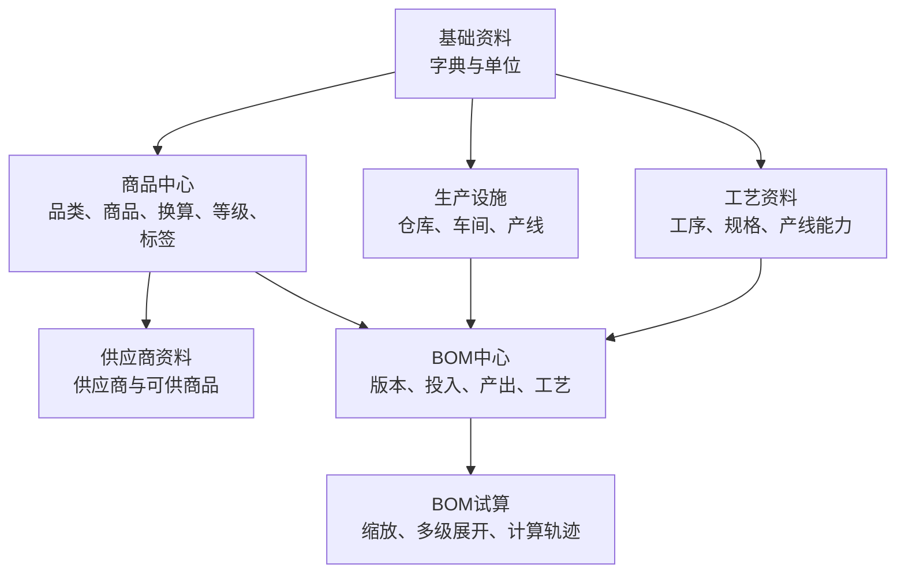
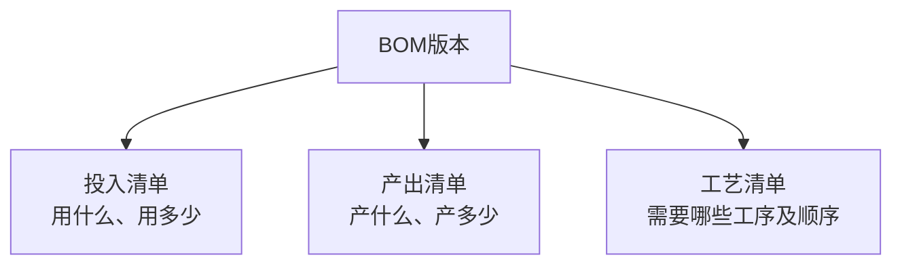
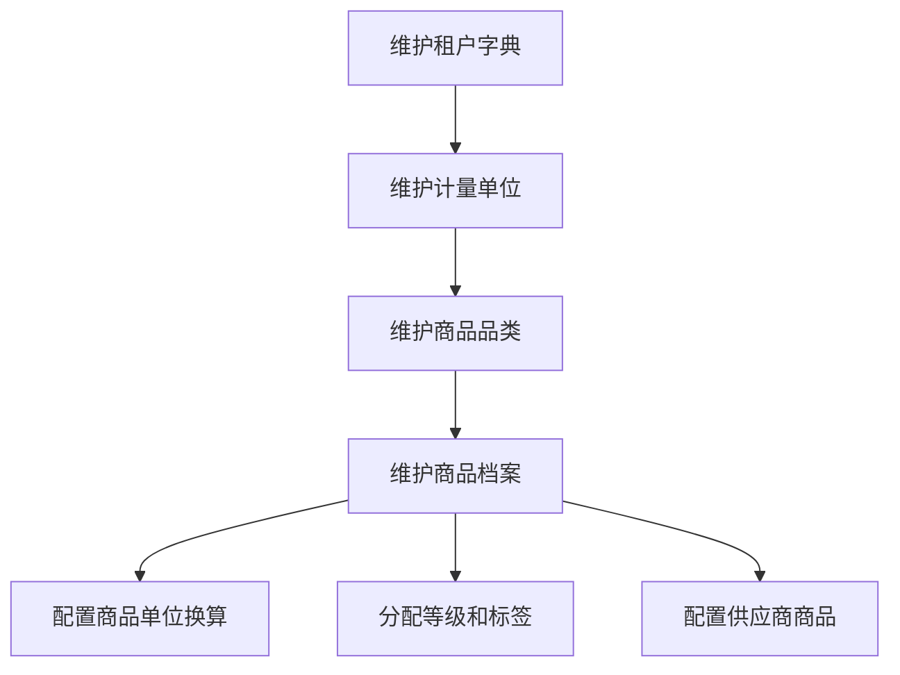
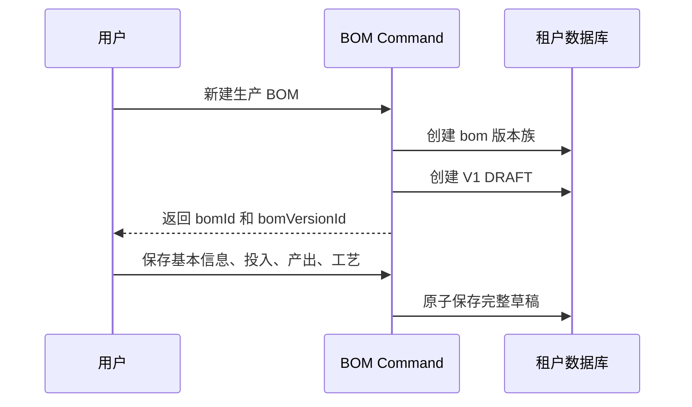
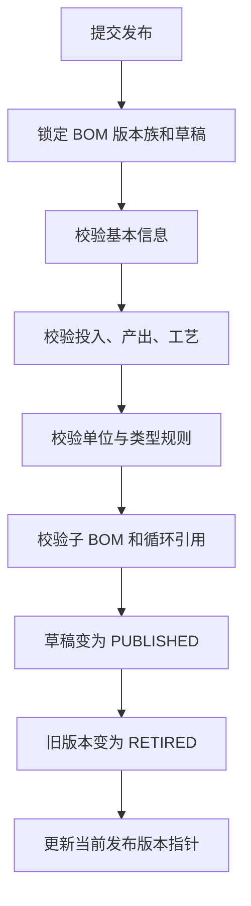
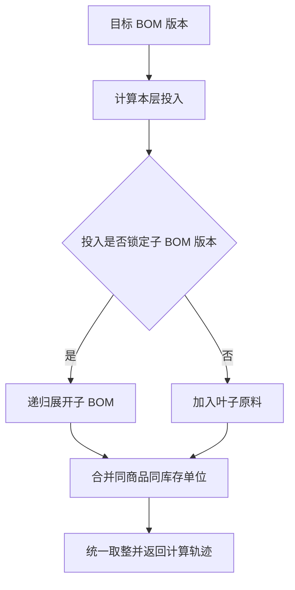
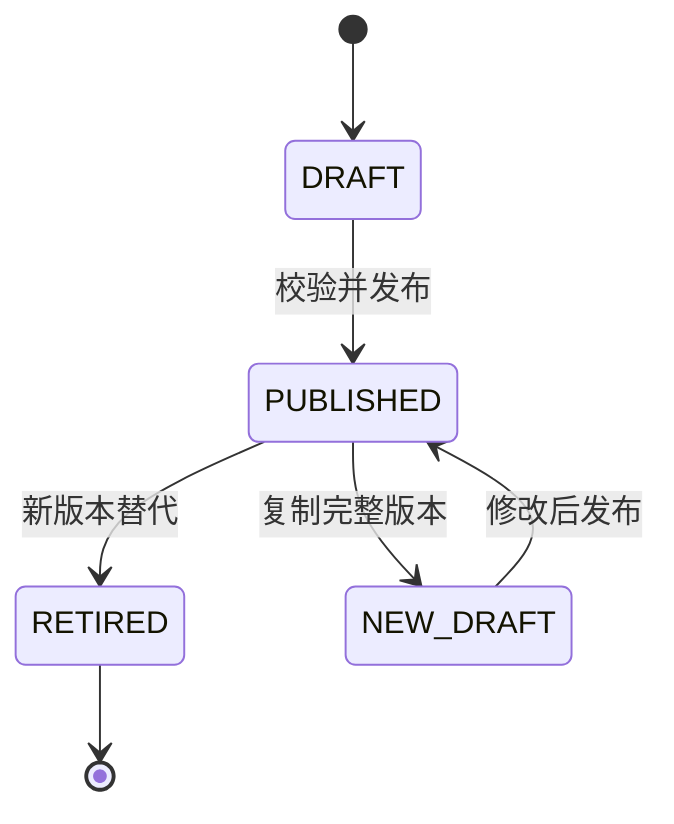

# 中央厨房 ERP 第一版业务闭环与业务设计

版本：1.0  
日期：2026-09-22  
适用对象：产品、架构、前端、后端、测试

## 1. 文档目标

第一版不追求完整生产 ERP，而是先形成一条可以实际配置、发布、查询、试算和持续修订的业务闭环：

```text
基础字典
→ 商品与单位
→ 生产资源与工艺
→ BOM 草稿
→ BOM 发布
→ 设置默认 BOM
→ BOM 试算与多级展开
→ 复制新版本继续修订
```

第一版完成后，系统应能回答以下问题：

- 系统中有哪些原料、半成品、成品和包材？
- 每个商品使用什么库存、采购、生产和销售单位？
- 哪些工序和产线可用于生产？
- 一个成品需要投入什么、产出什么、经过哪些工艺？
- 当前生效的是哪套 BOM、哪个版本？
- 生产目标数量确定后，理论投入量和副产品数量是多少？
- 半成品继续展开后，最终需要哪些叶子原料？
- 修改 BOM 后，如何保证历史版本不被污染？

## 2. 第一版范围

### 2.1 必须完成

- 租户数据字典、商品品类、计量单位和单位换算。
- 商品、商品等级、商品标签。
- 供应商与供应商商品关系。
- 仓库、库位、车间、产线及产线仓库。
- 工序、加工规格及产线可用工序。
- 单品 BOM、组合 BOM、包装 BOM。
- BOM 版本族、完整版本、投入清单、产出清单、工艺清单。
- 草稿编辑、发布校验、不可变版本、复制新版本。
- 商品默认 BOM、当前发布版本、版本历史。
- 固定数量和比例模式试算。
- 多级 BOM 锁版、递归展开和循环引用检测。
- UUID v7、ADR-009 审计字段、软删除和数据权限上下文。

### 2.2 第一版明确不做

- 工序与投入、产出之间的物料流映射。
- 中间产物在工序之间的流转图。
- 工序级领料、报工、损耗和实际出成率。
- 设备组、工艺路线模板及路线工序。
- MRP、采购建议、生产计划、生产工单和排产。
- 库存批次、库存流水、实际成本和成本差异。
- 客户专属 BOM、客户组 BOM、替代料和返工环路。
- 独立业务审计日志表；第一版先使用 ADR-009 当前状态字段和平台日志能力。

这些能力以后通过稳定的 `bom_version_id` 接入，不提前污染第一版主数据模型。

## 3. 第一版业务架构



Feature 依赖只允许从下游读取上游公开能力：

```text
reference-data
  ↓
product-master / facility-master / process-master
  ↓
production-bom
```

`production-bom` 可以读取商品、单位、产线和工序，但上游 Feature 不反向调用 BOM Repository。

## 4. 核心领域认知

### 4.1 商品是统一物料主档

原料、辅料、半成品、成品和包材共用 `product`，通过 `product_kind` 区分：

```text
MATERIAL
SEMI_FINISHED
FINISHED
PACKAGING
```

同一个半成品可以在下层 BOM 中作为主产出，在上层 BOM 中作为投入，不为不同业务角色重复建商品。

### 4.2 BOM 和 BOM 版本是两个身份

```text
bom.id          = 同一套生产方案的稳定版本族身份
bom_version.id  = 某一次发布后不可变的完整生产定义
```

`bom` 不保存名称、编码、商品、类型、产线等版本业务内容，只保存版本族生命周期和当前发布版本入口。

`bom_version` 保存该版本完整的基本信息与生产定义，包括：

- BOM 编码、名称、类型和描述。
- 生产产线、数量模式和总出成率。
- 标准投入清单。
- 标准产出清单。
- 有序工艺清单。
- 发布状态、生效时间和变更原因。

### 4.3 BOM 版本采用扁平生产定义

第一版不建立“工序下面的投入和产出”，而采用三个并列清单：



这意味着第一版只描述：

> 用什么、产出什么、怎么做。

暂不描述：

> 哪一种物料具体在哪一道工序投入或产出。

### 4.4 主产出是 BOM 商品的唯一真相

每个 BOM 版本必须且只能有一条：

```text
bom_version_output.output_role = PRIMARY
```

这条记录的 `product_id` 就是页面上的“BOM 商品”。不在 `bom` 或 `bom_version` 再保存一份 `primary_product_id`，避免出现两份商品不一致。

副产品使用：

```text
output_role = BYPRODUCT
```

第一版不使用 `INTERMEDIATE`，因为不建工序间中间产物流转。

## 5. 三种 BOM 的统一模型

| BOM 类型 | 枚举 | 业务语义 | 示例 |
|---|---|---|---|
| 单品加工 | `PROCESSING` | 主要原料加工为成品 | 青椒 → 青椒段 |
| 组合配方 | `FORMULA` | 多种原料组合为成品 | 肉片 + 生粉 → 腌制肉 |
| 包装装配 | `PACKAGING` | 散装物料和包材组成包装商品 | 65g 青椒段 + 包装袋 → 1包 |

三种类型共用：

```text
bom
bom_version
bom_version_input
bom_version_output
bom_version_operation
```

差异只放在发布校验和计算策略中，不创建三套数据库表。

## 6. 完整业务闭环

### 6.1 基础资料闭环



完成标准：

- 所有选择项保存实体 ID，不保存名称或编码字符串作为关系。
- 商品具有唯一库存单位。
- 同维度单位可以通过 `base_factor` 换算。
- 商品专属或跨维度换算通过 `product_unit_conversion` 完成。
- 停用或软删除数据不能用于新业务，但历史记录能够回显。

### 6.2 生产资源闭环

```text
仓库与库位
→ 车间与产线
→ 产线默认仓库
→ 工序主数据
→ 加工规格
→ 产线支持的工序
```

BOM 编辑器只能选择有效产线、有效工序和属于该工序的加工规格。

### 6.3 创建 BOM V1



创建时先生成一个最小 `bom`，再创建 V1 草稿。所有可编辑业务字段都写入 V1。

### 6.4 编辑 BOM 草稿

一个草稿编辑页面同时维护四部分：

```text
基本信息
├── 编码、名称、类型、描述
├── 生产产线
├── 固定数量或比例模式
└── 总出成率、最小批量等

投入清单
├── 商品、数量/比例、单位
├── 物料角色
├── 熟出成率、正常损耗率
└── 外购/自制及子 BOM 版本

产出清单
├── 主产品
├── 副产品
├── 标准产出数量和单位
└── 成本分摊比例

工艺清单
├── 工序
├── 加工规格
├── 顺序
└── 操作说明、参数和质检点
```

投入、产出、工艺都只关联 `bom_version_id`，三者之间没有直接外键。

### 6.5 发布 BOM 版本



以上操作必须在一个数据库事务内完成。发布后版本及其投入、产出、工艺全部只读。

第一版只支持“立即发布并立即生效”：`effective_from = published_at`，旧版本的 `effective_to` 同时关闭。字段仍然保留时间区间结构，为后续定时生效做准备，但第一版不实现未来时间自动切版任务。

### 6.6 设置商品默认 BOM

默认 BOM 与当前版本是两个不同概念：

```text
product_default_bom.bom_id
  = 商品默认使用哪一套 BOM 方案

bom.current_published_version_id
  = 该方案当前使用哪个已发布版本
```

选择流程：

```text
目标商品
→ 查询 product_default_bom
→ 获得 bom_id
→ 读取 current_published_version_id
→ 锁定 bom_version_id
```

发布 V2 后，只更新 BOM 当前版本指针，不需要重新设置商品默认 BOM。

### 6.7 BOM 列表与详情

BOM 列表不是直接展示 `bom` 的字段，而是使用列表 Query 投影：

```text
bom
→ current_published_version_id
→ bom_version
→ PRIMARY 产出商品
→ 商品品类
→ 生产产线
→ 工艺名称汇总
```

列表 DTO 至少返回：

```text
bomId
bomVersionId
name
code
bomType
productionLineName
productId
productName
productCode
productCategoryName
operationNames
isDefault
```

不要为了列表查询方便，把版本字段复制回 `bom`。第一版使用关联查询；数据量增长后再增加只读视图或查询投影表。

### 6.8 BOM 试算

每个 BOM 版本定义一个标准批次：

```text
标准投入：青椒 100kg
标准主产出：青椒段 90kg
目标主产出：青椒段 900kg
```

统一缩放：

```text
缩放倍数 = 目标主产出 / 标准主产出
理论投入 = 标准投入 × 缩放倍数
理论副产品 = 标准副产品 × 缩放倍数
```

上例：

```text
缩放倍数 = 900 / 90 = 10
理论青椒投入 = 100 × 10 = 1000kg
```

第一版以投入和产出行上的标准批次数量为计算真相。总出成率、熟出成率和损耗率用于展示、校验和计算轨迹，不得在数量已经是毛投入时再次重复除算。

比例模式下：

```text
参与配方投入的 ratio 合计 = 1
理论投入 = 目标基准量 × ratio
```

离散单位在所有叶子需求汇总后统一向上取整，不在递归中间层反复取整。

### 6.9 多级 BOM 展开

投入行可以选择：

```text
EXTERNAL        直接作为叶子原料
MAKE            使用指定 child_bom_version_id 继续展开
PRODUCT_DEFAULT 根据投入商品的默认 BOM 解析并在发布时锁定版本
```

发布后的投入必须锁定明确的 `child_bom_version_id`，避免下层发布新版本后改变上层历史结果。



递归路径中再次出现同一 `bom_version_id` 时立即拒绝，并返回完整循环路径。

### 6.10 创建新版本



用户不能直接修改已发布版本。发起修改时复制：

- BOM 版本基本信息。
- 全部投入行。
- 全部产出行。
- 全部工艺行。

新草稿通过 `based_on_version_id` 记录来源。发布新版本后，旧版本仍可独立查看和试算。

## 7. 发布校验规则

### 7.1 通用校验

- BOM 编码、名称、类型必填。
- 至少一条投入、一条产出和一道工艺。
- 只能有一个 `PRIMARY` 主产出。
- 投入和产出数量大于 0。
- 单位必须能换算到对应商品库存单位。
- 工艺 `sequence_number` 在版本内不能重复。
- 引用的商品、单位、产线、工序和规格必须有效且未软删除。
- 已发布版本及其子表禁止更新和软删除。

### 7.2 类型专属校验

| 类型 | 第一版规则 |
|---|---|
| PROCESSING | 只允许一个 MAIN 主要投入；可有辅料和副产品 |
| FORMULA | 支持固定数量或比例模式；比例合计误差不超过 `0.0001` |
| PACKAGING | 至少一个普通物料和一个包材投入；主产出单位通常为个、包、盒或箱 |

### 7.3 多级 BOM 校验

- `EXTERNAL` 投入不能填写子 BOM。
- `MAKE` 投入必须锁定已发布的子 BOM 版本。
- 子 BOM 的主产出商品必须等于当前投入商品。
- 当前 BOM 版本不能直接或间接引用自身。

## 8. 页面与 Vertical Slice

### 8.1 第一阶段：主数据

| Feature | Vertical Slice | 结果 |
|---|---|---|
| reference-data | `manage-dict-items` | 维护字典项、默认值和启停状态 |
| reference-data | `manage-units` | 维护计量单位和通用换算 |
| product-master | `manage-categories` | 维护商品品类树 |
| product-master | `manage-products` | 维护商品档案 |
| product-master | `manage-product-units` | 维护商品专属换算 |
| product-master | `assign-grades-and-tags` | 分配等级和标签 |
| supplier-master | `manage-suppliers` | 维护供应商和可供商品 |
| facility-master | `manage-facilities` | 维护仓库、车间和产线 |
| process-master | `manage-operations` | 维护工序、规格和产线能力 |

### 8.2 第二阶段：BOM

| Vertical Slice | 结果 |
|---|---|
| `query-bom-list` | 关联当前发布版本返回完整列表投影 |
| `create-bom` | 创建 BOM 版本族和 V1 草稿 |
| `edit-bom-version` | 编辑基本信息及三个并列清单 |
| `validate-bom-version` | 返回字段、单位、类型和循环错误 |
| `publish-bom-version` | 原子发布并切换当前版本 |
| `set-product-default-bom` | 设置商品默认 BOM 方案 |
| `copy-bom-version` | 从已发布版本复制新草稿 |
| `query-bom-history` | 查询完整版本历史 |
| `calculate-bom` | 单层缩放、多级展开和计算轨迹 |
| `query-related-boms` | 查询某商品或版本被哪些上层 BOM 使用 |

## 9. 数据一致性边界

- 主键和业务外键统一使用 UUID v7；只有主键生成新值。
- Database per Tenant 下，租户业务表不重复保存 `tenant_id`。
- 所有可维护业务表增加 ADR-009 的 8 个审计和软删除字段。
- 普通 Query 默认追加 `is_deleted = false`。
- 字典外键除存在性外，还必须在应用层校验字典 `type`。
- `bom.current_published_version_id` 只能由发布 Slice 修改。
- `product_default_bom` 指向 BOM 版本族，生产业务最终锁定具体 `bom_version_id`。
- 已发布版本的所有计算输入必须来自版本自身及其子表，不能运行时回查会变化的默认配置覆盖历史值。

## 10. 第一版验收闭环

使用以下场景做端到端验收：

```text
1. 创建重量单位：克、千克、斤。
2. 创建商品：青椒、青椒段5cm、包装袋、65克青椒段。
3. 创建产线：蔬菜清洗切割。
4. 创建工序：分拣、清洗、切段、包装。
5. 创建“青椒段5cm”PROCESSING BOM V1。
6. 投入青椒100kg，产出青椒段90kg，配置三道工艺。
7. 发布 V1，并设置为青椒段5cm的默认 BOM。
8. 试算900kg青椒段，得到1000kg青椒投入。
9. 创建“65克青椒段”PACKAGING BOM V1。
10. 投入青椒段65g和包装袋1个，产出1包。
11. 锁定青椒段 BOM V1，试算100包并递归展开。
12. 复制青椒段 V1为V2，将标准产出改为92kg并发布。
13. 验证新计算使用V2，历史试算仍可使用V1复现。
```

完成以上流程，即表示第一版已经形成：

> 主数据建档 → BOM 配置 → 版本发布 → 默认选择 → 理论试算 → 多级展开 → 版本修订。

MRP、工单、实际领料、报工和库存成本将在后续阶段引用不可变的 `bom_version_id`，不需要推翻第一版模型。
