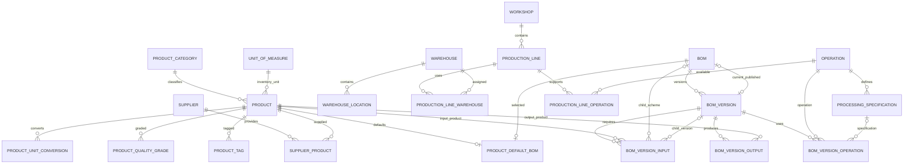

# 中央厨房 ERP 第一版实体清单与建表设计

版本：1.0  
日期：2026-09-22  
用途：Prisma 实体设计、PostgreSQL 建表、迁移编排和接口开发

## 1. 最终实体范围

第一版共 23 张租户业务表：

| Feature | 表 |
|---|---|
| `reference-data` | `tenant_dict_item`、`unit_of_measure` |
| `product-master` | `product_category`、`product`、`product_unit_conversion`、`product_quality_grade`、`product_tag` |
| `supplier-master` | `supplier`、`supplier_product` |
| `facility-master` | `warehouse`、`warehouse_location`、`workshop`、`production_line`、`production_line_warehouse` |
| `process-master` | `operation`、`processing_specification`、`production_line_operation` |
| `production-bom` | `bom`、`bom_version`、`product_default_bom`、`bom_version_input`、`bom_version_output`、`bom_version_operation` |

第一版不建：

- `equipment_group`
- `process_route`
- `process_route_operation`
- `audit_log`
- `bom_operation_input`
- `bom_operation_output`
- 工序物料流映射表
- MRP、生产计划、生产工单、库存流水和成本表

`file_asset`、用户身份、部门、通用附件属于平台已有能力，不在租户业务库重复建表。业务表只保存它们的 UUID v7 标识。

## 2. 全局数据库规范

### 2.1 主键和外键

- 每张业务表主键统一命名为 `id`。
- 主键类型为 PostgreSQL `uuid`，创建时生成 UUID v7。
- 业务外键同样保存 UUID v7，但不配置 UUID 默认生成器。
- 普通外键数据库字段使用 `{entity_name}_id`。
- 字典外键使用 `{业务语义}_dict_item_id`。
- 业务编码只能用于展示和搜索，不能代替外键。

```prisma
id        String @id @default(uuid(7)) @db.Uuid
productId String @map("product_id") @db.Uuid
```

### 2.2 ADR-009 公共字段

除明确说明的只追加基础设施表外，每张业务表都追加以下字段；后续各表不再重复列出：

```prisma
createdById String    @default("00000000-0000-7000-8000-000000000000") @map("created_by_id") @db.Uuid
deptId      String?   @map("dept_id") @db.Uuid
updatedById String?   @map("updated_by_id") @db.Uuid
createdAt   DateTime  @default(now()) @map("created_at")
updatedAt   DateTime  @updatedAt @map("updated_at")
isDeleted   Boolean   @default(false) @map("is_deleted")
deletedAt   DateTime? @map("deleted_at")
deletedById String?   @map("deleted_by_id") @db.Uuid
```

规则：

- `00000000-0000-7000-8000-000000000000` 是保留系统操作者 UUID，不允许分配给真实用户。
- 普通 Query 默认追加 `is_deleted = false`。
- 删除命令写入 `is_deleted`、`deleted_at`、`deleted_by_id` 和 `updated_by_id`。
- 恢复前必须检查活动记录唯一键冲突。
- 不向业务页面提供物理删除。

### 2.3 Database per Tenant

本文所有表位于租户独立数据库，因此不重复添加 `tenant_id`。如果未来切换为共享数据库，所有业务表、唯一约束和查询条件都必须增加 `tenant_id`。

### 2.4 公共类型

| 含义 | PostgreSQL 类型 |
|---|---|
| ID | `uuid` |
| 时间 | `timestamptz` |
| 数量 | `numeric(20,6)` |
| 换算倍率 | `numeric(20,10)` |
| 比率 | `numeric(12,8)`，保存 0～1 |
| 标准工时 | `numeric(12,4)` |
| 编码 | `varchar(64)` |
| 名称 | `varchar(128)` |
| 状态和固定枚举 | `varchar + check` 或 PostgreSQL enum |
| 可配置业务分类 | `tenant_dict_item` 外键 |

### 2.5 第一版代码枚举

| 枚举 | 可选值 |
|---|---|
| `RecordStatus` | `ACTIVE`、`DISABLED` |
| `ProductStatus` | `ACTIVE`、`STOPPED`、`ARCHIVED` |
| `ProductKind` | `MATERIAL`、`SEMI_FINISHED`、`FINISHED`、`PACKAGING` |
| `SupplyMode` | `PURCHASE`、`MAKE`、`HYBRID` |
| `WarehouseRole` | `INPUT`、`WIP`、`OUTPUT`、`RETURN` |
| `BomLifecycleStatus` | `ACTIVE`、`ARCHIVED` |
| `BomVersionStatus` | `DRAFT`、`PUBLISHED`、`RETIRED` |
| `BomType` | `PROCESSING`、`FORMULA`、`PACKAGING` |
| `QuantityMode` | `FIXED`、`RATIO` |
| `MaterialRole` | `MAIN`、`AUXILIARY`、`PACKAGING`、`PROCESSING_AID` |
| `SupplyPolicy` | `EXTERNAL`、`MAKE`、`PRODUCT_DEFAULT` |
| `OutputRole` | `PRIMARY`、`BYPRODUCT` |

这些枚举决定程序分支和计算规则，不使用租户数据字典。

## 3. 基础资料实体

### 3.1 `tenant_dict_item` 租户数据字典项

| 字段 | 类型 | 必填 | 说明 |
|---|---|:---:|---|
| `id` | uuid | 是 | UUID v7 主键 |
| `type` | varchar(50) | 是 | 字典类型代码，由 `as const` 注册表限定 |
| `code` | varchar(50) | 是 | 同类型业务编码 |
| `name` | varchar(100) | 是 | 显示名称 |
| `status` | varchar(10) | 是 | ACTIVE、DISABLED |
| `sort` | integer | 是 | 数值越小越靠前 |
| `is_default` | boolean | 是 | 是否为该类型默认项 |
| `remark` | varchar(255) | 否 | 备注 |

约束与索引：

- `unique(type, code)`，软删除后仍保留编码占用。
- `index(type, is_deleted, status, sort)`。
- 部分唯一索引：同一 `type` 在 `is_deleted=false` 时最多一个 `is_default=true`。
- 字典写入必须校验目标字段要求的 `type`；普通 FK 只能保证 ID 存在，不能保证类型正确。

第一版字典类型：

```text
UNIT_DIMENSION
PRODUCT_QUALITY_GRADE
PRODUCT_TAG
PRODUCT_PROCESSING_FORM
TEMPERATURE_ZONE
WAREHOUSE_TYPE
OPERATION_CATEGORY
```

### 3.2 `unit_of_measure` 计量单位

| 字段 | 类型 | 必填 | 外键/说明 |
|---|---|:---:|---|
| `id` | uuid | 是 | 主键 |
| `code` | varchar(32) | 是 | KG、G、PCS 等，唯一 |
| `name` | varchar(64) | 是 | 千克、克、个等 |
| `dimension_dict_item_id` | uuid | 是 | → `tenant_dict_item.id`，类型必须为 UNIT_DIMENSION |
| `base_factor` | numeric(20,10) | 否 | 转换到本维度基准单位的倍率 |
| `decimal_places` | smallint | 是 | 默认数量精度 |
| `is_system` | boolean | 是 | 是否系统内置 |
| `status` | varchar(16) | 是 | ACTIVE、DISABLED |

约束：

- `code` 全表唯一。
- 同一维度有且只有一个有效单位 `base_factor=1`。
- `decimal_places` 建议限制在 0～6。

## 4. 商品中心实体

### 4.1 `product_category` 商品品类

| 字段 | 类型 | 必填 | 外键/说明 |
|---|---|:---:|---|
| `id` | uuid | 是 | 主键 |
| `parent_product_category_id` | uuid | 否 | → 本表 `id` |
| `code` | varchar(64) | 是 | 品类编码，唯一 |
| `name` | varchar(128) | 是 | 品类名称 |
| `icon_file_asset_id` | uuid | 否 | 平台附件 ID |
| `sort_order` | integer | 是 | 排序 |
| `status` | varchar(16) | 是 | ACTIVE、DISABLED |

约束：禁止自引用；移动品类时递归检测层级循环；存在有效子品类或商品时禁止软删除。

### 4.2 `product` 商品

| 字段 | 类型 | 必填 | 外键/说明 |
|---|---|:---:|---|
| `id` | uuid | 是 | 主键 |
| `code` | varchar(64) | 是 | 商品编码，唯一 |
| `name` | varchar(128) | 是 | 商品名称 |
| `alias` | varchar(256) | 否 | 搜索别名 |
| `product_category_id` | uuid | 是 | → `product_category.id` |
| `inventory_unit_id` | uuid | 是 | → `unit_of_measure.id`，库存核算单位 |
| `default_purchase_unit_id` | uuid | 否 | → `unit_of_measure.id` |
| `default_production_unit_id` | uuid | 否 | → `unit_of_measure.id` |
| `default_sales_unit_id` | uuid | 否 | → `unit_of_measure.id` |
| `temperature_zone_dict_item_id` | uuid | 否 | → 字典 TEMPERATURE_ZONE |
| `processing_form_dict_item_id` | uuid | 否 | → 字典 PRODUCT_PROCESSING_FORM |
| `supply_mode` | varchar(24) | 是 | PURCHASE、MAKE、HYBRID |
| `product_kind` | varchar(24) | 是 | MATERIAL、SEMI_FINISHED、FINISHED、PACKAGING |
| `shelf_life_days` | integer | 否 | 保质期天数 |
| `batch_managed` | boolean | 是 | 是否启用批次管理 |
| `quantity_precision` | smallint | 是 | 数量小数位数 |
| `minimum_purchase_quantity` | numeric(20,6) | 否 | 按默认采购单位 |
| `minimum_sales_quantity` | numeric(20,6) | 否 | 按默认销售单位 |
| `maximum_sales_quantity` | numeric(20,6) | 否 | 按默认销售单位 |
| `minimum_production_quantity` | numeric(20,6) | 否 | 按默认生产单位 |
| `acceptance_standard` | text | 否 | 验收标准 |
| `image_file_asset_id` | uuid | 否 | 平台附件 ID |
| `reference_price` | numeric(20,6) | 否 | 参考价，不作为成本唯一来源 |
| `source` | varchar(16) | 是 | MANUAL、SYSTEM、IMPORT |
| `status` | varchar(16) | 是 | ACTIVE、STOPPED、ARCHIVED |

约束与索引：

- `code` 全表唯一。
- `index(product_category_id, is_deleted, status)`。
- 所有默认单位必须与商品单位换算规则兼容。
- `minimum_*`、`maximum_*` 大于 0；最大销售量不能小于最小销售量。

### 4.3 `product_unit_conversion` 商品单位换算

| 字段 | 类型 | 必填 | 外键/说明 |
|---|---|:---:|---|
| `id` | uuid | 是 | 主键 |
| `product_id` | uuid | 是 | → `product.id` |
| `from_unit_id` | uuid | 是 | → `unit_of_measure.id` |
| `to_unit_id` | uuid | 是 | → `unit_of_measure.id` |
| `conversion_factor` | numeric(20,10) | 是 | 1 源单位等于多少目标单位 |
| `effective_from` | timestamptz | 是 | 生效时间 |
| `effective_to` | timestamptz | 否 | 失效时间 |
| `status` | varchar(16) | 是 | ACTIVE、DISABLED |

约束：源单位不能等于目标单位；倍率大于 0；同商品、源单位、目标单位的有效期不得重叠。

### 4.4 `product_quality_grade` 商品等级关系

| 字段 | 类型 | 必填 | 外键/说明 |
|---|---|:---:|---|
| `id` | uuid | 是 | 主键 |
| `product_id` | uuid | 是 | → `product.id` |
| `quality_grade_dict_item_id` | uuid | 是 | → 字典 PRODUCT_QUALITY_GRADE |
| `is_default` | boolean | 是 | 是否为商品默认等级 |

约束：活动记录 `(product_id, quality_grade_dict_item_id)` 唯一；同一商品最多一个活动默认等级。

### 4.5 `product_tag` 商品标签关系

| 字段 | 类型 | 必填 | 外键/说明 |
|---|---|:---:|---|
| `id` | uuid | 是 | 主键 |
| `product_id` | uuid | 是 | → `product.id` |
| `tag_dict_item_id` | uuid | 是 | → 字典 PRODUCT_TAG |

约束：活动记录 `(product_id, tag_dict_item_id)` 唯一。

## 5. 供应商实体

### 5.1 `supplier` 供应商

| 字段 | 类型 | 必填 | 说明 |
|---|---|:---:|---|
| `id` | uuid | 是 | 主键 |
| `code` | varchar(64) | 是 | 供应商编码，唯一 |
| `name` | varchar(128) | 是 | 供应商名称 |
| `short_name` | varchar(64) | 否 | 简称 |
| `contact_name` | varchar(64) | 否 | 默认联系人 |
| `contact_phone` | varchar(32) | 否 | 默认联系电话 |
| `remark` | varchar(255) | 否 | 备注 |
| `status` | varchar(16) | 是 | ACTIVE、DISABLED |

第一版保留单联系人；多联系人、地址、证照和结算账户以后拆分子实体。

### 5.2 `supplier_product` 供应商商品

| 字段 | 类型 | 必填 | 外键/说明 |
|---|---|:---:|---|
| `id` | uuid | 是 | 主键 |
| `supplier_id` | uuid | 是 | → `supplier.id` |
| `product_id` | uuid | 是 | → `product.id` |
| `supplier_product_code` | varchar(128) | 否 | 供应商侧编码 |
| `purchase_unit_id` | uuid | 是 | → `unit_of_measure.id` |
| `minimum_order_quantity` | numeric(20,6) | 否 | 最小订购量 |
| `lead_time_hours` | integer | 否 | 采购提前期 |
| `is_default` | boolean | 是 | 是否默认供应商 |
| `status` | varchar(16) | 是 | ACTIVE、DISABLED |

约束：活动记录 `(supplier_id, product_id)` 唯一；同一商品最多一个有效默认供应商。

## 6. 生产设施实体

### 6.1 `warehouse` 仓库

| 字段 | 类型 | 必填 | 外键/说明 |
|---|---|:---:|---|
| `id` | uuid | 是 | 主键 |
| `code` | varchar(64) | 是 | 仓库编码，唯一 |
| `name` | varchar(128) | 是 | 仓库名称 |
| `warehouse_type_dict_item_id` | uuid | 是 | → 字典 WAREHOUSE_TYPE |
| `temperature_zone_dict_item_id` | uuid | 否 | → 字典 TEMPERATURE_ZONE |
| `status` | varchar(16) | 是 | ACTIVE、DISABLED |

### 6.2 `warehouse_location` 库位

| 字段 | 类型 | 必填 | 外键/说明 |
|---|---|:---:|---|
| `id` | uuid | 是 | 主键 |
| `warehouse_id` | uuid | 是 | → `warehouse.id` |
| `code` | varchar(64) | 是 | 仓库内库位编码 |
| `zone` | varchar(64) | 否 | 区域 |
| `shelf` | varchar(64) | 否 | 货架 |
| `layer` | varchar(64) | 否 | 层 |
| `position` | varchar(64) | 否 | 位 |
| `temperature_zone_dict_item_id` | uuid | 否 | → 字典 TEMPERATURE_ZONE，可覆盖仓库值 |
| `status` | varchar(16) | 是 | ACTIVE、DISABLED |

约束：`unique(warehouse_id, code)`。

### 6.3 `workshop` 车间

| 字段 | 类型 | 必填 | 说明 |
|---|---|:---:|---|
| `id` | uuid | 是 | 主键 |
| `code` | varchar(64) | 是 | 车间编码，唯一 |
| `name` | varchar(128) | 是 | 车间名称 |
| `description` | text | 否 | 说明 |
| `status` | varchar(16) | 是 | ACTIVE、DISABLED |

### 6.4 `production_line` 生产产线

| 字段 | 类型 | 必填 | 外键/说明 |
|---|---|:---:|---|
| `id` | uuid | 是 | 主键 |
| `workshop_id` | uuid | 是 | → `workshop.id` |
| `code` | varchar(64) | 是 | 产线编码，唯一 |
| `name` | varchar(128) | 是 | 产线名称 |
| `minimum_batch_quantity` | numeric(20,6) | 否 | 通用最小批次默认值 |
| `minimum_batch_unit_id` | uuid | 条件 | 填写最小批量时 → `unit_of_measure.id` |
| `status` | varchar(16) | 是 | ACTIVE、DISABLED |

### 6.5 `production_line_warehouse` 产线仓库关系

| 字段 | 类型 | 必填 | 外键/说明 |
|---|---|:---:|---|
| `id` | uuid | 是 | 主键 |
| `production_line_id` | uuid | 是 | → `production_line.id` |
| `warehouse_id` | uuid | 是 | → `warehouse.id` |
| `warehouse_role` | varchar(24) | 是 | INPUT、WIP、OUTPUT、RETURN |
| `is_default` | boolean | 是 | 是否为该角色默认仓库 |

约束：活动记录 `(production_line_id, warehouse_id, warehouse_role)` 唯一；同一产线和角色最多一个默认仓库。

## 7. 工艺主数据实体

### 7.1 `operation` 工序

| 字段 | 类型 | 必填 | 外键/说明 |
|---|---|:---:|---|
| `id` | uuid | 是 | 主键 |
| `code` | varchar(64) | 是 | 工序编码，唯一 |
| `name` | varchar(128) | 是 | 工序名称 |
| `operation_category_dict_item_id` | uuid | 是 | → 字典 OPERATION_CATEGORY |
| `default_setup_minutes` | integer | 是 | 默认准备时间 |
| `default_cleanup_minutes` | integer | 是 | 默认清理时间 |
| `default_yield_rate` | numeric(12,8) | 否 | 默认参考出成率，不直接参与已发布 BOM 计算 |
| `minimum_operator_count` | integer | 否 | 最少操作人数 |
| `minimum_batch_quantity` | numeric(20,6) | 否 | 工序默认最小批量 |
| `minimum_batch_unit_id` | uuid | 条件 | 填写最小批量时 → `unit_of_measure.id` |
| `sop_text` | text | 否 | 默认操作指引 |
| `status` | varchar(16) | 是 | ACTIVE、DISABLED |

SOP 图片和附件通过平台通用附件能力按工序 ID 查询，不在本表保存逗号字符串或 JSON 数组。

### 7.2 `processing_specification` 加工规格

| 字段 | 类型 | 必填 | 外键/说明 |
|---|---|:---:|---|
| `id` | uuid | 是 | 主键 |
| `operation_id` | uuid | 是 | → `operation.id` |
| `code` | varchar(64) | 是 | 工序内规格编码 |
| `name` | varchar(128) | 是 | 如切丝5mm、切片3mm |
| `description` | text | 否 | 加工说明 |
| `default_yield_rate` | numeric(12,8) | 否 | 默认参考出成率 |
| `status` | varchar(16) | 是 | ACTIVE、DISABLED |

约束：活动记录 `(operation_id, code)` 唯一。

### 7.3 `production_line_operation` 产线可用工序

| 字段 | 类型 | 必填 | 外键/说明 |
|---|---|:---:|---|
| `id` | uuid | 是 | 主键 |
| `production_line_id` | uuid | 是 | → `production_line.id` |
| `operation_id` | uuid | 是 | → `operation.id` |
| `is_default` | boolean | 是 | 是否为该工序默认产线 |
| `setup_minutes` | integer | 否 | 本产线覆盖准备时间 |
| `cleanup_minutes` | integer | 否 | 本产线覆盖清理时间 |

约束：活动记录 `(production_line_id, operation_id)` 唯一；同一工序最多一个活动默认产线。

## 8. BOM 实体

### 8.1 `bom` BOM 版本族

`bom` 只提供稳定版本族身份和当前发布版本入口，不保存用户看到的名称、编码、商品、类型、产线和描述。

| 字段 | 类型 | 必填 | 外键/说明 |
|---|---|:---:|---|
| `id` | uuid | 是 | 主键 |
| `current_published_version_id` | uuid | 否 | → `bom_version.id`，当前发布版本 |
| `lifecycle_status` | varchar(16) | 是 | ACTIVE、ARCHIVED |

约束：

- `current_published_version_id` 唯一，一个版本不能成为多个 BOM 的当前版本。
- 当前版本必须属于本 `bom.id`；发布 Slice 必须在事务中校验。
- `current_published_version_id` 只能由发布/退役用例修改。
- `ARCHIVED` 后不能创建和发布新版本。

建表时先创建 `bom`，再创建 `bom_version`，最后通过迁移补充 `current_published_version_id` 外键，以处理循环建表依赖。

### 8.2 `bom_version` BOM 完整版本

| 字段 | 类型 | 必填 | 外键/说明 |
|---|---|:---:|---|
| `id` | uuid | 是 | 主键 |
| `bom_id` | uuid | 是 | → `bom.id` |
| `based_on_version_id` | uuid | 否 | → 本表 `id`，复制来源 |
| `version_number` | integer | 是 | 版本号数字部分 |
| `version_status` | varchar(16) | 是 | DRAFT、PUBLISHED、RETIRED |
| `code` | varchar(64) | 是 | 该版本 BOM 编码 |
| `name` | varchar(128) | 是 | 该版本 BOM 名称 |
| `bom_type` | varchar(24) | 是 | PROCESSING、FORMULA、PACKAGING |
| `description` | text | 否 | 版本说明 |
| `production_line_id` | uuid | 否 | → `production_line.id` |
| `quantity_mode` | varchar(16) | 是 | FIXED、RATIO |
| `total_yield_enabled` | boolean | 是 | 是否启用总出成率 |
| `total_yield_rate` | numeric(12,8) | 条件 | 启用时必填 |
| `default_cooked_yield_rate` | numeric(12,8) | 否 | 投入行未覆盖时的默认参考值 |
| `minimum_batch_quantity` | numeric(20,6) | 否 | 版本最小生产批量 |
| `minimum_batch_unit_id` | uuid | 条件 | 填写最小批量时 → `unit_of_measure.id` |
| `effective_from` | timestamptz | 否 | 生效时间 |
| `effective_to` | timestamptz | 否 | 失效时间 |
| `change_reason` | text | 否 | 变更原因 |
| `published_by_id` | uuid | 否 | 发布人 UUID v7 |
| `published_at` | timestamptz | 否 | 发布时间 |
| `row_version` | integer | 是 | 乐观锁版本，默认 0 |

约束与索引：

- `unique(bom_id, version_number)`。
- `index(bom_id, version_status, effective_from)`。
- `index(code, version_status, is_deleted)`。
- DRAFT 可以编辑；PUBLISHED、RETIRED 及其三个子表均只读。
- `total_yield_enabled=true` 时，`total_yield_rate` 必须大于 0 且不大于 1。
- 同一 BOM 已发布版本的生效区间不能重叠。
- 编码可以在同一 BOM 的多个版本中重复；发布时禁止与其他当前有效 BOM 使用相同编码。
- 第一版只允许立即发布：`effective_from=published_at`；未来定时生效字段先保留，但不实现自动切版任务。

### 8.3 `product_default_bom` 商品默认 BOM

| 字段 | 类型 | 必填 | 外键/说明 |
|---|---|:---:|---|
| `id` | uuid | 是 | 主键 |
| `product_id` | uuid | 是 | → `product.id` |
| `bom_id` | uuid | 是 | → `bom.id` |

约束：

- 一个商品最多一个活动默认 BOM：`product_id where is_deleted=false` 部分唯一。
- 一个 BOM 版本族只能作为其主产出商品的默认方案，建议 `bom_id where is_deleted=false` 部分唯一。
- 设置默认前，BOM 必须存在当前发布版本，且当前版本 PRIMARY 产出的商品等于 `product_id`。

### 8.4 `bom_version_input` BOM 版本投入

投入直接属于 BOM 版本，不属于某道工序。

| 字段 | 类型 | 必填 | 外键/说明 |
|---|---|:---:|---|
| `id` | uuid | 是 | 主键 |
| `bom_version_id` | uuid | 是 | → `bom_version.id` |
| `product_id` | uuid | 是 | → `product.id` |
| `quantity` | numeric(20,6) | 条件 | FIXED 模式下必填，表示标准毛投入 |
| `unit_id` | uuid | 是 | → `unit_of_measure.id` |
| `ratio` | numeric(12,8) | 条件 | RATIO 模式下必填 |
| `material_role` | varchar(24) | 是 | MAIN、AUXILIARY、PACKAGING、PROCESSING_AID |
| `cooked_yield_rate` | numeric(12,8) | 否 | 原料熟出成率参考值 |
| `normal_loss_rate` | numeric(12,8) | 否 | 正常损耗率参考值 |
| `supply_policy` | varchar(24) | 是 | EXTERNAL、MAKE、PRODUCT_DEFAULT |
| `child_bom_id` | uuid | 否 | → `bom.id`，草稿阶段选择的下层方案 |
| `child_bom_version_id` | uuid | 否 | → `bom_version.id`，发布时锁定的下层版本 |
| `sort_order` | integer | 是 | 展示顺序 |
| `remark` | varchar(255) | 否 | 备注 |

规则：

- FIXED 模式要求 `quantity>0`，`ratio` 为空。
- RATIO 模式要求 `ratio>0`，参与配方的比例合计为 1。
- `EXTERNAL` 不允许填写子 BOM。
- `MAKE` 必须选择 `child_bom_id`，发布时解析并锁定 `child_bom_version_id`。
- `PRODUCT_DEFAULT` 根据投入商品的默认 BOM 解析，发布时同样锁定具体版本。
- 子 BOM 主产出商品必须等于本行 `product_id`。
- 活动记录建议 `(bom_version_id, product_id, material_role)` 唯一；相同商品和角色重复时应合并数量。
- `index(bom_version_id, sort_order)`、`index(child_bom_version_id)`。

### 8.5 `bom_version_output` BOM 版本产出

产出直接属于 BOM 版本，不属于某道工序。

| 字段 | 类型 | 必填 | 外键/说明 |
|---|---|:---:|---|
| `id` | uuid | 是 | 主键 |
| `bom_version_id` | uuid | 是 | → `bom_version.id` |
| `product_id` | uuid | 是 | → `product.id` |
| `quantity` | numeric(20,6) | 是 | 标准批次产出数量 |
| `unit_id` | uuid | 是 | → `unit_of_measure.id` |
| `output_role` | varchar(24) | 是 | PRIMARY、BYPRODUCT |
| `cost_allocation_ratio` | numeric(12,8) | 否 | 成本分摊比例，第一版可暂不启用 |
| `sort_order` | integer | 是 | 展示顺序 |
| `remark` | varchar(255) | 否 | 备注 |

约束：

- 每个 BOM 版本有且只有一条活动 PRIMARY 产出，使用部分唯一索引保证。
- `quantity>0`。
- 活动记录 `(bom_version_id, product_id, output_role)` 唯一。
- 启用成本分摊时，PRIMARY 和 BYPRODUCT 的比例合计为 1。
- `index(bom_version_id, output_role, sort_order)`。

PRIMARY 产出就是该版本的“BOM 商品”，不在 `bom` 或 `bom_version` 重复保存商品 ID。

### 8.6 `bom_version_operation` BOM 版本工艺

工艺直接属于 BOM 版本，与投入、产出不存在外键关系。

| 字段 | 类型 | 必填 | 外键/说明 |
|---|---|:---:|---|
| `id` | uuid | 是 | 主键 |
| `bom_version_id` | uuid | 是 | → `bom_version.id` |
| `operation_id` | uuid | 是 | → `operation.id` |
| `processing_specification_id` | uuid | 否 | → `processing_specification.id` |
| `sequence_number` | integer | 是 | 工艺顺序，建议 10、20、30 |
| `setup_minutes` | integer | 否 | 本版本覆盖准备时间 |
| `cleanup_minutes` | integer | 否 | 本版本覆盖清理时间 |
| `standard_labor_hours` | numeric(12,4) | 否 | 标准工时 |
| `quality_checkpoint` | boolean | 是 | 是否质检点 |
| `instruction_text` | text | 否 | 本版本操作说明 |
| `instruction_parameters` | jsonb | 否 | 温度、时间、刀距等差异化参数 |
| `sort_order` | integer | 是 | 页面排序 |
| `remark` | varchar(255) | 否 | 备注 |

约束：

- 活动记录 `(bom_version_id, sequence_number)` 唯一。
- 加工规格必须属于所选工序。
- 如果版本指定生产产线，所选工序必须存在有效 `production_line_operation`。
- 第一版不保存工序出成率，不参与投入和产出计算。
- 操作指导附件通过平台附件能力按 `bom_version_operation.id` 查询。
- `index(bom_version_id, sort_order)`。

## 9. 核心关系图



## 10. 外键删除策略

业务表统一软删除，数据库物理外键默认使用 `ON DELETE RESTRICT`：

| 关系 | 策略 |
|---|---|
| 主数据被 BOM 引用 | 禁止物理删除；停用或软删除后历史可读 |
| BOM 版本及其三个子表 | 业务上聚合软删除；已发布版本禁止删除 |
| 字典项被引用 | 禁止物理删除；优先改为 DISABLED |
| 商品品类父子关系 | 有有效子节点时禁止删除父节点 |
| 平台用户、部门、附件 | 跨库逻辑引用，不建立 PostgreSQL 跨库 FK |

不要在数据库使用级联物理删除已发布 BOM 历史。

## 11. BOM 发布事务

发布 `bom_version` 时按以下顺序执行：

```text
1. 锁定 bom 和目标 DRAFT 版本。
2. 校验版本基本信息。
3. 校验投入、产出和工艺清单。
4. 校验单位换算和 BOM 类型规则。
5. 解析 PRODUCT_DEFAULT/MAKE 投入并锁定 child_bom_version_id。
6. 执行多级 BOM 循环检测。
7. 将原 current published 版本改为 RETIRED。
8. 将目标版本改为 PUBLISHED，写入发布人和时间。
9. 更新 bom.current_published_version_id。
10. 提交事务。
```

任何一步失败都必须整体回滚。

## 12. 推荐建表顺序

```text
第一组：基础资料
  01 tenant_dict_item
  02 unit_of_measure

第二组：商品中心
  03 product_category
  04 product
  05 product_unit_conversion
  06 product_quality_grade
  07 product_tag

第三组：供应商
  08 supplier
  09 supplier_product

第四组：生产设施
  10 warehouse
  11 warehouse_location
  12 workshop
  13 production_line
  14 production_line_warehouse

第五组：工艺资料
  15 operation
  16 processing_specification
  17 production_line_operation

第六组：BOM
  18 bom                         先不添加 current version FK
  19 bom_version
  20 为 bom 补 current_published_version_id FK
  21 product_default_bom
  22 bom_version_input
  23 bom_version_output
  24 bom_version_operation
```

上面的 20 是迁移步骤，不是额外实体，因此最终仍是 23 张表。

## 13. 建库完成验收

- 23 张业务表全部使用 UUID v7 主键。
- 所有业务外键为 `uuid` 且没有 UUID 默认生成器。
- 所有可维护表具有 ADR-009 的 8 个公共字段。
- 所有外键字段使用标准蛇形命名。
- 所有字典外键均有类型校验入口。
- 所有活动关系唯一约束考虑 `is_deleted=false`。
- `bom` 不包含名称、编码、商品、类型、产线等版本业务字段。
- `bom_version` 可以独立还原完整基本信息。
- 投入、产出、工艺分别直接关联 `bom_version_id`。
- 不存在 `bom_operation_input`、`bom_operation_output` 和工序物料流字段。
- 每个版本只能存在一个 PRIMARY 产出。
- 发布事务可以原子切换 `current_published_version_id`。
- 商品默认 BOM 指向 `bom_id`，生产业务最终锁定 `bom_version_id`。
